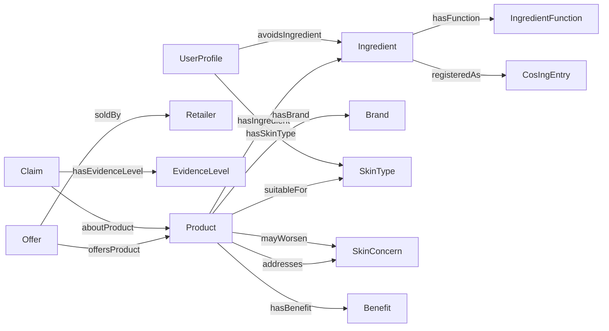
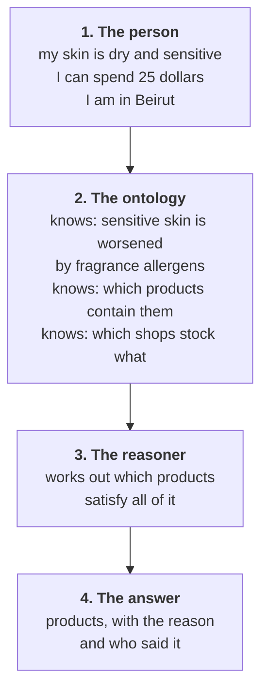

# Everything I need to defend the ontology phase

Written from zero. Read it top to bottom once and you can answer any question
tomorrow.

---

# PART A. The idea

## A1. What is an ontology, really

An ontology is a **map of a subject**: what kinds of thing exist in it, and how
they connect.

My spreadsheet is a list of 12,629 rows. An ontology is not a list. It is the
description of what those rows *mean*.

Compare:

| My spreadsheet says | An ontology says |
|---|---|
| A row with `skin_type = Oily` | A **Product** can be **suitableFor** a **SkinType**. Oily is one SkinType. |
| A cell containing `AQUA, GLYCERIN, PARFUM` | A **Product** **hasIngredient** many **Ingredients**. Each Ingredient **hasFunction**. Parfum is a **DeclarableAllergen**. |
| A cell containing `8.83` | An **Offer** is one shop selling one Product at one price on one date. |

**The plain difference:** a spreadsheet can filter. An ontology can hold a
definition and let a computer work out consequences.

## A2. The one example that shows why it is worth doing

I want to find products that are safe for sensitive skin.

**Spreadsheet way:** I look at every product, check whether its ingredients
contain any of the 26 EU allergens, and write "safe" in a column. 12,629 times.
If I fix a formula next week, that column is now wrong and nothing tells me.

**Ontology way:** I write the meaning down once.

```
SensitiveSafeProduct = any Product that contains none of the 26 EU allergens
```

Then a program called a **reasoner** reads that and works out which products
belong. If I fix a formula next week, the membership fixes itself.

That is the whole argument. **I write meanings, not labels.**

---

# PART B. My ontology, class by class, from my own columns

This is the answer to "how do I know what classes to have". They come from my
own dataset. Here is the mapping.

| My column | Becomes | Kind of thing |
|---|---|---|
| `product_id`, `name` | `Product` | class, 12,629 individuals |
| `brand` | `Brand` | class, 1,463 individuals |
| `ingredients` | `Ingredient` | class, 13,699 individuals |
| `ingredient_functions` | `IngredientFunction` | class, from CosIng |
| `product_type` | `ProductType` | class, 22 values |
| `skin_type` | `SkinType` | class, 5 values |
| `sensitivity` | `Sensitivity` | class, 2 values |
| `concerns` | `SkinConcern` | class, 7 values |
| `benefits` | `Benefit` | class, 14 values |
| `price_usd`, `price_lbp`, `price_seen_date`, `sold_by_shops` | `Offer` | class, one per shop per product |
| `sold_by_shops` | `Retailer` | class, 9 Lebanese shops |
| `source_category`, `country`, `price_tier` | `ContextualFeature` | class, describes availability |
| `skin_type_tier` | `EvidenceLevel` | class, 4 values |
| `restricted_ingredients` | `RestrictedIngredient` | subclass of Ingredient |
| `cosing_matched`, `cosing_coverage` | data properties on Product | numbers |

**The rule I used:** a column with a **small fixed list of values** becomes a
class. A column with a **number or a date** becomes a data property. A column
that **points at another thing** becomes an object property.

| Column type | Example | Becomes |
|---|---|---|
| small fixed list | `skin_type` has 5 values | a class |
| free number | `price_usd` | a data property |
| points at something | `brand` points at a company | an object property to a class |

## B1. The connections



**`addresses` and `mayWorsen` are separate on purpose.** A product can help one
problem and make another worse. If I merged them into one link, the system
could recommend something harmful.

---

# PART C. The four reusable vocabularies

## C1. What they are, in one sentence

They are **dictionaries that other people already wrote and published on the
internet**, which I point at instead of inventing my own words.

## C2. Why bother

Four things in my ontology are not skincare problems. They are general problems
that other people solved years ago.

| Problem | Is it a skincare problem | Who already solved it |
|---|---|---|
| One shop sells one product at one price on one date | No, that is shopping | **schema.org** |
| Recording who said something and when | No, that is provenance | **PROV-O** (W3C) |
| A list where "Hydrating" and "Hydration" are one idea | No, that is vocabulary control | **SKOS** (W3C) |
| Titles and dates on a document | No, that is metadata | **Dublin Core** |

Reusing them means I only wrote the part that is actually mine: skincare
knowledge, the EU register link, and Lebanese availability.

## C3. Can I refuse to use them

Yes. Nothing breaks. Here is the honest trade.

| If I invent my own words | If I reuse |
|---|---|
| I decide what "Offer" means | It already means one seller, one price, one date |
| Only my thesis understands my file | Any search engine or system can read it |
| "Why these terms?" answer: I chose them | Answer: W3C standard, here is the spec |
| Faster today | Defensible in a viva |

## C4. Do they have their own files

Yes. Each lives at a fixed web address, maintained by its publisher.

| Vocabulary | Publisher | Address |
|---|---|---|
| schema.org | Google, Microsoft, Yahoo, Yandex | `https://schema.org/` |
| PROV-O | W3C | `http://www.w3.org/ns/prov#` |
| SKOS | W3C | `http://www.w3.org/2004/02/skos/core#` |
| Dublin Core | DCMI | `http://purl.org/dc/terms/` |

I do **not** keep copies. My file points at the addresses. Copying them would
freeze a file that other people keep updating.

## C5. How my file links to them, literally

Two lines. Both are already in `vocabularies/skincare-profile.ttl`.

**Line 1, a nickname for the address:**

```turtle
@prefix schema: <https://schema.org/> .
```

Now writing `schema:Product` means `https://schema.org/Product`. It is only an
abbreviation, like saving a phone number under a name.

**Line 2, the actual link:**

```turtle
skc:Product  rdfs:subClassOf  schema:Product .
```

Read out loud: *my Product is a kind of schema.org's Product.*

That is it. That single line is "reusing a vocabulary".

## C6. The example that makes it concrete

The same Cetaphil lotion is **$8.66** at one Beirut shop and **$32.36** at
another. Real rows in my data.

Without `schema:Offer` I must either invent two products, or throw one price
away. Both are wrong.

With it:

```
one Product: Cetaphil Moisturising Lotion
  Offer 1: sohaticare,  $8.66,  seen 2026-08-30
  Offer 2: zeinacare,  $32.36,  seen 2026-08-30
```

One product, two offers, both prices kept. I did not design that. It already
existed.

---

# PART D. OntoCosmetic

## D1. What it is

An ontology built by researchers at Universite de Lorraine for **designing**
cosmetic emulsions. I have the file: `papers/OntoCosmetic-30-withoutRules.owl`.

| | |
|---|---|
| Classes | 116 |
| Object properties | 26 |
| Data properties | 20 |
| Individuals already filled in | 279 |

## D2. Why I am NOT importing it

Its classes include `HLB`, `DropletSize`, `AqueousThickeners`,
`OWCosmeticEmulsion`, `HeuristicForSurfactant`, `Rheology`, `MeltingPoint`.

These describe **how to make a cream stable**. I have none of that data and
never will, because manufacturers do not publish droplet sizes or dosages.

Importing 116 classes to use 10 of them would drag emulsion chemistry into an
ontology about buying skincare in Beirut.

## D3. What I DO take from it

| From OntoCosmetic | What I do with it |
|---|---|
| Its ingredient type names: `Emollient`, `Surfactant`, `Thickener`, `Active`, `Preservative`, `UvFilter`, `Humectant`, `Antioxidant`, `Stabilizer`, `PHRegulator` | I already hold ingredient functions from CosIng on 92.7 percent of products. I use **their names** so I am not inventing a third vocabulary |
| `hasINCIcode` | Confirms INCI is the right key to join ingredients on, which is what I did |
| `hasOrigin` (natural or synthetic) | A property people ask about constantly |
| The split between `ProductProperty` and `IngredientProperty` | I was mixing them. `spf` belongs to the product. Function belongs to the ingredient |

**The sentence for my supervisors:** *OntoCosmetic is the closest published
cosmetics ontology, so I read it and borrowed its ingredient classification
rather than inventing one. I did not import it, because it models formulation
chemistry and I model retail availability.*

## D4. How to open it in Protege

1. Download Protege from `https://protege.stanford.edu/` and install it (free)
2. Open Protege
3. **File > Open**
4. Choose `repo/papers/OntoCosmetic-30-withoutRules.owl`
5. Click the **Entities** tab, then **Classes** on the left
6. Expand `owl:Thing` to see the 116 classes
7. Click `Ingredient` and look at the subclasses in the panel. That is the
   ingredient typing I am borrowing
8. To see it as a picture: **Window > Tabs > OntoGraf**, then drag a class in

---

# PART E. My own file, and how to open it

## E1. Where it is

`repo/vocabularies/skincare-profile.ttl`

| | |
|---|---|
| Format | Turtle (`.ttl`), a plain text way of writing an ontology. Easier to read than OWL XML |
| Size | 27 classes, 13 object properties, 4 data properties |
| Contains | my classes, the four vocabulary imports, and three defined classes |

## E2. Opening it in Protege

1. Open Protege
2. **File > Open**
3. Choose `repo/vocabularies/skincare-profile.ttl`
4. The **Active ontology** tab shows the imports at the top
5. **Entities > Classes** shows my 27 classes
6. Click `SensitiveSafeProduct`. In the right panel you will see
   **Equivalent To** with the definition in it. That is a defined class
7. To run the reasoner: **Reasoner > HermiT**, then **Reasoner > Start
   reasoner**. Inferred results appear in yellow

If Protege complains it cannot fetch the imports, that is only because it is
trying to download schema.org and PROV-O. **Reasoner > Configure** and untick
the import fetching, or work offline. The file itself is fine.

## E3. What is inside, in plain words

| Section | What it does |
|---|---|
| Prefixes at the top | nicknames for the four vocabulary addresses |
| `owl:imports` | says "I reuse these four" |
| `skc:Product`, `skc:Ingredient`, etc | my 27 classes |
| `skc:hasIngredient`, `skc:suitableFor`, etc | my 13 connections |
| The last section | **three defined classes**, the important part |

## E4. The three defined classes, explained

These are the ones to show tomorrow.

**1. `SensitiveSafeProduct`**

> Any product that contains none of the 26 EU declarable fragrance allergens.

I never tag a product as safe. The reasoner finds them. If a formula is
corrected, the answer corrects itself.

**2. `AvailableInLebanon`**

> Any product with at least one Offer from a Lebanese shop.

This is the class the entire project exists for. No other skincare ontology
has it.

**3. `ManufacturerStatedProduct`**

> Any product whose suitability claim came from the manufacturer, evidence
> level 1.

Lets a query exclude my own guesses in one step.

---

# PART F. How the system will work



## The test question I will use

> A hydrating serum under 30 dollars, sold in Beirut, safe for sensitive skin,
> where the claim came from the manufacturer.

| The question needs | Comes from |
|---|---|
| hydrating | `hasBenefit` |
| under 30 dollars | `Offer` and `priceUSD` |
| sold in Beirut | `Offer` and `soldBy` |
| safe for sensitive skin | the defined class `SensitiveSafeProduct` |
| claim from the manufacturer | `Claim` and `EvidenceLevel` |

If the ontology answers that, the design works.

---

# PART G. What I will do next, in order

| Step | What | Tool | Done when |
|---|---|---|---|
| 1 | Concepts file: 5 skin types, 7 concerns, 14 benefits, ingredient functions | Protege, by hand | It fits on two printed pages |
| 2 | Run the reasoner on it | HermiT | No contradictions |
| 3 | Take those two pages to a dermatologist | paper | The clinical gap is closed |
| 4 | Turn the CSV into the product ontology | OntoRefine, or Python with Owlready2 | 12,629 products load |
| 5 | User profile file | Protege | Holds only what a person can tell me |
| 6 | Bridge file that imports all three | Protege | Reasoner runs over everything |
| 7 | Ask the test question | Owlready2 or SPARQL | It returns products with reasons |

---

# PART H. Questions they will ask, and my answers

**Why an ontology and not just the spreadsheet?**
> A spreadsheet filters. It cannot hold a definition. I write down what "safe
> for sensitive skin" means once, and the reasoner works out which of 12,629
> products qualify. If a formula is corrected, the answer corrects itself.

**Why three files instead of one?**
> Because the three parts change at different speeds and are checked by
> different people. Clinical knowledge barely changes and a dermatologist
> should review it. Product data changes with every scrape. If they are in one
> file, nobody will ever review the clinical part, because it is buried in
> 12,629 products.

**Why reuse schema.org and the others?**
> Four parts of my model are not skincare problems. A shop selling a product at
> a price on a date is schema.org's Offer. Recording who made a claim is
> PROV-O. Controlled lists are SKOS. Reusing them means I only built what is
> genuinely mine, and it means my data can be read by systems I did not write.
> Noy and McGuinness recommend exactly this: look for an existing vocabulary
> first.

**Why not import OntoCosmetic?**
> It is built for formulating emulsions. Its classes are HLB, droplet size,
> rheology. I have none of that data because manufacturers do not publish it.
> I borrowed its ingredient type names so I am not inventing a third
> vocabulary, and I cite it as the closest published cosmetics ontology.

**How did you decide the classes?**
> From my own columns. A column with a small fixed list of values became a
> class. A number became a data property. A column pointing at another thing
> became an object property. Nothing in the model exists that my data cannot
> fill.

**What is new here compared with the papers you read?**
> Three things none of them has. Ingredients linked to the EU CosIng register,
> so a regulatory statement cites the Commission and not me. Every claim
> carries who made it, so a manufacturer's statement and my own inference are
> not treated as the same fact. And local availability, so the system only
> recommends what can actually be bought in Lebanon.

**What is the weakness?**
> No dermatologist has reviewed my vocabulary yet. Hansanie and Silva did that
> and I did not. It is step 3 of my plan. Also 827 products still have no
> ingredient list, mostly small Lebanese brands that publish nothing, and each
> of those was checked by hand and recorded as checked.

**How will you evaluate it?**
> The test question in Part F first, as a structural check. Then a user study
> like the one Hansanie and Silva ran with 24 participants. I would want to be
> careful to report satisfaction and accuracy separately, because their 87.5
> percent is satisfaction, not accuracy, and it is often quoted as if it were
> accuracy.

---

# PART I. The one minute summary

> I have 12,629 skincare products sold in Lebanon, 93.5 percent with full
> ingredient lists, linked to the EU register, and every claim records who made
> it. For the ontology I read five papers. From Hansanie and Silva I take the
> three file structure and the reasoner. From Moe and Aung I take contextual
> features, because price and availability describe a product in a place, not
> the product itself. From the VU Amsterdam project I take defined classes,
> which is what makes an ontology worth more than a spreadsheet. From
> OntoCosmetic I take the ingredient type names but not the file, because it
> models formulation and I model retail. I reuse four standard vocabularies so
> I only build what is genuinely mine. The result is the only skincare ontology
> I know of that can say a product is available here, at this price, and that
> this particular claim came from the manufacturer.
