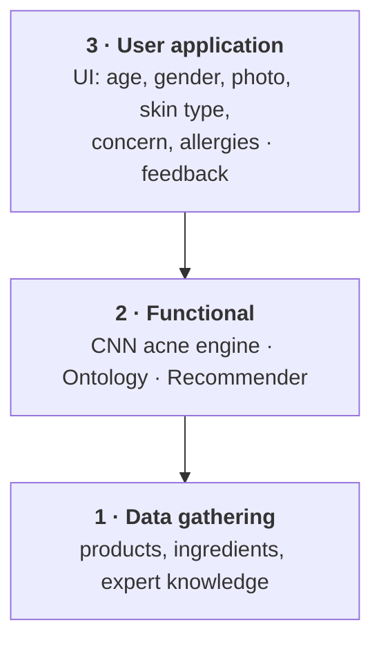
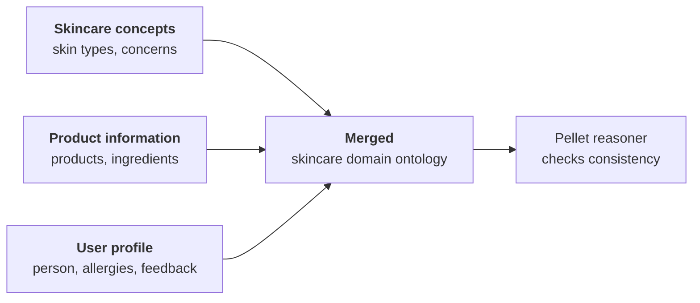
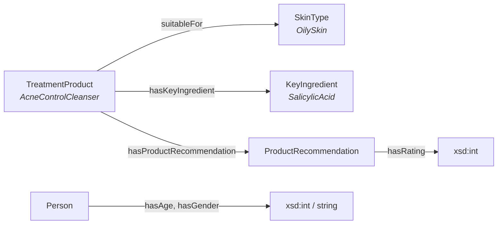
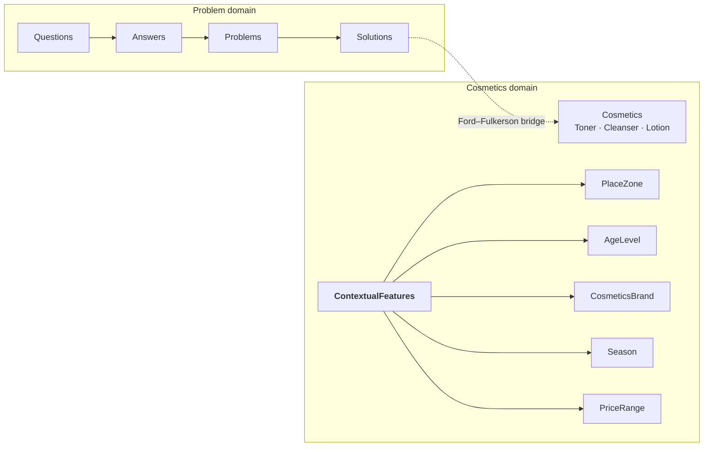
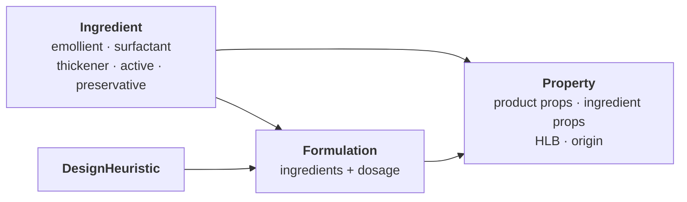
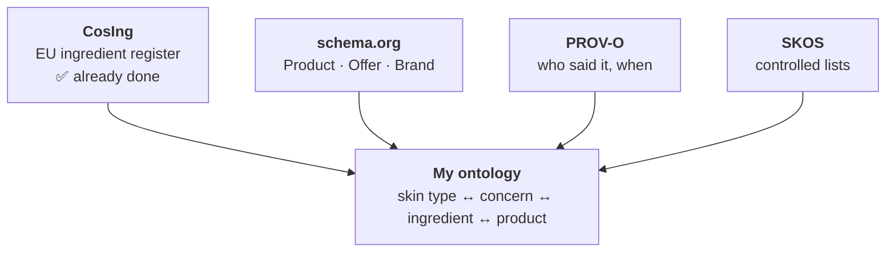
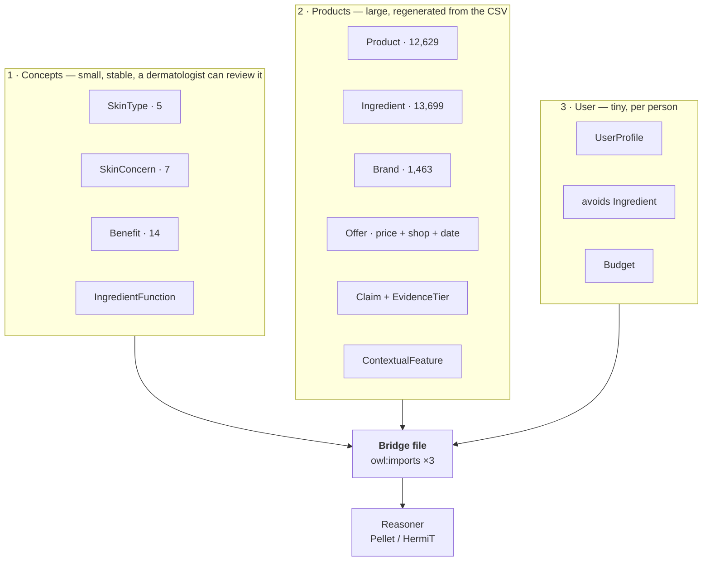
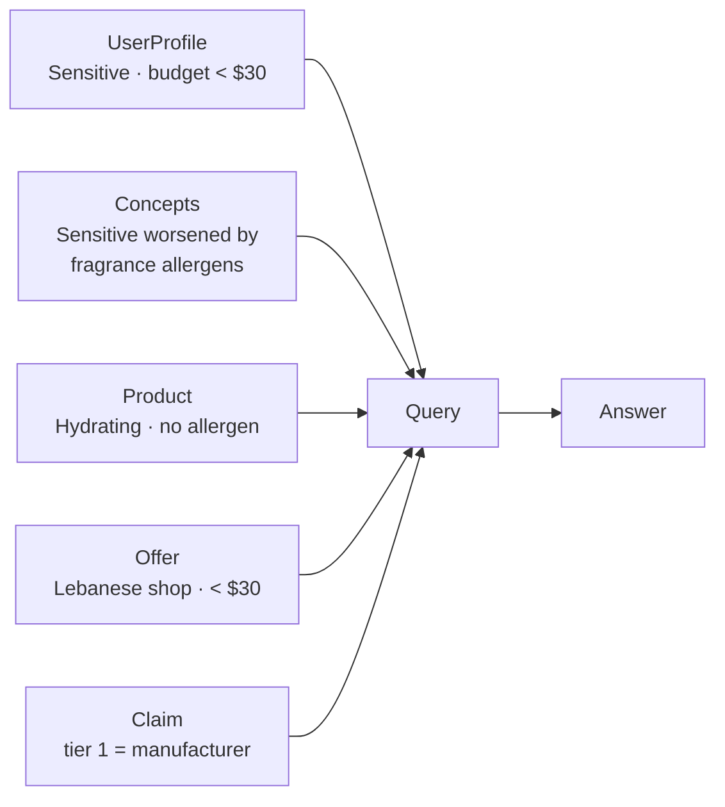

# Ontologies — what I read, what I am taking, what I am building

Five papers read. Four vocabularies chosen. One structure proposed.

---

## 1. The five papers at a glance

| # | Paper | What they built | Tools | What I take |
|---|---|---|---|---|
| 1 | **Hansanie & Silva (2024)** IEEE ICIPRoB | CNN grades acne from a photo + OWL ontology recommends | Protégé, **Pellet**, Owlready2, Tkinter | **3 ontologies merged**, reasoner from day one |
| 2 | **Personalized Skincare Rec. System (2025)** | Methontology ontology, 3,800 products scraped | Protégé, Methontology | `Formulation`, `ApplicationFrequency`, `SkinConcern` as a class |
| 3 | **Moe & Aung (2014)** IJITCS | Two ontologies + a bridge between them | Protégé, Taxonomic CCBR, Ford–Fulkerson | **`ContextualFeatures`** — price, place, brand |
| 4 | **Serna et al. (2021)** — OntoCosmetic | Knowledge base for *designing* emulsions | Protégé | Ingredients typed by **function** |
| 5 | **Gabriel et al. (2023)** ESCAPE-33 | Formultools app built on OntoCosmetic | Protégé + mobile app | Split **product** vs **ingredient** properties |

**Papers 4 and 5 are for formulating products, not recommending them.** I cite
them, I borrow their ingredient structure, I do not import their ontology.

---

## 2. Paper 1 — Hansanie & Silva (2024) · the main one

### Their system, three layers

### How they built the ontology — three files, then merged

### Their classes and properties (published in the paper)

### Three facts to say out loud

- **Vocabulary came from dermatologists**, not from the authors — plus a survey
  of 21 consumers aged 21–30.
- **Class hierarchy built top-down**: general concepts first, then specialise.
- **87.5% is NOT model accuracy.** The CNN scored 77.5% accuracy / 76.6% F1.
  87.5% is how many of 24 survey participants *said* they liked the results.

### ✅ Take / ❌ Leave

| ✅ Take | ❌ Leave |
|---|---|
| Three ontologies, merged | The CNN — I have no facial images or ethics approval |
| Pellet/HermiT reasoner from the start | Tkinter desktop UI |
| Feedback (`hasRating`) modelled *inside* the ontology | |
| Owlready2 to query from Python | |

---

## 3. Paper 3 — Moe & Aung (2014) · the idea that changed my design

They built **two** ontologies and an explicit **bridge**:

**The thing worth stealing: `ContextualFeatures`.**

Price, place and brand are not properties of a product in the abstract — they
are properties of *a product available in a place*. The same product in Beirut
and in a global catalogue is in two different contexts.

I have been storing these flat in the CSV:

| My column | Values | Belongs under |
|---|---|---|
| `price_tier` | 3 | `ContextualFeature` |
| `sold_by_shops` | 9 retailers | `ContextualFeature` |
| `country` | 55 | `ContextualFeature` |
| `source_category` | 4 | `ContextualFeature` |

❌ **Leave:** the conversational question-asking, and Ford–Fulkerson. My
products are already scored on availability, price and evidence tier.

⚠️ **Their weakness:** ingredients are stored as plain text with no register
behind them. Nothing in their ontology can say an ingredient is restricted
under EU law. Mine can.

---

## 4. Papers 4 & 5 — OntoCosmetic (Serna 2021, Gabriel 2023)

Built for a **chemist designing a cream**, not a person choosing one.
Gabriel et al. turned it into an app (Formultools) for screening ingredients,
selecting by criteria, and evaluating a formulation.

| ✅ Take | ❌ Leave |
|---|---|
| Ingredients typed by **function** — I already have this in `ingredient_functions` (91.5%) | HLB, rheology, dosages — I have none of this data and never will |
| Split **product properties** (`spf`, `size_ml`) from **ingredient properties** (function, restriction) | The whole formulation-design branch |
| Origin (natural / synthetic) as an ingredient property | |

---

## 5. What I am reusing — four vocabularies only

| Vocabulary | Does what | Status in my data |
|---|---|---|
| **CosIng** | ingredient → function, CAS, restriction | **done** — 99.2% of products with a formula linked |
| **schema.org** | `Product` (the thing) vs `Offer` (one shop, one price, one date) | needed for 9 Lebanese shops |
| **PROV-O** | `wasDerivedFrom`, `wasAttributedTo`, `generatedAtTime` | my tier 1–4 system |
| **SKOS** | 14 benefits, 7 concerns, 22 types, 5 skin types as *concepts* not strings | 8 columns |

**Dropped:** ChEBI, SNOMED CT, GS1 GPC, CHEMINF, OBI, eNanoMapper, OntoCAPE,
UMLS, DermO, SPO. Reason in every case: large import, nothing I can use.

---

## 6. My proposed structure

**They join at only three shared classes** — that small interface is what keeps
each file separately reviewable:

| Shared class | User | Product | Concepts |
|---|---|---|---|
| `SkinType` | has it | suits it | knows what it is prone to |
| `SkinConcern` | reports it | addresses / worsens it | knows what helps it |
| `Ingredient` | avoids it | contains it | types it by function |

---

## 7. The test I will hold it to

> *A hydrating serum under \$30, sold in Beirut, safe for sensitive skin, where
> the suitability claim came from the manufacturer.*

If the merged ontology answers this, the structure is right.

---

## 8. Build order

| Step | What | How |
|---|---|---|
| 1 | Concepts ontology | **by hand** — small enough to print and take to a dermatologist |
| 2 | Product ontology | **generated** from `SKINCARE_FINAL.csv`, never hand-edited |
| 3 | User profile | last, once I know what 1 and 2 can answer |
| 4 | Bridge file | `owl:imports` + the three joins, nothing else |
| 5 | Reasoner | after **every** step, not at the end |

---

## 9. Where I stand against all five papers

| | Papers 1–3 | Papers 4–5 | **Mine** |
|---|---|---|---|
| Products | 3,800 | n/a (design tool) | **12,629** |
| Ingredients linked to a **regulator** | ❌ plain text | ❌ supplier data | ✅ **CosIng, 99.2%** |
| Records **who made each claim** | ❌ | ❌ | ✅ **tier 1–4 + source page** |
| **Local availability** and price | ❌ | ❌ | ✅ **9 Lebanese shops, USD + LBP** |
| Reviewed by a dermatologist | ✅ paper 1 | ✅ | ❌ **not yet — my gap** |

**Two honest points to make myself, before anyone else does:**

1. Paper 1 consulted dermatologists to build their vocabulary. I did not — mine
   came from what retailers publish, validated against the formula. That is a
   real gap and closing it is a next step.
2. Size is not my argument. 12,629 vs 3,800 sounds better than it is, because
   their ingredient depth per product is comparable. **Provenance, regulatory
   linkage and local availability** are the arguments.

---

## References

1. Hansanie, M. and Silva, T. (2024). *Ontology based Machine Learning Approach
   for Facial Skincare Products Recommendation.* IEEE ICIPRoB, University of
   Moratuwa. DOI 10.1109/ICIPRoB62548.2024.10543444 · `papers/ICIPRob2024_paper_287.pdf`
2. *Personalized Skincare Recommendation System Based on Ontology and User
   Preferences* (2025). ResearchGate 394583703.
3. Moe, H.H. and Aung, W.T. (2014). *Building Ontologies for Cross-domain
   Recommendation on Facial Skin Problem and Related Cosmetics.* IJITCS
   6(6):33–39. DOI 10.5815/ijitcs.2014.06.05 · `papers/Building_Ontologies_for_Cross_domain_Rec.pdf`
4. Serna, J. et al. (2021). *Towards an ontology-based decision support system
   for the design of emulsion based cosmetic products.* ECCE13. HAL hal-04674074
   · `papers/Towards an ontology-based decision support system....pdf`
5. Gabriel, A. et al. (2023). *Decision making software for cosmetic product
   design based on an ontology.* ESCAPE-33, 1987–1992.
   DOI 10.1016/B978-0-443-15274-0.50316-4 · `papers/Chapter-ESCAPE-33-FINAL.pdf`
6. Noy, N.F. and McGuinness, D.L. (2001). *Ontology Development 101.* Stanford
   KSL-01-05.
7. European Commission (2009). *Regulation (EC) No 1223/2009 on cosmetic
   products.*
8. W3C (2013). *PROV-O: The PROV Ontology.* · W3C (2009). *SKOS Reference.*
