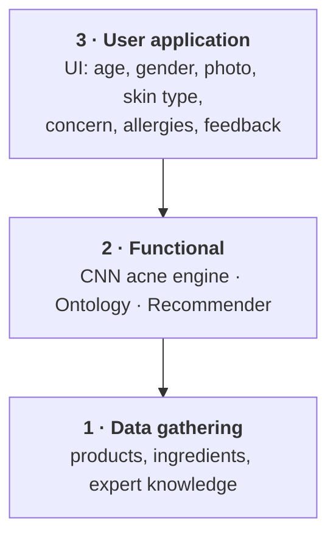
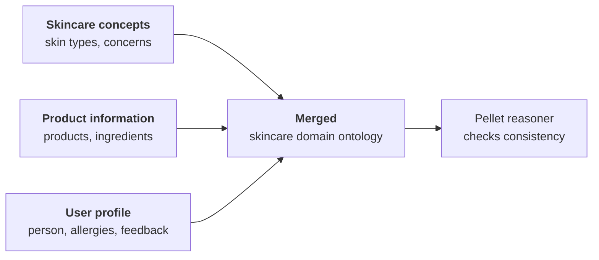
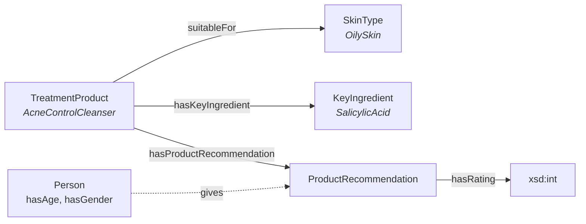
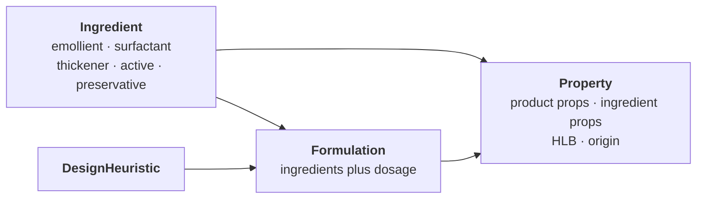
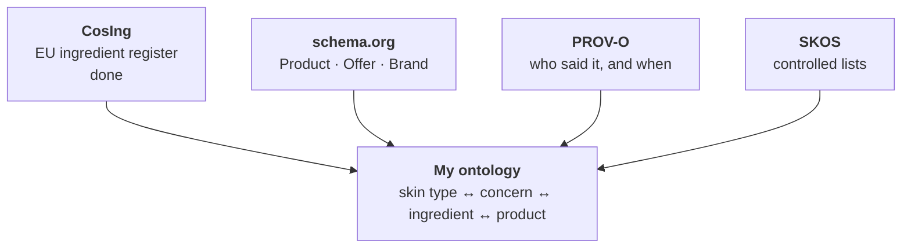
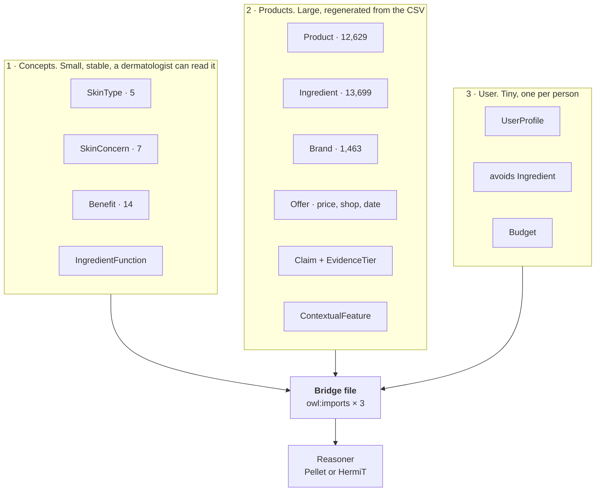
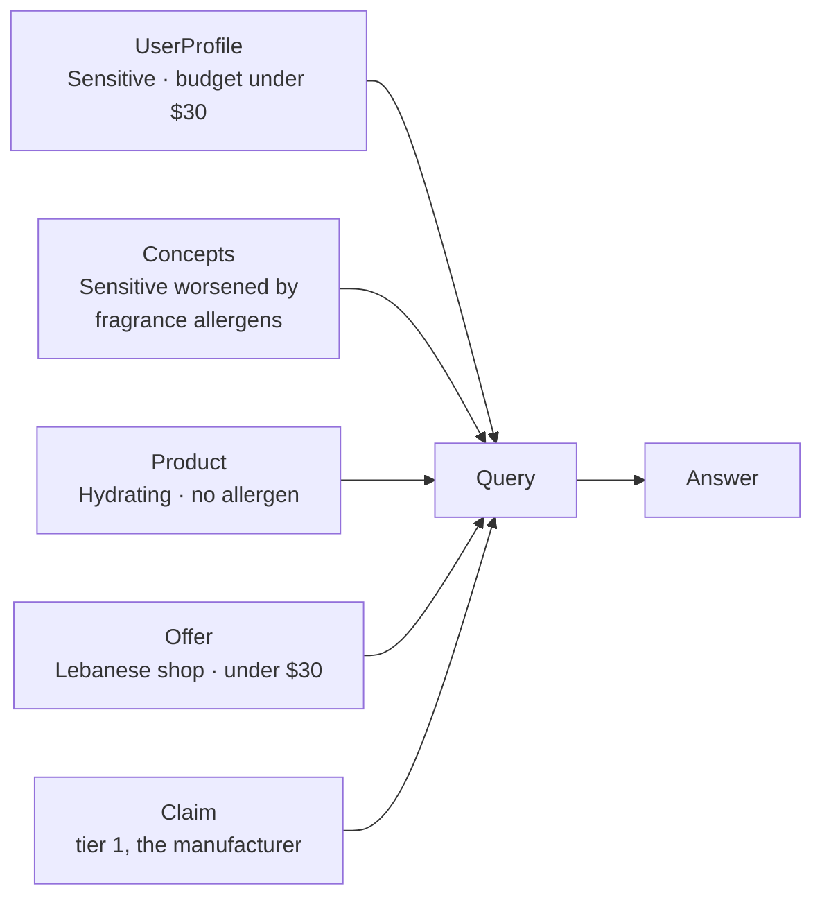

# Ontologies: what I read, what I am taking, what I am building

Five papers read. Four vocabularies chosen. One structure proposed.

---

## 1. The five papers at a glance

| # | Paper | What they built | Tools | What I take |
|---|---|---|---|---|
| 1 | **Hansanie & Silva (2024)**, IEEE ICIPRoB | CNN grades acne from a photo, an OWL ontology does the recommending | Protégé, **Pellet**, Owlready2, Tkinter | **Three ontologies merged**, reasoner from day one |
| 2 | **Personalized Skincare Rec. System (2025)** | Methontology ontology, 3,800 products scraped | Protégé, Methontology | `Formulation`, `ApplicationFrequency`, `SkinConcern` as a class |
| 3 | **Moe & Aung (2014)**, IJITCS | Two ontologies with a bridge between them | Protégé, Taxonomic CCBR, Ford Fulkerson | **`ContextualFeatures`**: price, place, brand |
| 4 | **Serna et al. (2021)**, OntoCosmetic | Knowledge base for *designing* emulsions | Protégé | Ingredients typed by **function** |
| 5 | **Gabriel et al. (2023)**, ESCAPE 33 | Formultools app built on OntoCosmetic | Protégé, mobile app | Split **product** from **ingredient** properties |

Papers 4 and 5 are about formulating products, not recommending them. I cite
them and borrow their ingredient structure. I do not import their ontology.

---

## 2. Paper 1, Hansanie & Silva (2024)

### Their system: three layers

### Their ontology: three files, then merged

### Their classes and properties, as published

### Three facts worth stating

| Fact | Detail |
|---|---|
| Vocabulary source | They interviewed dermatologists and health professionals, then surveyed 21 consumers aged 21 to 30 |
| Class hierarchy | Built top down: general concepts first, then specialised |
| The 87.5% figure | **Not model accuracy.** Their CNN scored 77.5% accuracy, 76.6% F1. The 87.5% is how many of 24 survey participants said they liked the results |

### Take or leave

| Take | Leave |
|---|---|
| Three ontologies, merged | The CNN. I have no facial images and no ethics approval |
| Pellet or HermiT reasoner from the start | Tkinter desktop interface |
| Feedback (`hasRating`) modelled inside the ontology | |
| Owlready2 to query from Python | |

---

## 3. Paper 3, Moe & Aung (2014)

Two ontologies joined by an explicit bridge.

**The idea worth taking is `ContextualFeatures`.** Price, place and brand are
not properties of a product on its own. They describe a product *as sold in a
place*. The same cream in Beirut and in a global catalogue sits in two
different contexts.

Four of my columns belong there:

| My column | Values | Belongs under |
|---|---|---|
| `price_tier` | 3 | `ContextualFeature` |
| `sold_by_shops` | 9 retailers | `ContextualFeature` |
| `country` | 55 | `ContextualFeature` |
| `source_category` | 4 | `ContextualFeature` |

**Leave:** the conversational question asking, and Ford Fulkerson. My products
already carry scores for availability, price and evidence tier.

**Their weak point:** ingredients are stored as plain text with no register
behind them, so nothing in their ontology can say an ingredient is restricted
under EU law. Mine can.

---

## 4. Papers 4 and 5, OntoCosmetic

Built for a chemist designing a cream, not for a person choosing one. Gabriel
et al. turned it into an app called Formultools that screens ingredients,
selects them against criteria, and checks a formulation against heuristics.

| Take | Leave |
|---|---|
| Ingredients typed by **function**. I already hold this in `ingredient_functions`, 92.7% | HLB, rheology, dosages. I have none of that data and never will |
| Split **product properties** (`spf`, `size_ml`) from **ingredient properties** (function, restriction) | The formulation design branch |
| Origin, natural or synthetic, as an ingredient property | |

---

## 5. What I am reusing: four vocabularies

| Vocabulary | Does what | Where I stand |
|---|---|---|
| **CosIng** | ingredient to function, CAS number, restriction | **Done.** 11,704 products linked, 92.7% |
| **schema.org** | separates `Product` (the thing) from `Offer` (one shop, one price, one date) | Needed for 9 Lebanese shops |
| **PROV-O** | `wasDerivedFrom`, `wasAttributedTo`, `generatedAtTime` | My tier 1 to 4 system |
| **SKOS** | turns 14 benefits, 7 concerns, 22 types, 5 skin types into concepts rather than strings | 8 columns |

**Dropped:** ChEBI, SNOMED CT, GS1 GPC, CHEMINF, OBI, eNanoMapper, OntoCAPE,
UMLS, DermO, SPO. Same reason each time: a large import, and nothing in it I
can use.

---

## 6. My proposed structure

Why three files and not one:

| Ontology | Changes when | Who checks it |
|---|---|---|
| Concepts | rarely, the knowledge is stable | a dermatologist |
| Products | constantly, every scrape and price | me, against the CSV |
| User profile | per person, at runtime | nobody, it is generated |

They meet at three shared classes. Keeping that interface small is what lets
each file be reviewed on its own.

| Shared class | User | Product | Concepts |
|---|---|---|---|
| `SkinType` | has it | suits it | knows what it is prone to |
| `SkinConcern` | reports it | addresses or worsens it | knows what helps it |
| `Ingredient` | avoids it | contains it | types it by function |

Everything else stays put. `Offer`, `Retailer` and `Brand` never leave the
product file. `Budget` never leaves the user file.

---

## 7. The test I will hold it to

> A hydrating serum under $30, sold in Beirut, safe for sensitive skin, where
> the suitability claim came from the manufacturer.

If the merged ontology answers this, the structure works.

---

## 8. Build order

| Step | What | How |
|---|---|---|
| 1 | Concepts ontology | By hand. Small enough to print and take to a dermatologist |
| 2 | Product ontology | Generated from `SKINCARE_FINAL.csv`. Never edited by hand |
| 3 | User profile | Last, once I know what steps 1 and 2 can answer |
| 4 | Bridge file | `owl:imports` and the three joins, nothing else |
| 5 | Reasoner | After **every** step, not at the end |

---

## 9. Where I stand against all five papers

| | Papers 1 to 3 | Papers 4 and 5 | **Mine** |
|---|---|---|---|
| Products | 3,800 | not applicable, a design tool | **12,629** |
| Ingredients linked to a regulator | no, plain text | no, supplier data | **yes, CosIng, 92.7%** |
| Records who made each claim | no | no | **yes, tier 1 to 4 plus the source page** |
| Local availability and price | no | no | **yes, 9 Lebanese shops, USD and LBP** |
| Reviewed by a dermatologist | yes, paper 1 | yes | **not yet, my gap** |

Two points I should make before anyone else does:

1. Paper 1 built their vocabulary with dermatologists. I did not. Mine came
   from what retailers publish, checked against the formula. That is a real
   gap and closing it is a next step.
2. Size is not my argument. 12,629 against 3,800 sounds stronger than it is,
   because their ingredient depth per product is similar. **Provenance,
   regulatory linkage and local availability** are the arguments.

---

## References

| # | Reference | File |
|---|---|---|
| 1 | Hansanie, M. and Silva, T. (2024). *Ontology based Machine Learning Approach for Facial Skincare Products Recommendation.* IEEE ICIPRoB, University of Moratuwa. DOI 10.1109/ICIPRoB62548.2024.10543444 | `papers/ICIPRob2024_paper_287.pdf` |
| 2 | *Personalized Skincare Recommendation System Based on Ontology and User Preferences* (2025). ResearchGate 394583703 | not open access |
| 3 | Moe, H.H. and Aung, W.T. (2014). *Building Ontologies for Cross-domain Recommendation on Facial Skin Problem and Related Cosmetics.* IJITCS 6(6):33 to 39. DOI 10.5815/ijitcs.2014.06.05 | `papers/Building_Ontologies_for_Cross_domain_Rec.pdf` |
| 4 | Serna, J. et al. (2021). *Towards an ontology-based decision support system for the design of emulsion based cosmetic products.* ECCE13. HAL hal-04674074 | `papers/Towards an ontology-based...pdf` |
| 5 | Gabriel, A. et al. (2023). *Decision making software for cosmetic product design based on an ontology.* ESCAPE 33, 1987 to 1992. DOI 10.1016/B978-0-443-15274-0.50316-4 | `papers/Chapter-ESCAPE-33-FINAL.pdf` |
| 6 | Noy, N.F. and McGuinness, D.L. (2001). *Ontology Development 101.* Stanford KSL-01-05 | |
| 7 | European Commission (2009). *Regulation (EC) No 1223/2009 on cosmetic products* | |
| 8 | W3C (2013). *PROV-O.* W3C (2009). *SKOS Reference* | |
