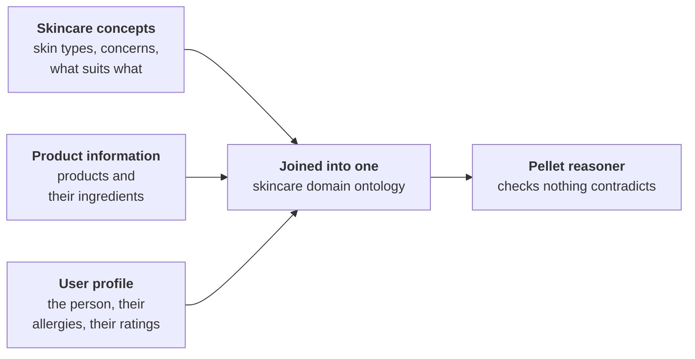
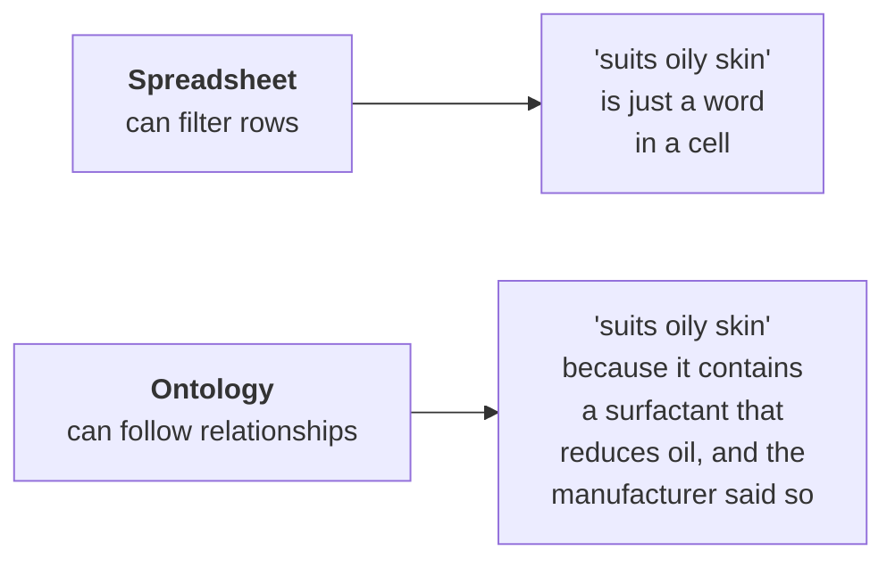
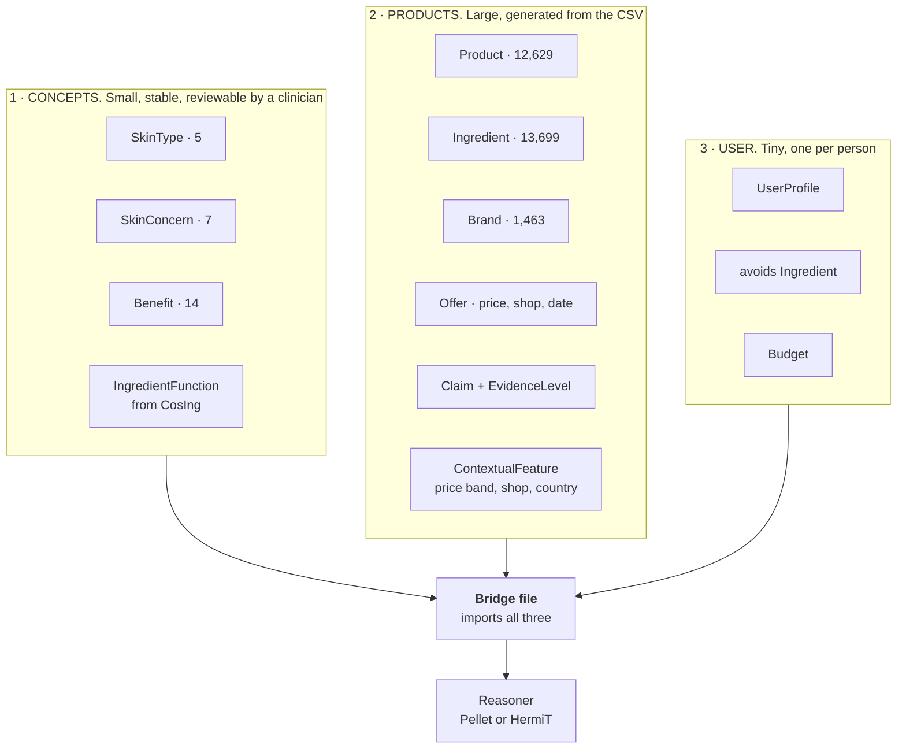
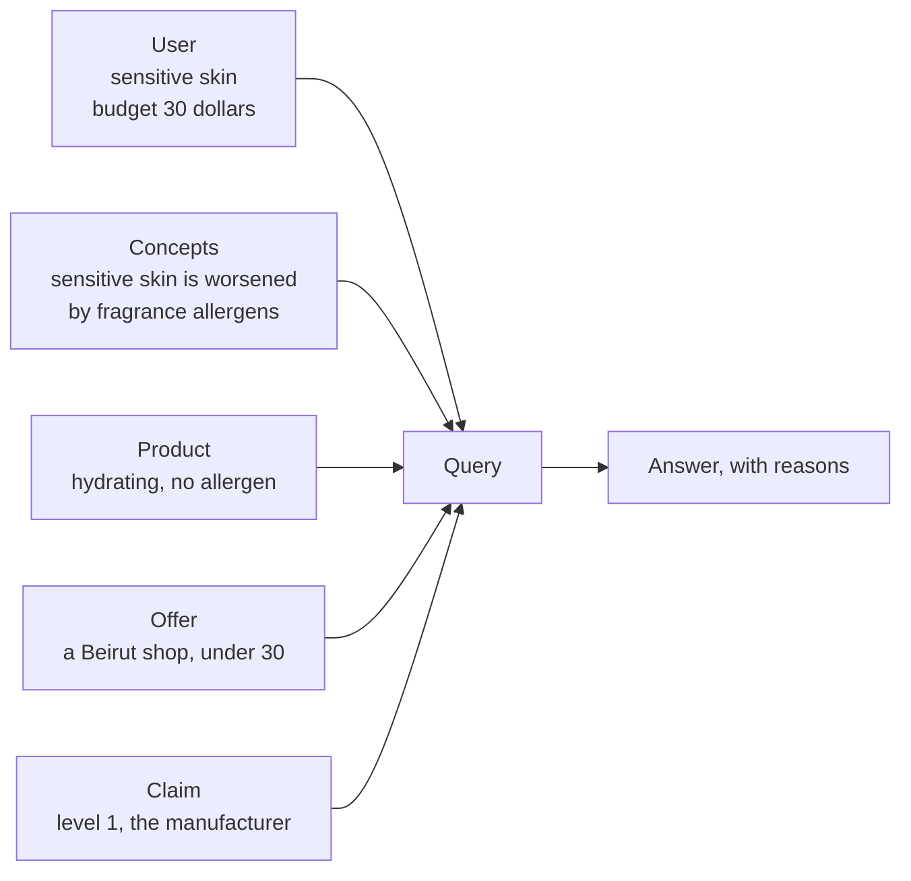

# The ontology phase: what I read, what I am building, and why

This is my working note for the ontology part of the thesis. I am writing it
the way I would explain it to myself, because most of these words were new to
me a few weeks ago.

---

## 1. The words, in plain language

Before anything else, here is the vocabulary. I kept getting lost in it, so
this table stays at the top.

| Word | What it actually means | Example from my work |
|---|---|---|
| **Ontology** | A structured description of a subject: the things that exist in it, and how they relate. Not a database of rows, a description of *kinds of thing* | "A Product has Ingredients. An Ingredient has a Function. A SkinType can be worsened by an Ingredient." |
| **Class** | A kind of thing | `Product`, `Ingredient`, `SkinType` |
| **Individual** (or instance) | One actual member of a class | `Revox B77 Niacinamide Moisturiser` is one individual of the class `Product` |
| **Object property** | A link between two individuals | `Revox B77` **suitableFor** `OilySkin` |
| **Data property** | A link from an individual to a plain value like a number or a word | `Revox B77` **hasPrice** `8.83` |
| **OWL** | Web Ontology Language. The file format ontologies are written in. A `.owl` file is XML text that any ontology tool can open | The OntoCosmetic file I was sent is 235 KB of OWL |
| **Protégé** | Free desktop software from Stanford for building ontologies. You click to add classes and properties instead of typing XML | Every paper I read used it |
| **Reasoner** | A program that reads the ontology and works out what follows logically from what you wrote, and tells you if you contradicted yourself | If I say a product suits sensitive skin, and separately that it contains a known irritant that sensitive skin must avoid, a reasoner flags the clash |
| **Pellet** | One reasoner. Older, widely used, the one Hansanie and Silva used | |
| **HermiT** | Another reasoner. Newer, usually faster, ships inside Protégé | Either works; I only need one |
| **Inference** | A fact the reasoner works out that I never typed | I say `AcneCleanser` is a kind of `Cleanser`, and `Cleanser` is a kind of `Product`. The reasoner concludes `AcneCleanser` is a `Product` without me saying it |
| **Query** | A question asked of the ontology, in the way a search is asked of a database | "give me every product that suits oily skin, costs under 30 dollars, and is sold in Beirut" |
| **SPARQL** | The standard query language for this kind of data. The equivalent of SQL for spreadsheets and databases | |
| **Owlready2** | A Python library that lets me open an OWL file and work with its classes as if they were normal Python objects, instead of writing SPARQL by hand | My whole pipeline is Python already, so this fits |
| **INCI** | International Nomenclature of Cosmetic Ingredients. The standard naming system printed on every product label | Water is written `AQUA`, vitamin B3 is written `NIACINAMIDE` |
| **CosIng** | The European Commission's register of cosmetic ingredients, 28,573 of them, kept under Regulation (EC) 1223/2009 | I have already linked my dataset to it |

---

## 2. What I am actually building, in one paragraph

A person in Lebanon says what their skin is like and what they can spend. The
system returns skincare products that suit them **and that they can actually
buy here**, and for each recommendation it can say where the claim came from.
The ontology is the part in the middle that holds the knowledge: which
ingredients suit which skin, which ones make which problems worse, and what
each product contains.

---

## 3. The papers

Five works. Before the detail, the whole of section 3 on one screen, because
this is the table I would want if somebody asked me in a viva what each paper
contributed.

| | Methodology | Technique | Results | Evaluated? |
|---|---|---|---|---|
| **3.1 Hansanie and Silva (2024)** | dermatologist interviews plus a survey of 21 people, then top down class building, split into three ontologies | CNN grades acne from a photograph, grade written into the ontology, Pellet reasons, Owlready2 queries from Python | CNN accuracy **77.5%**; **87.5%** of 24 survey participants satisfied | partly. No baseline, small sample |
| **3.2 Moe and Aung (2014)** | eight stated ontological engineering tasks, from glossary of terms to constants table | Taxonomic CCBR narrows the problem, then Ford Fulkerson maximum flow over a weighted graph scores products | flow weights 0.38 to 0.70 per product, ranked; precision, recall and F measure plotted against a threshold alpha | partly. Metrics reported, but no dataset size and no baseline |
| **3.3 Serna et al. (2021)** | knowledge base assembled from subproblems, solution strategies, ingredient databases and heuristics | emulsion science encoded as heuristics with high and low thresholds, each carrying its source | a case study: the design of a moisturising cream | no |
| **3.3 Gabriel et al. (2023)** | five planes user centred design, co-design with cosmetics experts, iterative usability testing measured with AttrakDiff | cross platform mobile app on OntoCosmetic; ingredient screening, multi criteria selection, formulation checking | a working tool performing its three functions | **no, and they say so**: expert testing was still future work |
| **3.4 Abesova et al. (2023)** | middle out, iterative, scope widened twice as new CSVs arrived | OntoRefine to make RDF, GraphDB to hold it, DBpedia through a SPARQL endpoint, class restrictions instead of manual tagging | 36 classes, 6 object and 6 data properties; 9 recommended products for one user | no. One worked example, three limitations stated |
| **3.5 Noy and McGuinness (2001)** | the seven step guide the other four are all following, knowingly or not | competency questions, reuse before invention, class versus property test | not a system, a method | not applicable |

**What that table tells me, and it is the thing I should say first.** Not one of
these five reports an evaluation against a ground truth set of correct
recommendations. Two report user opinion, one reports internal metrics with no
baseline, one is a case study, one was never tested with experts. The bar for
evaluation in this area is low, so if I evaluate properly I have something, and
if I do not I am no worse than the published work but no better either.

### 3.1 Hansanie and Silva (2024), IEEE ICIPRoB
`papers/ICIPRob2024_paper_287.pdf`

**What they built.** A system where a person uploads a photo of their face. A
neural network (a CNN, a type of model that reads images) grades how severe
their acne is. That grade goes into an ontology together with what the person
typed about their skin, and the ontology picks the products.

#### Methodology: where their vocabulary came from

They did not start from a spreadsheet. They started from people.

| Step | What they did |
|---|---|
| 1 | Interviewed dermatologists and health professionals |
| 2 | Surveyed 21 people aged 21 to 30 about routines and buying habits |
| 3 | Wrote the results into a spreadsheet |
| 4 | Turned the spreadsheet into classes, building the hierarchy **top down**, general idea first (`Product`), specific ones underneath (`TreatmentProduct`, then `AcneControlCleanser`) |
| 5 | Split the result into three files rather than one |

#### Technique: three ontologies joined, and a network in front

They did not build one big file. They built three separate ones and joined them:



They built the class hierarchy **top down**, meaning they wrote the general
idea first (`Product`) and then the specific ones underneath it
(`TreatmentProduct`, then `AcneControlCleanser`).

**Their actual properties, copied from the paper:**

| Property | From | To | Plain meaning |
|---|---|---|---|
| `suitableFor` | `TreatmentProduct` (AcneControlCleanser) | `SkinType` (OilySkin) | this product suits this skin |
| `hasKeyIngredient` | `TreatmentProduct` | `KeyIngredient` (SalicylicAcid) | this is what is in it |
| `hasProductRecommendation` | `TreatmentProduct` | `ProductRecommendation` | a user rated it |
| `hasAge`, `hasGender` | `Person` | a number, a word | who the user is |
| `hasRating` | `ProductRecommendation` | a number | the score they gave |

The photograph is graded by the CNN, the grade is written into the ontology as
a fact about the person, and the reasoner does the rest. The image model and
the knowledge are kept apart, which is why one can be replaced without touching
the other.

**Their tools:** Protégé to build it, Pellet to check it, Owlready2 to query it
from Python, Tkinter (a basic Python toolkit for desktop windows) for the
interface.

| I take | Because |
|---|---|
| Three ontologies, joined | The three parts change at completely different speeds. Product data changes weekly. Clinical knowledge barely changes. Keeping them apart means I can hand a dermatologist one small file instead of 12,629 rows |
| A reasoner from the start | I have spent months finding faults in my own data that produced plausible wrong answers instead of errors. A reasoner is a tool that complains loudly, which is exactly what I have been missing |
| Ratings kept inside the ontology | A rating becomes a fact about a product with a person attached, not a separate table I have to remember to join |
| Owlready2 | My whole pipeline is Python |

#### Results

| What was measured | Number |
|---|---|
| Accuracy of the CNN grading acne severity | **77.5%** |
| Survey participants who said they were satisfied with the products shown | **87.5%** of 24 people |

**Read those two numbers correctly.** The headline in the paper is 87.5
percent. That is user satisfaction, not system accuracy. The model itself
scored 77.5. There is no comparison against a baseline recommender and no test
set of correct recommendations, so the 87.5 is an opinion poll on a small
group, not a measure of correctness. I will quote it as what it is.

#### What I take, and what I leave

**What I leave:** the CNN. I have no facial photographs, no ethical approval to
collect any, and my contribution is on the product side. Their three layer
design means it could be added later without touching anything else.

**One number to be careful with.** Their headline is 87.5 percent. That is not
the accuracy of their model. Their model scored 77.5 percent accuracy. The 87.5
is the share of 24 survey participants who said they liked the products they
were shown. I should quote it correctly.

**One thing they did that I have not.** They consulted dermatologists. My skin
type and concern vocabulary came from what retailers publish, checked against
the formula. Nobody clinical has reviewed it. That is a real gap and I should
say so before anyone asks.

---

### 3.2 Moe and Aung (2014), IJITCS 6(6):33 to 39
`papers/Building_Ontologies_for_Cross_domain_Rec.pdf`
University of Technology Yatanarpon Cyber City, and University of Computer
Studies Yangon, Myanmar

**What they built.** Two ontologies with a bridge between them. One holds the
user's *problem*, the other holds *cosmetics*. A recommendation is a path from
a problem to a product.

#### Methodology: eight tasks, in order

They did not improvise. They followed a stated ontological engineering
procedure, and this is the part worth copying because it is a checklist I can
actually follow:

| Task | What it produces |
|---|---|
| 1 | A glossary of terms: every term, its plain language definition, its synonyms and acronyms |
| 2 | Concept taxonomies, to classify the concepts |
| 3 | Binary relation diagrams, showing how concepts relate to each other and to concepts in other ontologies |
| 4 | A concept dictionary: the instances of each concept, their attributes, their relations |
| 5 | A description of every binary relation in detail |
| 6 | A description of every instance attribute |
| 7 | A description of every class attribute |
| 8 | A constants table, for values that never change |

Both ontologies were then built in Protege.

#### Technique: how the recommendation is computed

Three stages.

**Stage 1, narrowing the problem.** Taxonomic Conversational Case Based
Reasoning. The user gives a rough query. The system ranks and presents
questions. The user answers some. It repeats until a definite problem is
identified. Their `isNextRelatedTo` property is what builds the question
taxonomy.

**Stage 2, joining the two domains.** The problem and the products are placed
in a weighted directed acyclic graph, with the problem as source and products
as targets.

**Stage 3, scoring.** They apply the Ford Fulkerson maximum flow algorithm,
citing Kirchhoff's law: *everything that leaves the source must eventually get
to the sink*. Each product ends up with a flow weight:

```
W(v_i) = sum over k of f(v_i,k)      f is the weight of the flow
```

The higher the flow weight, the stronger the semantic relation between the
user's problem and that product.

#### Results

Their worked example produces a flow weight per product:

| Product | Flow weight | | Product | Flow weight |
|---|---|---|---|---|
| 8 | **0.70** | | 3 | 0.53 |
| 7 | 0.60 | | 5 | 0.52 |
| 9 | 0.60 | | 2 | 0.45 |
| 4 | 0.58 | | 1 | 0.38 |

Recommendation is simply that list in descending order.

**How they evaluated it.** Precision, recall and F measure. They note the
tension honestly: making the recommendation set larger raises recall and lowers
precision, so F measure is used because it weights both equally.

They then introduce a threshold **alpha**, the flow weight above which a
product is recommended, and run an experiment to choose it, reporting how
precision, recall and F measure move as alpha changes.

**What is missing from their results, and I should notice it.** They report the
shape of the relationship but no dataset size, no number of users, and no
comparison against a baseline. The claim that the system is "more accurate than
other related works" is not supported by a table anywhere in the paper.

#### What I take, and what I leave

| Take | Why |
|---|---|
| **The eight task methodology** | It is a checklist. Task 1, a glossary of terms with synonyms, is exactly what my `benefits` and `concerns` columns need, since "Hydrating" and "Hydration" are the same concept |
| **`ContextualFeatures`** | Their class for `PlaceZone`, `AgeLevel`, `CosmeticsBrand`, `Season`, `PriceRange`. Price and place describe a product *as sold somewhere*, not the product itself. My `price_tier`, `sold_by_shops`, `country` and `source_category` all belong there |
| **Tuning a threshold and reporting it** | When I score products I should show how the cutoff was chosen, not just assert one |

| Leave | Why |
|---|---|
| Taxonomic CCBR | No user facing system yet, and no user study |
| Ford Fulkerson | Heavier than I need. My products already carry availability, price and evidence level, so a weighted filter does the same job |

**Their weak point, which is my strength.** Ingredients are stored as
`hasIngredients` and `hasIngValue`, free text and a number, with no register
behind them. Nothing in their ontology can say an ingredient is restricted
under EU law. Mine can, for 99.2 percent of products that have a formula.

---

### 3.3 Serna et al. (2021) and Gabriel et al. (2023): OntoCosmetic
`papers/Towards an ontology-based decision support system...pdf`
`papers/Chapter-ESCAPE-33-FINAL.pdf`
`papers/OntoCosmetic-30-withoutRules.owl`
Universite de Lorraine (ERPI-ENSGSI and LRGP), with Universidad Nacional de
Colombia

Two papers, one ontology, two years apart. The first builds it, the second
turns it into software.

#### Paper 1, Serna et al. (2021): building the knowledge base

**Methodology.** They built the knowledge base out of four kinds of material,
combined deliberately rather than scraped:

| Building block | What it holds | Example from the paper |
|---|---|---|
| General subproblems | physicochemical properties to promote or limit | achieving shear thinning or thixotropic behaviour |
| General solution strategies | a route to a goal, not yet tied to a compound | implementing a steric surfactant system |
| Ingredient databases | typed by function | emollients, surfactants, preservatives, actives |
| Heuristics | rules connecting ingredients to the above | |

**Technique.** Emulsion science principles plus expert knowledge, encoded as
heuristics with thresholds. Their file has `hasHeuristicHighThreshold`,
`hasHeuristicLowThreshold` and `hasHeuristicSource`, so every rule records the
numbers it fires on and where the rule came from. That last one is provenance,
in a formulation ontology.

**Results.** A demonstration, not an evaluation: they design a moisturising
cream with it. They list four intended uses: analysing solution strategies,
supporting reformulation and ingredient substitution, designing a new product,
and representing a design graphically.

#### Paper 2, Gabriel et al. (2023): Formultools

**Methodology.** This one is about how the software was designed, and it is
more rigorous than the first:

| Step | What they did |
|---|---|
| Design approach | the five planes user centred design method (Garrett, 2011) |
| Who was involved | co-design between cosmetics experts and computer scientists |
| How it developed | iteratively, with usability tests between iterations |
| How each iteration was measured | the **AttrakDiff** questionnaire (Lallemand et al., 2015), a standard instrument for user experience |
| When it stopped | when the problems found by non expert testers were resolved |

**Technique.** A cross platform mobile application sitting on OntoCosmetic. It
supports three decisions:

1. screening ingredients by their properties
2. selecting ingredients against multiple criteria, meaning performance, origin
   and price together
3. evaluating a candidate formulation against the design heuristics

They cite the Analytic Hierarchy Process (Saaty, 1987) for handling the
multiple criteria.

**Results, and this is the honest part.** The tool works and performs its three
functions. But the conclusion states plainly that **it had not yet been tested
with experts at the time of publication**: "in a near future, it will be tested
with experts and improved for its subsequent application in real design cases."

So neither OntoCosmetic paper reports an evaluation against ground truth. One
is a case study, the other is a usability process with the expert evaluation
still pending. Worth knowing before I cite either as evidence that ontology
based tools work.

#### What is actually in the file

I have the OWL, so these numbers are counted rather than quoted:

| | |
|---|---|
| Classes | 116 |
| Object properties | 26 |
| Data properties | 20 |
| Individuals already filled in | 279 |
| Address | `https://purl.org/ontocosmetic` |

Its classes are `HLB`, `DropletSize`, `Rheology`, `AqueousThickeners`,
`OWCosmeticEmulsion`, `HeuristicForSurfactant`, `MeltingPoint`,
`Emollient_Dosage`. This is a tool for making a cream stable, not for choosing
one in a pharmacy.

#### What I take, and what I leave

| Take | Why |
|---|---|
| The **ingredient type names**: `Emollient`, `Surfactant`, `Thickener`, `Active`, `Preservative`, `UvFilter`, `Humectant`, `Antioxidant`, `Stabilizer`, `PHRegulator` | I already hold ingredient functions from CosIng on 92.7 percent of products. Using their names avoids inventing a third vocabulary. Although since CosIng is the Commission and OntoCosmetic is a secondary source, taking the names straight from CosIng is the cleaner argument |
| The split between `ProductProperty` and `IngredientProperty` | I was mixing them. `spf` and `size_ml` belong to the product. Function and restriction belong to the ingredient and are inherited from the register |
| `hasOrigin`, natural or synthetic | People ask about this constantly. My `free_from` column is a crude version |
| `hasHeuristicSource` | Every rule records where it came from. That is the same instinct as my evidence levels, applied to rules instead of claims |

| Leave | Why |
|---|---|
| The whole emulsion science branch | HLB, droplet size, rheology, dosage. Manufacturers do not publish any of it and I never will have it |
| Importing the file | 116 classes to use ten of them |

**The sentence for my supervisors.** OntoCosmetic is the closest published
cosmetics ontology, so I read it and opened the file. It models formulation
chemistry for a designer. I model retail availability for a buyer. I borrow its
ingredient classification and cite it, and I do not import it.

---

### 3.4 Abesova, Hajkova, Ramadan and Zdych (2023), Skincare Ontology
`papers/Skincare_Ontology_for_Personalised_Recommendation.pdf`
Vrije Universiteit Amsterdam, Knowledge and Data course, Group 31

**First, what this is.** A student final project, not a peer reviewed paper. I
should say that when I cite it. It is still the most useful of the five for me,
because it is the only one that shows the mechanism I had not understood.

**What they built.** A recommender over Sephora product and review data. The
user gives four things: skin type, skin tone, which country they live in, and
how complicated a routine they are willing to follow. The system returns a
routine.

#### Methodology: middle out, and it is honest about being messy

They state the approach plainly: **middle out**, meaning start with the
concepts you are sure of and work outward in both directions, towards the
abstract and towards the specific, rather than top down or bottom up.

| Step | What happened |
|---|---|
| 1 | One team member built a base ontology with the main classes and properties |
| 2 | A Sephora review CSV was found, which **widened the scope** and forced new classes |
| 3 | Classes and properties were added to fit the new data |
| 4 | A second CSV, on the countries with Sephora shops, was folded in the same way |
| 5 | More properties were added to join the two sources together |

They describe it as iterative. That matches my situation exactly: I did not
know my final columns when I started either, and my scope widened when the
Lebanese origin products arrived.

**Size of the result:** 36 classes, 6 object properties, 6 data properties.
Small, and it still does something.

#### Technique: OntoRefine, GraphDB, DBpedia, SPARQL

| Tool | Used for |
|---|---|
| **OntoRefine** | turning the scraped Sephora CSV into RDF, mapping columns to classes |
| **GraphDB** | holding the graph and running the queries |
| **DBpedia** | pulled in through an external SPARQL endpoint. `dbr:Czech_Republic` gave them the country, and the latitude and longitude of its capital for the map |
| **SPARQL** | the recommendation itself is a set of queries, not code |
| **Class restrictions** | products are placed in skin type classes by a rule, not by hand |

The DBpedia step is the one to notice. They did not type country data. They
linked to something that already had it, and got coordinates for free. That is
what reusing vocabulary actually looks like in practice.

**Their classes:**

| Class | Values |
|---|---|
| `Category` | Cleanser, Moisturizer, Treatment. Treatment splits into Exfoliant (Chemical, Physical), Serum, Toner, and SPF sits under Moisturizer |
| `Product` | with four subclasses: Oily, Dry, Normal and Combination Skin Products |
| `Skin Type` | Oily, Dry, Normal, Combination |
| `Skin Tone` | Porcelain, Fair, Light, Medium, Olive, Tan, Deep, Dark, Ebony |
| `Brand`, `Country`, `Rating Stars`, `Review Id` | |

**Their properties:**

| Object property | Links |
|---|---|
| `hasBrand` | Product to Brand |
| `hasCategory` | Product to Category |
| `hasSkinType` | Review to Skin Type |
| `hasSkinTone` | Review to Skin Tone |
| `aboutProduct` | Review to Product |
| `hasReviewId` | Product to Review |

| Data property | Value |
|---|---|
| `hasRating` | stars |
| `hasOilyScore`, `hasDryScore`, `hasNormalScore`, `hasCombinationScore` | a decimal per skin type |
| `hasSephoraWebPage` | the shop link for that country |

#### Results

Their output for one user is **9 recommended products**, three per category,
plus the Sephora page for that user's country and whether there is a physical
shop.

They report no accuracy, no precision, no user study. The outcome section
describes one worked example and admits the interface was rushed, showing full
URIs instead of product names.

**Their three stated limitations, which I should read carefully because two of
them are my opening:**

| Their limitation | What it means for me |
|---|---|
| 1. Every product in `Oily Skin Products` has a rating of exactly 5.0, so there is no way to rank within the class. The same top three come out every time | A defined class puts products in a set but does not order them. I need a separate ranking signal, and availability and price in Lebanon are mine |
| 2. A product with a single 1.0 review can be recommended ahead of products known to score 5.0, because the two selection paths are not comparable | Thin evidence beating strong evidence. My level columns exist precisely so that a claim with one weak source is not treated as equal to a manufacturer statement |
| 3. **"class restrictions based on ingredients could be developed. This would ensure a more symbolic and chemical approach, compared to the statistical one that is currently employed"** | This is my contribution, written as future work in somebody else's paper. Their classes are built on review scores. Mine are built on the formula, checked against the EU register on 99.2 percent of products with an ingredient list |

That third one is worth saying out loud in the defence. The gap they name is
the gap the dataset fills.

### The idea I am taking, and it is the important one in this whole document

They do not tag a product as being for oily skin. They **define what the phrase
means** and let the reasoner work out which products qualify:

```
Oily Skin Products  is equivalent to  hasOilyScore value 5
```

This is called a **defined class** (as opposed to a class you assign by hand).
The difference in practice:

| Without it | With it |
|---|---|
| I write "suits oily skin" on 4,000 rows | I write the rule once |
| If a formula is corrected, the tag stays wrong until I remember to fix it | Membership recalculates itself |
| A reviewer has to trust my tagging | A reviewer reads one line and can check it |

**This is the answer to "why not just use the spreadsheet".** My spreadsheet
can filter. It cannot hold a definition. Three defined classes are already
written into `vocabularies/skincare-profile.ttl`:

| Defined class | Means |
|---|---|
| `SensitiveSafeProduct` | any product containing none of the 26 EU declarable allergens. The reasoner finds them, I do not list them |
| `AvailableInLebanon` | any product with at least one Offer from a Lebanese shop. The class this whole project exists for |
| `ManufacturerStatedProduct` | any product whose suitability claim carries evidence level 1 |

**Three more things I take:**

| From them | Why |
|---|---|
| **Skin tone as a separate dimension from skin type** | I do not have it at all. Nine values, and it matters for sun care and pigmentation products, which is a large part of the Lebanese market |
| **A score per skin type instead of one label** | My `skin_type` holds one value. A decimal for each of the four would let a product be mostly for oily skin and partly for combination, which is closer to the truth |
| **Routine complexity as a user input** | People abandon routines that are too long. A three step routine for a beginner is a real filter, and I could derive it from product type |

**Their tools, and one I did not know about:**

| Tool | What it does |
|---|---|
| **OntoRefine** | part of GraphDB. Maps a CSV file to RDF triples through a visual interface, instead of writing a conversion script. This is exactly my step 4, and I should try it before writing Python |
| **SPARQL** | the query language. Their report includes the actual queries |
| **geo** and **dbo** vocabularies | they queried DBpedia, an open database built from Wikipedia, to get capital city coordinates and draw a map of which countries have a Sephora |

That last one is directly useful to me. They used `Country` plus geography to
answer "can this person buy it where they live". That is my whole problem,
except that mine is one country and nine shops rather than a global map.

**Where their work is weaker than mine, and it is a large gap:** their ontology
has **no ingredients in it at all**. Products, brands, ratings, skin scores,
but nothing about what is inside the bottle. So it cannot say why a product
suits oily skin, only that reviewers with oily skin rated it well. Mine holds
13,699 ingredients, 99.2 percent of them resolved against the EU register.

**One thing I respect about the report.** They state a mistake in their own
work: `Product hasCategory Category` was never implemented, they used
`rdf:type` instead, and they found out too late to fix it. They wrote it down
rather than hiding it. I have made more mistakes than that in this project and
I should be equally direct about them.

---

### 3.5 Noy and McGuinness (2001), Ontology Development 101

The standard beginner's guide, cited by all the papers above. Its main advice
is the reason this document exists: **look for an existing vocabulary before
inventing your own.**

---

## 4. Why my design looks the way it does

This is the section I most need to be able to defend, so here is the reasoning
in order.

### 4.1 Why an ontology at all, and not just the spreadsheet

My spreadsheet can already answer "show me products for oily skin under 30
dollars". What it cannot do is answer *why*, or notice a contradiction.



### 4.2 Why three files and not one

Because the three things change at different speeds and are checked by
different people.

| File | Changes | Who checks it | Size |
|---|---|---|---|
| Concepts | rarely | a dermatologist | small, a few pages |
| Products | every time I scrape | me, against the CSV | 12,629 products |
| User | every time somebody uses it | nobody, generated | tiny |

If I put them in one file, a dermatologist reviewing my clinical rules has to
open a file with 12,629 products in it. That will not happen.

### 4.3 Why evidence strength is in the model and not a footnote

Every claim in my dataset carries a level from 1 to 4 saying who made it:

| Level | Who said it | Count |
|---|---|---|
| 1 | the manufacturer | 4,460 |
| 2 | a retailer | 4,539 |
| 3 | a weaker published source | 1,954 |
| 4 | nobody, I worked it out from the formula | 1,676 |

Nearly 87 percent came from a source that actually stated it. If the system
treats my own guess the same as the manufacturer's statement, it will make
confident recommendations it cannot support. Putting the level in the ontology
means a query can simply exclude level 4.

### 4.4 Why availability is a first class idea

Every other paper I read assumes you can buy anything. In Lebanon you often
cannot. A product that suits your skin and is not sold here is not a
recommendation, it is a frustration. So `Offer`, `Retailer` and availability
are in the model, not bolted on afterwards.

---

## 5. My proposed structure



The three files meet at only three shared classes. Keeping that connection
small is what lets each file be reviewed on its own.

| Shared class | The user | The product | The concepts |
|---|---|---|---|
| `SkinType` | has one | suits some | knows what each is prone to |
| `SkinConcern` | reports some | helps or worsens some | knows what helps each |
| `Ingredient` | avoids some | contains some | knows what each one does |

### The four vocabularies I am reusing

| Vocabulary | What it gives me | Status |
|---|---|---|
| **CosIng** | every ingredient gets a function, a CAS number and a legal status from the European Commission | **Done.** 11,704 products, 99.2 percent of those with a formula |
| **schema.org** | the standard way to describe a `Product` separately from an `Offer` (one shop, one price, one date). Used by every search engine | to do |
| **PROV-O** | the W3C standard for saying where a fact came from, who said it and when | to do |
| **SKOS** | the standard for controlled lists, so `Hydrating` and `Hydration` become one concept with two labels instead of two different things | to do |

Dropped: ChEBI, SNOMED CT, GS1 GPC, CHEMINF, OBI, eNanoMapper, OntoCAPE, UMLS,
DermO, SPO. Same reason each time. A large import and nothing in it I can use.

**The files are in `vocabularies/`.** I do not keep copies of the four
vocabularies themselves, because they are maintained by other people and an
ontology imports them by address rather than by copying them.
`vocabularies/fetch_vocabularies.py` downloads them if I want to read one.

What is in there and is mine:

| File | What it is |
|---|---|
| `vocabularies/skincare-profile.ttl` | my ontology. 27 classes, 13 object properties, 4 data properties, and the three defined classes below. Open it in Protégé |
| `vocabularies/README.md` | the four vocabularies, their addresses and their licences |
| `vocabularies/fetch_vocabularies.py` | downloads them locally when needed |
| `papers/OntoCosmetic-30-withoutRules.owl` | the OntoCosmetic file, for reference, not imported |

---

## 6. How I will proceed, step by step

| Step | What I do | Tool | How I know it worked |
|---|---|---|---|
| 1 | Write the concepts ontology by hand. 5 skin types, 7 concerns, 14 benefits, and the ingredient function names borrowed from OntoCosmetic | Protégé | It fits on two printed pages |
| 2 | Run the reasoner on just that file | HermiT inside Protégé | No contradictions. For example nothing is both helped and worsened by the same ingredient function |
| 3 | Take those two pages to a dermatologist and have them corrected | paper | The gap I admitted in section 3.1 is closed |
| 4 | Turn `SKINCARE_FINAL.csv` into the product ontology | **OntoRefine** first (a visual CSV to RDF mapper inside GraphDB, which the VU group used), Owlready2 if that is not enough | 12,629 products load and the file opens in Protégé |
| 5 | Never hand edit the product file | | I can regenerate it any time the dataset changes |
| 6 | Write the user profile ontology | Protégé | It only holds what a person can tell me |
| 7 | Write the bridge file that imports all three | Protégé | The reasoner runs over the whole thing without complaint |
| 8 | Ask the test question below | Owlready2 or SPARQL | It returns products, and I can trace every part of the answer |

### The question I will test it with

> A hydrating serum under 30 dollars, sold in Beirut, safe for sensitive skin,
> where the suitability claim came from the manufacturer and not from me.



If it answers that correctly, the structure works. If it cannot, something in
the design is wrong and I would rather find out at step 8 than at the end.

---

## 7. Thinking about it as a product for the Lebanese market

My supervisors will ask what this is for beyond the thesis, so here is my
answer.

### Who would use it

| Who | What they get |
|---|---|
| A person buying skincare | Products that suit them **and are stocked here**, at prices in both dollars and lira |
| A pharmacy or shop | A way to guide customers using their own stock list rather than a foreign catalogue |
| A dermatologist | Something to point a patient at, where every claim can be traced to its source |
| A local brand | Their products appear next to international ones, which no global catalogue does for them |

### What makes it defensible as a local product

| Feature | Why it matters in Lebanon | Comes from |
|---|---|---|
| Only shows what can be bought here | 5,014 products are sold in Lebanese shops and appear in no global catalogue | `source_category` |
| Prices in dollars and lira, with the date | Prices move quickly and people are paid in one currency and charged in another | `price_usd`, `price_lbp`, `price_seen_date` |
| Includes 802 Lebanese made products | Local brands are invisible in every international dataset | Lebanese origin source |
| Every claim traceable | Builds trust, and a shop or clinic can check any recommendation | evidence levels 1 to 4 |
| Ingredients checked against EU law | A regulator said it, not me | CosIng |

### The honest commercial risks

| Risk | What I would say |
|---|---|
| Prices go stale | It is a snapshot with a date on every price, not a live feed. A live version needs a scraping schedule |
| 827 products still have no ingredient list | Mostly small local brands that publish nothing. Their pages are checked and recorded as such |
| No clinical review yet | Step 3 above |
| Not evaluated with real users | Hansanie and Silva used 24 participants. I would need something similar before claiming it works |

---

## 8. Where I stand next to the papers

| | Hansanie & Silva | Moe & Aung | OntoCosmetic | **Mine** |
|---|---|---|---|---|
| Purpose | recommend | recommend | design a formula | **recommend, in one market** |
| Products | small set | small set | 279 ingredients | **12,629** |
| Ingredients linked to a regulator | no | no | no | **yes, CosIng, 99.2 percent** |
| Records who made each claim | no | no | no | **yes, four levels plus the page** |
| Local availability and price | no | partly, `PriceRange` | ingredient price only | **yes, 9 shops, two currencies** |
| Reviewed by a clinician | **yes** | no | **yes** | **not yet** |

Two things I will say myself before anyone asks me:

1. Nobody clinical has reviewed my vocabulary yet. Step 3 fixes that.
2. Size is not my argument. Twelve thousand products against a few thousand
   sounds better than it is. **Provenance, regulatory linkage and local
   availability** are the arguments.

---

## 9. References

| # | Reference | File |
|---|---|---|
| 1 | Hansanie, M. and Silva, T. (2024). *Ontology based Machine Learning Approach for Facial Skincare Products Recommendation.* IEEE ICIPRoB. DOI 10.1109/ICIPRoB62548.2024.10543444 | `papers/ICIPRob2024_paper_287.pdf` |
| 2 | Moe, H.H. and Aung, W.T. (2014). *Building Ontologies for Cross-domain Recommendation on Facial Skin Problem and Related Cosmetics.* IJITCS 6(6). DOI 10.5815/ijitcs.2014.06.05 | `papers/Building_Ontologies_for_Cross_domain_Rec.pdf` |
| 3 | Serna, J. et al. (2021). *Towards an ontology-based decision support system for the design of emulsion based cosmetic products.* ECCE13. HAL hal-04674074 | `papers/Towards an ontology-based...pdf` |
| 4 | Gabriel, A. et al. (2023). *Decision making software for cosmetic product design based on an ontology.* ESCAPE 33. DOI 10.1016/B978-0-443-15274-0.50316-4 | `papers/Chapter-ESCAPE-33-FINAL.pdf` |
| 5 | OntoCosmetic ontology file, 116 classes | `papers/OntoCosmetic-30-withoutRules.owl` |
| 6 | Abesova, S., Hajkova, K., Ramadan, Y. and Zdych, M. *Skincare Ontology.* Vrije Universiteit Amsterdam, Knowledge and Data, Group 31. Student final project | `papers/Skincare_Ontology_for_Personalised_Recommendation.pdf` |
| 7 | *Personalized Skincare Recommendation System Based on Ontology and User Preferences* (2025). ResearchGate 394583703 | not open access |
| 8 | Noy, N.F. and McGuinness, D.L. (2001). *Ontology Development 101.* Stanford KSL-01-05 | |
| 9 | European Commission (2009). *Regulation (EC) No 1223/2009 on cosmetic products* | |
| 10 | W3C (2013). *PROV-O.* W3C (2009). *SKOS Reference.* schema.org vocabulary | |
