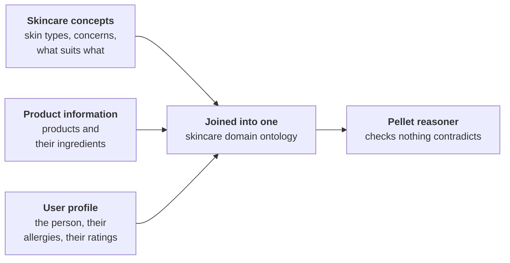
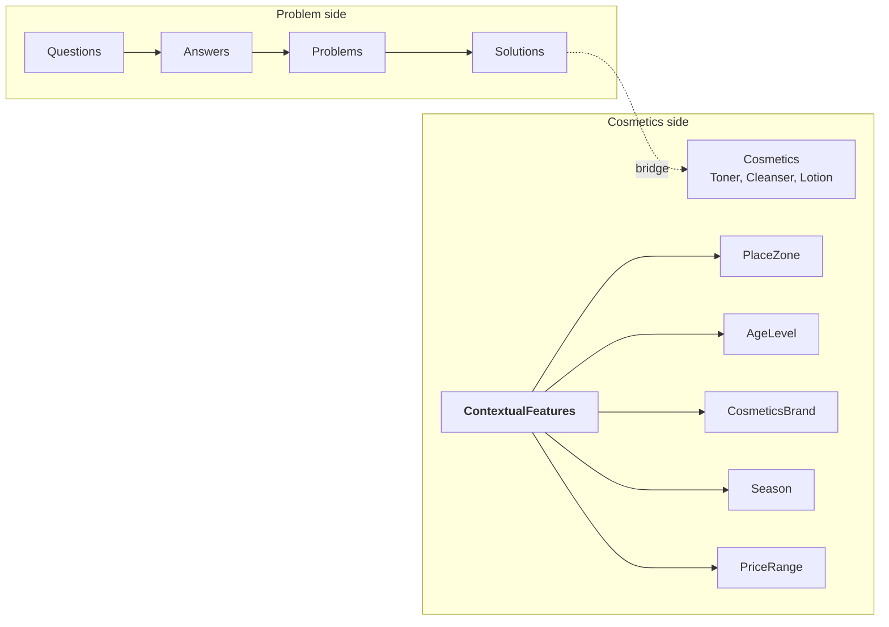
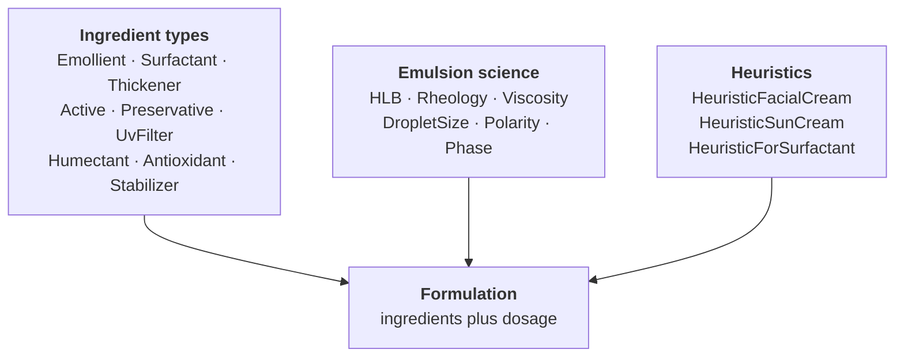
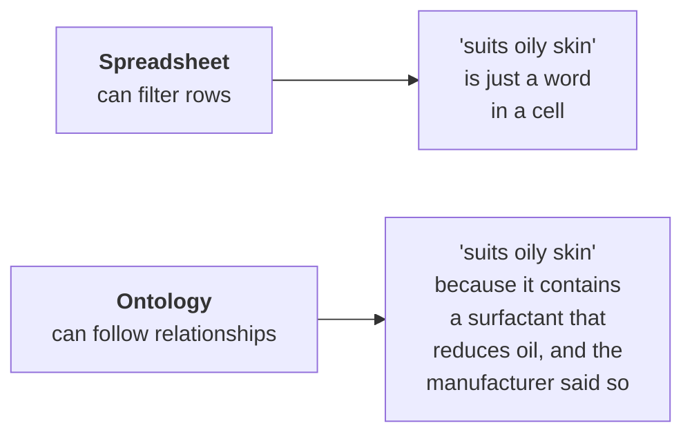
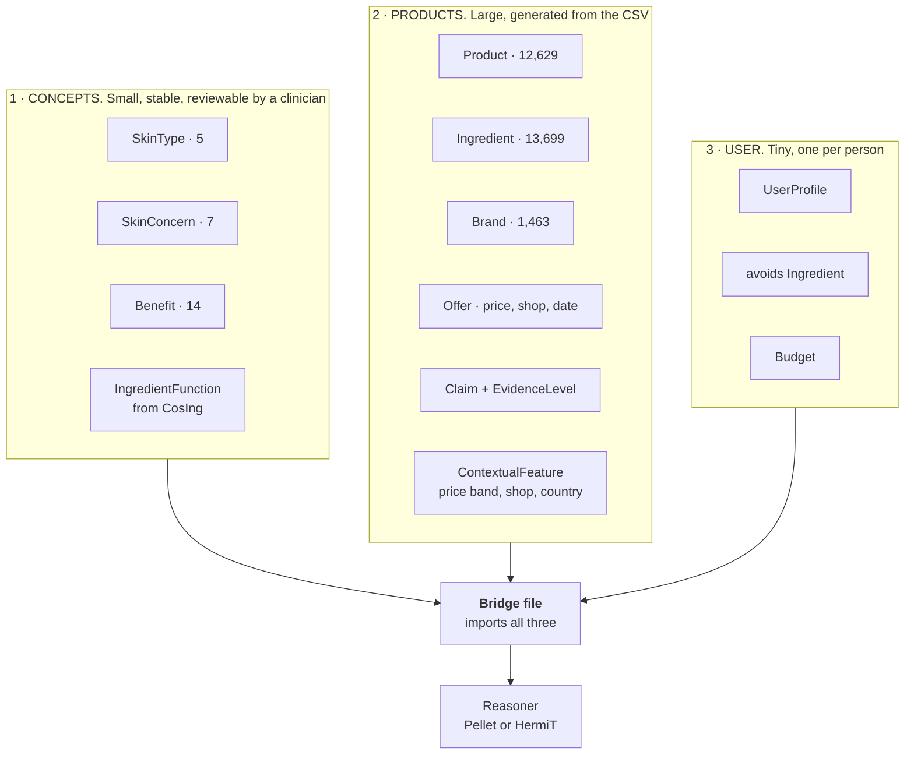
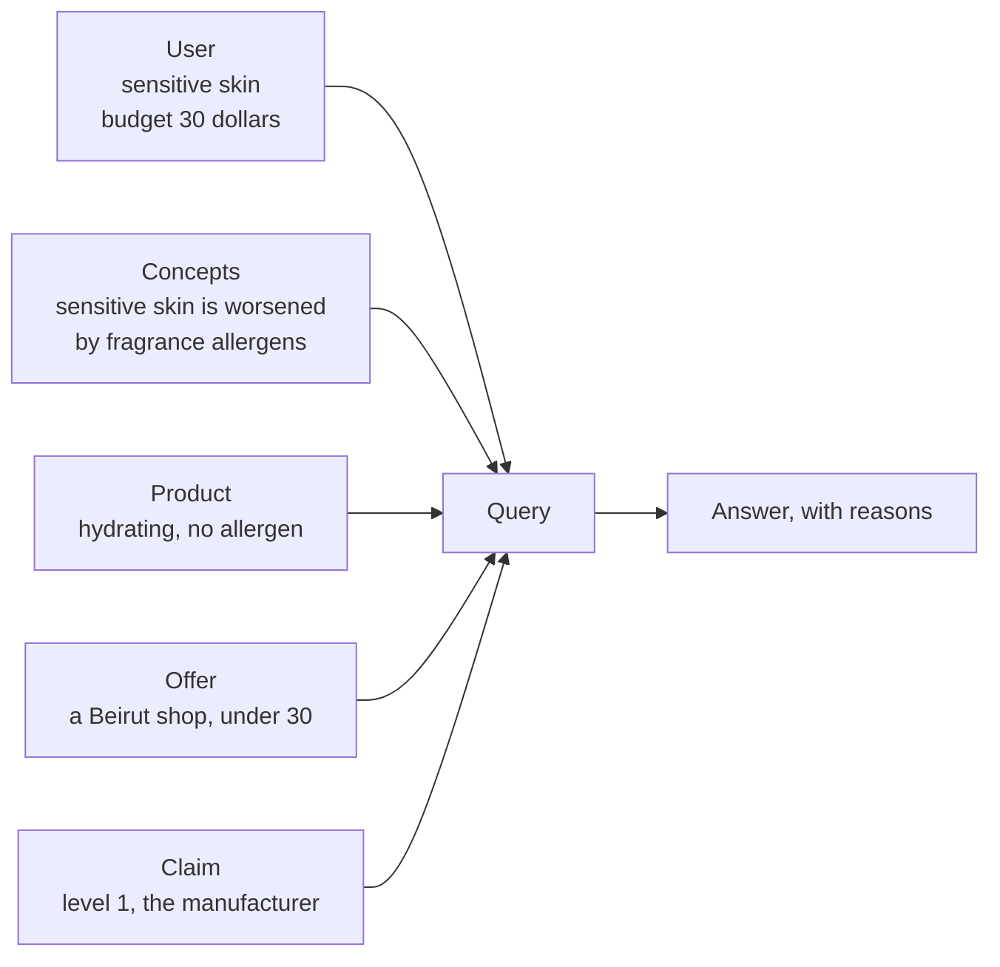

# The ontology phase: what I read, what I am building, and why

This is my working note for the ontology part of the thesis. I am writing it
the way I would explain it to myself, because most of these words were new to
me a few weeks ago.

---

## 1. The words, in plain language

Before anything else, here is the vocabulary. I kept getting lost in it, so
this table stays at the top.

| Word | What it actually means | Example from my work |
|---|---|---|
| **Ontology** | A structured description of a subject: the things that exist in it, and how they relate. Not a database of rows, a description of *kinds of thing* | "A Product has Ingredients. An Ingredient has a Function. A SkinType can be worsened by an Ingredient." |
| **Class** | A kind of thing | `Product`, `Ingredient`, `SkinType` |
| **Individual** (or instance) | One actual member of a class | `Revox B77 Niacinamide Moisturiser` is one individual of the class `Product` |
| **Object property** | A link between two individuals | `Revox B77` **suitableFor** `OilySkin` |
| **Data property** | A link from an individual to a plain value like a number or a word | `Revox B77` **hasPrice** `8.83` |
| **OWL** | Web Ontology Language. The file format ontologies are written in. A `.owl` file is XML text that any ontology tool can open | The OntoCosmetic file I was sent is 235 KB of OWL |
| **Protégé** | Free desktop software from Stanford for building ontologies. You click to add classes and properties instead of typing XML | Every paper I read used it |
| **Reasoner** | A program that reads the ontology and works out what follows logically from what you wrote, and tells you if you contradicted yourself | If I say a product suits sensitive skin, and separately that it contains a known irritant that sensitive skin must avoid, a reasoner flags the clash |
| **Pellet** | One reasoner. Older, widely used, the one Hansanie and Silva used | |
| **HermiT** | Another reasoner. Newer, usually faster, ships inside Protégé | Either works; I only need one |
| **Inference** | A fact the reasoner works out that I never typed | I say `AcneCleanser` is a kind of `Cleanser`, and `Cleanser` is a kind of `Product`. The reasoner concludes `AcneCleanser` is a `Product` without me saying it |
| **Query** | A question asked of the ontology, in the way a search is asked of a database | "give me every product that suits oily skin, costs under 30 dollars, and is sold in Beirut" |
| **SPARQL** | The standard query language for this kind of data. The equivalent of SQL for spreadsheets and databases | |
| **Owlready2** | A Python library that lets me open an OWL file and work with its classes as if they were normal Python objects, instead of writing SPARQL by hand | My whole pipeline is Python already, so this fits |
| **INCI** | International Nomenclature of Cosmetic Ingredients. The standard naming system printed on every product label | Water is written `AQUA`, vitamin B3 is written `NIACINAMIDE` |
| **CosIng** | The European Commission's register of cosmetic ingredients, 28,573 of them, kept under Regulation (EC) 1223/2009 | I have already linked my dataset to it |

---

## 2. What I am actually building, in one paragraph

A person in Lebanon says what their skin is like and what they can spend. The
system returns skincare products that suit them **and that they can actually
buy here**, and for each recommendation it can say where the claim came from.
The ontology is the part in the middle that holds the knowledge: which
ingredients suit which skin, which ones make which problems worse, and what
each product contains.

---

## 3. The papers

### 3.1 Hansanie and Silva (2024), IEEE ICIPRoB
`papers/ICIPRob2024_paper_287.pdf`

**What they built.** A system where a person uploads a photo of their face. A
neural network (a CNN, a type of model that reads images) grades how severe
their acne is. That grade goes into an ontology together with what the person
typed about their skin, and the ontology picks the products.

**How they built the ontology, which is the part I am copying.** They did not
build one big file. They built three separate ones and joined them:

They built the class hierarchy **top down**, meaning they wrote the general
idea first (`Product`) and then the specific ones underneath it
(`TreatmentProduct`, then `AcneControlCleanser`).

**Their actual properties, copied from the paper:**

| Property | From | To | Plain meaning |
|---|---|---|---|
| `suitableFor` | `TreatmentProduct` (AcneControlCleanser) | `SkinType` (OilySkin) | this product suits this skin |
| `hasKeyIngredient` | `TreatmentProduct` | `KeyIngredient` (SalicylicAcid) | this is what is in it |
| `hasProductRecommendation` | `TreatmentProduct` | `ProductRecommendation` | a user rated it |
| `hasAge`, `hasGender` | `Person` | a number, a word | who the user is |
| `hasRating` | `ProductRecommendation` | a number | the score they gave |

**Where their vocabulary came from.** They interviewed dermatologists and
health professionals, and separately surveyed 21 people aged 21 to 30 about
their routines and buying habits. They put the results in a spreadsheet first,
then turned that into classes.

**Their tools:** Protégé to build it, Pellet to check it, Owlready2 to query it
from Python, Tkinter (a basic Python toolkit for desktop windows) for the
interface.

**What I take, and why:**

| I take | Because |
|---|---|
| Three ontologies, joined | The three parts change at completely different speeds. Product data changes weekly. Clinical knowledge barely changes. Keeping them apart means I can hand a dermatologist one small file instead of 12,629 rows |
| A reasoner from the start | I have spent months finding faults in my own data that produced plausible wrong answers instead of errors. A reasoner is a tool that complains loudly, which is exactly what I have been missing |
| Ratings kept inside the ontology | A rating becomes a fact about a product with a person attached, not a separate table I have to remember to join |
| Owlready2 | My whole pipeline is Python |

**What I leave:** the CNN. I have no facial photographs, no ethical approval to
collect any, and my contribution is on the product side. Their three layer
design means it could be added later without touching anything else.

**One number to be careful with.** Their headline is 87.5 percent. That is not
the accuracy of their model. Their model scored 77.5 percent accuracy. The 87.5
is the share of 24 survey participants who said they liked the products they
were shown. I should quote it correctly.

**One thing they did that I have not.** They consulted dermatologists. My skin
type and concern vocabulary came from what retailers publish, checked against
the formula. Nobody clinical has reviewed it. That is a real gap and I should
say so before anyone asks.

---

### 3.2 Moe and Aung (2014), IJITCS
`papers/Building_Ontologies_for_Cross_domain_Rec.pdf`

**What they built.** Two ontologies with a bridge between them. One holds the
user's *problem*, the other holds *cosmetics*. A recommendation is a path from
a problem to a product.

They get from a vague complaint to a specific problem by asking questions, one
at a time, narrowing down (they call this Taxonomic Conversational Case Based
Reasoning). Then they use an algorithm from graph theory called Ford Fulkerson
to work out which products the problem connects to most strongly.

**The idea I am taking from this paper, and it changed my design.** Their
`ContextualFeatures` class. Price, place and brand are not properties of a
product by itself. They describe *a product as sold somewhere*. The same cream
in a global catalogue and in a Beirut pharmacy is in two different situations.

I had these sitting flat in my spreadsheet as ordinary columns:

| My column | Values | Where it belongs |
|---|---|---|
| `price_tier` (I should rename this) | 3 bands | under `ContextualFeature` |
| `sold_by_shops` | 9 Lebanese shops | under `ContextualFeature` |
| `country` | 55 | under `ContextualFeature` |
| `source_category` | Global, Lebanese retail, Lebanese origin, Both | under `ContextualFeature` |

For a Lebanese system this is not a small detail. Availability *is* the
product's context, and it is the whole reason my dataset exists.

**What I leave:** the question and answer conversation, and Ford Fulkerson. My
products already carry scores for availability, price and evidence strength, so
a filter does the same work with far less machinery.

**Their weak point, which is my strength.** Their ingredients are stored as
plain text with no register behind them. Nothing in their ontology can say an
ingredient is restricted under EU law. Mine can, for 99.2 percent of products
that have a formula.

---

### 3.3 Serna et al. (2021) and Gabriel et al. (2023): OntoCosmetic
`papers/Towards an ontology-based...pdf` and `papers/Chapter-ESCAPE-33-FINAL.pdf`
and the ontology file itself, `OntoCosmetic-30-withoutRules.owl`

I now have their actual OWL file, so I can describe it from the file rather
than from the paper.

| | |
|---|---|
| Classes | 116 |
| Object properties | 26 |
| Data properties | 20 |
| Individuals already filled in | 279 |
| Base address | `https://purl.org/ontocosmetic` |

**What it is for.** Helping a chemist *design* a cream. Not helping a person
*choose* one. Once I opened the file that became very clear:

Classes like `HLB`, `DropletSize`, `AqueousThickeners`, `OWCosmeticEmulsion`
and `HeuristicForSurfactant` are about how to make an emulsion stable. I have
none of that data, and I never will, because manufacturers do not publish
droplet sizes or dosages.

**What I take from the file anyway, and these are real:**

| From OntoCosmetic | What it is | How I use it |
|---|---|---|
| `Ingredient_Type` hierarchy: `Emollient`, `Surfactant`, `Thickener`, `Active`, `Preservative`, `UvFilter`, `Humectant`, `Antioxidant`, `Stabilizer`, `PHRegulator` | a functional classification of ingredients | I already hold this. CosIng gives me the function of every ingredient, on 92.7 percent of products. I can map my functions onto their type names and reuse their vocabulary rather than invent one |
| `hasINCIcode` | a data property holding the INCI name | Confirms INCI is the right key to join on, which is what I did |
| `hasOrigin` (natural or synthetic) | where an ingredient comes from | People ask about this constantly. My `free_from` column is a rough version of the same idea |
| `hasPricePerKilogram` | price as a property of an ingredient | Shows price belongs in the model, not outside it |
| The split between `ProductProperty` and `IngredientProperty` | two different kinds of property | I have been mixing them. `spf` and `size_ml` belong to the product. Function and restriction belong to the ingredient and are inherited from CosIng |

**Decision: cite it, borrow the ingredient type names, do not import the file.**
Importing 116 classes to use 10 of them would bring a large amount of emulsion
chemistry into an ontology about buying skincare in Beirut.

---

### 3.4 The paper I could not read

The Academia link would not open for me. It returns a 404 without a logged in
session, both through a plain fetch and through a browser. I am not going to
summarise a paper I have not read. If I export the PDF it goes here.

---

### 3.5 Noy and McGuinness (2001), Ontology Development 101

The standard beginner's guide, cited by all the papers above. Its main advice
is the reason this document exists: **look for an existing vocabulary before
inventing your own.**

---

## 4. Why my design looks the way it does

This is the section I most need to be able to defend, so here is the reasoning
in order.

### 4.1 Why an ontology at all, and not just the spreadsheet

My spreadsheet can already answer "show me products for oily skin under 30
dollars". What it cannot do is answer *why*, or notice a contradiction.

### 4.2 Why three files and not one

Because the three things change at different speeds and are checked by
different people.

| File | Changes | Who checks it | Size |
|---|---|---|---|
| Concepts | rarely | a dermatologist | small, a few pages |
| Products | every time I scrape | me, against the CSV | 12,629 products |
| User | every time somebody uses it | nobody, generated | tiny |

If I put them in one file, a dermatologist reviewing my clinical rules has to
open a file with 12,629 products in it. That will not happen.

### 4.3 Why evidence strength is in the model and not a footnote

Every claim in my dataset carries a level from 1 to 4 saying who made it:

| Level | Who said it | Count |
|---|---|---|
| 1 | the manufacturer | 4,460 |
| 2 | a retailer | 4,539 |
| 3 | a weaker published source | 1,954 |
| 4 | nobody, I worked it out from the formula | 1,676 |

Nearly 87 percent came from a source that actually stated it. If the system
treats my own guess the same as the manufacturer's statement, it will make
confident recommendations it cannot support. Putting the level in the ontology
means a query can simply exclude level 4.

### 4.4 Why availability is a first class idea

Every other paper I read assumes you can buy anything. In Lebanon you often
cannot. A product that suits your skin and is not sold here is not a
recommendation, it is a frustration. So `Offer`, `Retailer` and availability
are in the model, not bolted on afterwards.

---

## 5. My proposed structure

The three files meet at only three shared classes. Keeping that connection
small is what lets each file be reviewed on its own.

| Shared class | The user | The product | The concepts |
|---|---|---|---|
| `SkinType` | has one | suits some | knows what each is prone to |
| `SkinConcern` | reports some | helps or worsens some | knows what helps each |
| `Ingredient` | avoids some | contains some | knows what each one does |

### The four vocabularies I am reusing

| Vocabulary | What it gives me | Status |
|---|---|---|
| **CosIng** | every ingredient gets a function, a CAS number and a legal status from the European Commission | **Done.** 11,704 products, 99.2 percent of those with a formula |
| **schema.org** | the standard way to describe a `Product` separately from an `Offer` (one shop, one price, one date). Used by every search engine | to do |
| **PROV-O** | the W3C standard for saying where a fact came from, who said it and when | to do |
| **SKOS** | the standard for controlled lists, so `Hydrating` and `Hydration` become one concept with two labels instead of two different things | to do |

Dropped: ChEBI, SNOMED CT, GS1 GPC, CHEMINF, OBI, eNanoMapper, OntoCAPE, UMLS,
DermO, SPO. Same reason each time. A large import and nothing in it I can use.

---

## 6. How I will proceed, step by step

| Step | What I do | Tool | How I know it worked |
|---|---|---|---|
| 1 | Write the concepts ontology by hand. 5 skin types, 7 concerns, 14 benefits, and the ingredient function names borrowed from OntoCosmetic | Protégé | It fits on two printed pages |
| 2 | Run the reasoner on just that file | HermiT inside Protégé | No contradictions. For example nothing is both helped and worsened by the same ingredient function |
| 3 | Take those two pages to a dermatologist and have them corrected | paper | The gap I admitted in section 3.1 is closed |
| 4 | Write a Python script that reads `SKINCARE_FINAL.csv` and writes the product ontology | Owlready2 | 12,629 products load and the file opens in Protégé |
| 5 | Never hand edit the product file | | I can regenerate it any time the dataset changes |
| 6 | Write the user profile ontology | Protégé | It only holds what a person can tell me |
| 7 | Write the bridge file that imports all three | Protégé | The reasoner runs over the whole thing without complaint |
| 8 | Ask the test question below | Owlready2 or SPARQL | It returns products, and I can trace every part of the answer |

### The question I will test it with

> A hydrating serum under 30 dollars, sold in Beirut, safe for sensitive skin,
> where the suitability claim came from the manufacturer and not from me.

If it answers that correctly, the structure works. If it cannot, something in
the design is wrong and I would rather find out at step 8 than at the end.

---

## 7. Thinking about it as a product for the Lebanese market

My supervisors will ask what this is for beyond the thesis, so here is my
answer.

### Who would use it

| Who | What they get |
|---|---|
| A person buying skincare | Products that suit them **and are stocked here**, at prices in both dollars and lira |
| A pharmacy or shop | A way to guide customers using their own stock list rather than a foreign catalogue |
| A dermatologist | Something to point a patient at, where every claim can be traced to its source |
| A local brand | Their products appear next to international ones, which no global catalogue does for them |

### What makes it defensible as a local product

| Feature | Why it matters in Lebanon | Comes from |
|---|---|---|
| Only shows what can be bought here | 5,014 products are sold in Lebanese shops and appear in no global catalogue | `source_category` |
| Prices in dollars and lira, with the date | Prices move quickly and people are paid in one currency and charged in another | `price_usd`, `price_lbp`, `price_seen_date` |
| Includes 802 Lebanese made products | Local brands are invisible in every international dataset | Lebanese origin source |
| Every claim traceable | Builds trust, and a shop or clinic can check any recommendation | evidence levels 1 to 4 |
| Ingredients checked against EU law | A regulator said it, not me | CosIng |

### The honest commercial risks

| Risk | What I would say |
|---|---|
| Prices go stale | It is a snapshot with a date on every price, not a live feed. A live version needs a scraping schedule |
| 827 products still have no ingredient list | Mostly small local brands that publish nothing. Their pages are checked and recorded as such |
| No clinical review yet | Step 3 above |
| Not evaluated with real users | Hansanie and Silva used 24 participants. I would need something similar before claiming it works |

---

## 8. Where I stand next to the papers

| | Hansanie & Silva | Moe & Aung | OntoCosmetic | **Mine** |
|---|---|---|---|---|
| Purpose | recommend | recommend | design a formula | **recommend, in one market** |
| Products | small set | small set | 279 ingredients | **12,629** |
| Ingredients linked to a regulator | no | no | no | **yes, CosIng, 99.2 percent** |
| Records who made each claim | no | no | no | **yes, four levels plus the page** |
| Local availability and price | no | partly, `PriceRange` | ingredient price only | **yes, 9 shops, two currencies** |
| Reviewed by a clinician | **yes** | no | **yes** | **not yet** |

Two things I will say myself before anyone asks me:

1. Nobody clinical has reviewed my vocabulary yet. Step 3 fixes that.
2. Size is not my argument. Twelve thousand products against a few thousand
   sounds better than it is. **Provenance, regulatory linkage and local
   availability** are the arguments.

---

## 9. References

| # | Reference | File |
|---|---|---|
| 1 | Hansanie, M. and Silva, T. (2024). *Ontology based Machine Learning Approach for Facial Skincare Products Recommendation.* IEEE ICIPRoB. DOI 10.1109/ICIPRoB62548.2024.10543444 | `papers/ICIPRob2024_paper_287.pdf` |
| 2 | Moe, H.H. and Aung, W.T. (2014). *Building Ontologies for Cross-domain Recommendation on Facial Skin Problem and Related Cosmetics.* IJITCS 6(6). DOI 10.5815/ijitcs.2014.06.05 | `papers/Building_Ontologies_for_Cross_domain_Rec.pdf` |
| 3 | Serna, J. et al. (2021). *Towards an ontology-based decision support system for the design of emulsion based cosmetic products.* ECCE13. HAL hal-04674074 | `papers/Towards an ontology-based...pdf` |
| 4 | Gabriel, A. et al. (2023). *Decision making software for cosmetic product design based on an ontology.* ESCAPE 33. DOI 10.1016/B978-0-443-15274-0.50316-4 | `papers/Chapter-ESCAPE-33-FINAL.pdf` |
| 5 | OntoCosmetic ontology file, 116 classes | `papers/OntoCosmetic-30-withoutRules.owl` |
| 6 | *Personalized Skincare Recommendation System Based on Ontology and User Preferences* (2025). ResearchGate 394583703 | not open access |
| 7 | Noy, N.F. and McGuinness, D.L. (2001). *Ontology Development 101.* Stanford KSL-01-05 | |
| 8 | European Commission (2009). *Regulation (EC) No 1223/2009 on cosmetic products* | |
| 9 | W3C (2013). *PROV-O.* W3C (2009). *SKOS Reference.* schema.org vocabulary | |
