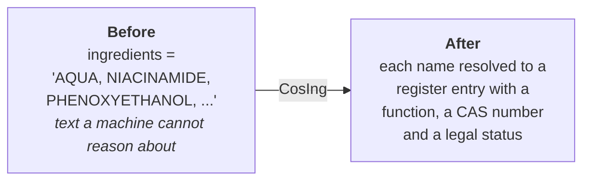
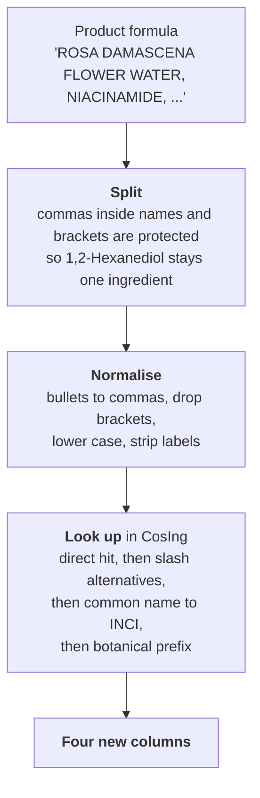
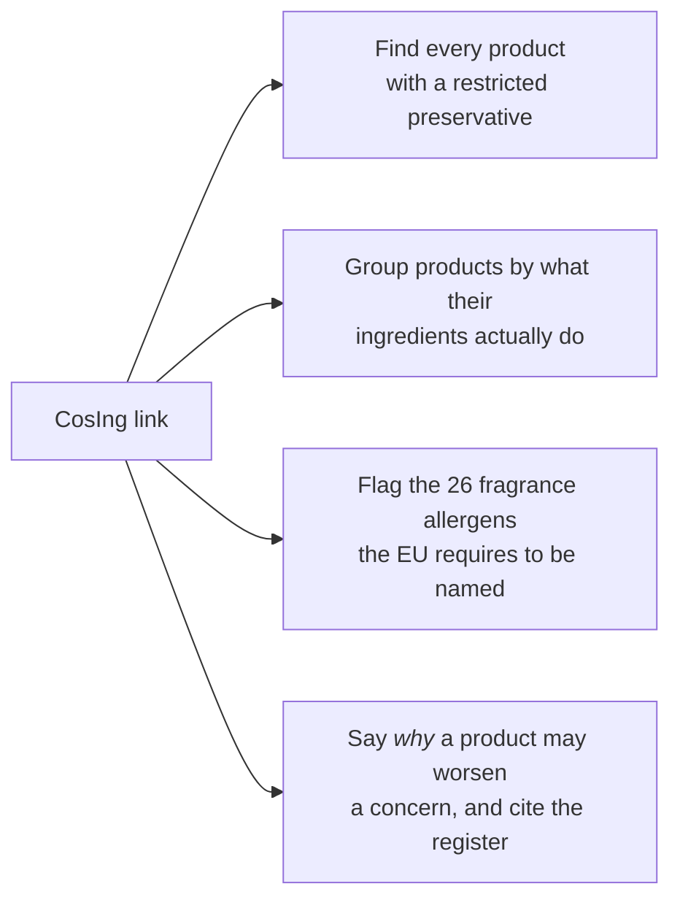
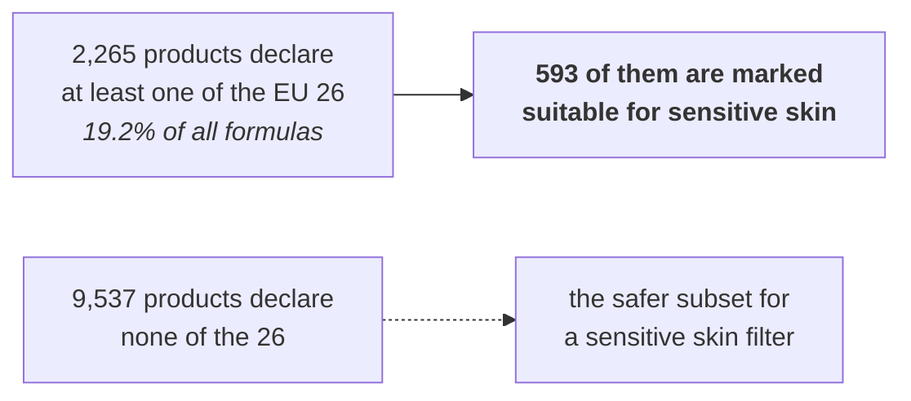

# CosIng: the EU ingredient register, and what it gave my dataset

One page for anyone who asks what the European register added and why it was
worth the work.

---

## 1. What CosIng is

CosIng is the European Commission's own list of cosmetic ingredients, kept
under Regulation (EC) 1223/2009. It is not an ontology and not a research
dataset. It is the register that companies selling into the EU have to work
against.

| | |
|---|---|
| Entries | 28,573 |
| Kept by | European Commission, DG GROW |
| Legal basis | Regulation (EC) No 1223/2009 |
| What each entry holds | INCI name, CAS number, EC number, recognised functions, restriction reference, update date |

---

## 2. The problem it solves

Before the link, my `ingredients` column was a string. A long, unpunctuated,
inconsistently spelled string.



With a string I can search for the word "phenoxyethanol". With a register entry
I can ask whether a product contains a preservative that the EU restricts, and
cite the article that says so.

---

## 3. How the linking works



Four lookup passes were needed because shops do not write INCI cleanly:

| Pass | Handles | Example |
|---|---|---|
| Direct | the name as registered | `NIACINAMIDE` |
| Slash alternatives | one ingredient written in three languages | `Aqua/Water/Eau` |
| Common name to INCI | what small brands actually write | `Shea Butter` to `Butyrospermum Parkii Butter` |
| Botanical prefix | a plant name missing its part | `Prunus Amygdalus Dulcis` to `... Oil` |

---

## 4. The four columns it produced

| Column | Holds | Filled on |
|---|---|---|
| `ingredient_functions` | what each ingredient does, counted | 11,703 products |
| `cosing_matched` | how many of the product's ingredients are registered | 11,704 products |
| `cosing_coverage` | that as a percentage of the formula | 11,704 products |
| `restricted_ingredients` | the ones the EU restricts, named | 9,613 products |

---

## 5. A worked example

**Revox B77, JUST 10% Niacinamide Daily Moisturiser.** Sold in the global
catalogue and by a Beirut shop, $8.83. Eight ingredients, all eight found in
the register.

| # | Ingredient as written | CAS number | Function per the Commission | Restricted |
|---|---|---|---|---|
| 1 | ROSA DAMASCENA FLOWER WATER | 90106-38-0 | fragrance, skin conditioning, skin protecting | |
| 2 | NIACINAMIDE | 98-92-0 | smoothing | |
| 3 | PROPYLENE GLYCOL | 57-55-6 | humectant, skin conditioning, solvent, viscosity controlling | |
| 4 | ZINC CITRATE | 546-46-3 | antiplaque, oral care | **yes, Annex III/24** |
| 5 | PHENOXYETHANOL | 122-99-6 | antimicrobial, preservative | **yes, Annex V/29** |
| 6 | XANTHAN GUM | 11138-66-2 | binding, emulsion stabilising, gel forming | |
| 7 | PPG-1-PEG-9 LAURYL GLYCOL ETHER | none assigned | surfactant, cleansing and emulsifying | |
| 8 | DISODIUM EDTA | 139-33-3 | chelating, viscosity controlling | |

What the four columns then say about this one product:

```
cosing_matched          8
cosing_coverage         100
ingredient_functions    Skin Conditioning (3), Viscosity Controlling (3),
                        Surfactant - Cleansing (2), Fragrance (1), ...
restricted_ingredients  Phenoxyethanol, Zinc Citrate
```

**Read the restriction correctly.** `V/29` and `III/24` are pointers into the
annexes of the regulation, not a warning. Annex V is the list of preservatives
that are *allowed*, each with a maximum concentration. Phenoxyethanol at entry
29 is permitted up to 1%. So the column means *this ingredient is regulated and
here is where to look it up*, not *this product breaks the law*. Saying
otherwise would be a serious misreading, and the dataset never implies it.

---

## 6. Where the dataset stands

| Measure | Result |
|---|---|
| Products with a formula | 11,802 of 12,629, 93.5% |
| Of those, linked to CosIng | 11,704, **99.2%** |
| Individual ingredient mentions | 295,991 |
| Mentions found in the register | 285,917, **96.6%** |
| Median coverage per product | **100%** |

How well each product matched:

| Coverage | Products | Share |
|---|---|---|
| 100% of its ingredients found | 9,032 | 77.2% |
| 90 to 99% | 1,256 | 10.7% |
| 75 to 89% | 790 | 6.7% |
| under 75% | 626 | 5.3% |

The 3.4% that never matched are mostly trade names, copolymers and supplier
blends that the register does not carry. That is expected, not a fault.

---

## 7. What this makes possible



**The most common functions across all 11,802 formulas**, which is a picture of
the market rather than of any one product:

| Function | Products |
|---|---|
| Skin conditioning | 11,265 |
| Viscosity controlling | 9,477 |
| Fragrance | 9,052 |
| Solvent | 8,746 |
| Hair conditioning | 6,919 |
| Skin conditioning, emollient | 6,452 |
| Humectant | 5,847 |

**The most common restricted ingredients:**

| Ingredient | Products | Why it is regulated |
|---|---|---|
| Phenoxyethanol | 4,293 | preservative, Annex V |
| Citric acid | 3,257 | pH adjuster, conditions apply |
| Sodium hydroxide | 2,139 | pH adjuster, concentration limits |
| Sodium benzoate | 1,870 | preservative, Annex V |
| Potassium sorbate | 1,575 | preservative, Annex V |
| Limonene | 1,210 | declarable fragrance allergen |
| Linalool | 1,196 | declarable fragrance allergen |

---

## 8. The finding I was not looking for

The EU names 26 fragrance allergens that must be listed on the label when they
are present above a threshold. Because ingredients now carry regulatory status
and skin type claims carry a source, the two can be checked against each other.



The dataset records both the marketing claim and the ingredient. It does not
overrule either, and it could not do this at all if the claim's source had not
been kept.

---

## 9. Why a register and not a list of my own

| If I had written my own list | Using CosIng |
|---|---|
| I decide what counts as a preservative | the Commission decides |
| "restricted" means whatever I meant by it | it points at an annex and an entry number |
| a reviewer has to trust me | a reviewer can look it up |
| it goes stale the day I stop editing | it is maintained, with an update date per entry |

That is the whole argument. The register lets the dataset make regulatory
statements without me being the authority behind them.

---

## 10. Files

| File | Contains |
|---|---|
| `SKINCARE_FINAL.csv` | the four columns, on 11,704 products |
| `COMBINED_EVIDENCE.csv` | where each formula was read from, and by which route |
| `scripts/link_cosing.py` | the original linking pass |
| `../FINAL_PIPELINE/relink_cosing_properly.py` | the current pass, with the four lookup routes and formula cleaning |
| `THE_FOUR_COSING_COLUMNS.md` | the same four columns explained one at a time |
| `GLOSSARY.md` | INCI, CAS, annex, restricted, and the rest of the vocabulary |
