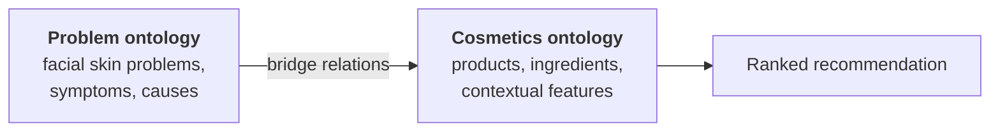
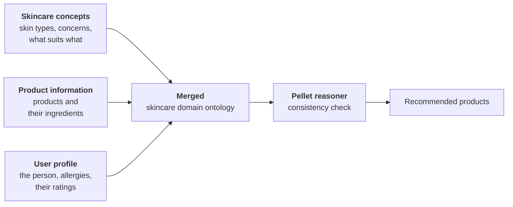

# Literature review, track B: ontologies and knowledge graphs in skincare, cosmetics and cosmetic regulation

These are the direct competitors. The gap I am filling lives in this section.

**A note on how I read each one.** Five of these I have as PDFs and read in
full. Five I found while searching and read from the abstract, the publisher
page and the artefacts, and I say so in each entry. I am not going to pretend
to have read a paper I have not.

---

## Contents

| | Paper | Read |
|---|---|---|
| B1 | Moe and Aung (2014), cross domain cosmetics ontology | full PDF |
| B2 | Serna et al. (2021) and Gabriel et al. (2023), OntoCosmetic | full PDF plus the OWL file |
| B3 | Hansanie and Silva (2024), CNN plus ontology | full PDF |
| B4 | Abesova et al. (2023), VU Amsterdam skincare ontology | full PDF |
| B5 | Anonymous (2025), bit-Tech, METHONTOLOGY skincare ontology | abstract and publisher page |
| B6 | TOXIN knowledge graph (2024), Database, Oxford | full article text |
| B7 | CosIng-KG, biobricks-ai | repository only |
| B8 | DermO (2016), J Biomedical Semantics | abstract and BioPortal |
| B9 | D3X (2024), JMIR Medical Informatics | abstract |
| B10 | Flavouring halal ontology (2024), JISTaP | abstract |

---

# B1. Moe and Aung (2014)

## Identity

| | |
|---|---|
| Citation | K. S. M. Moe and T. N. Aung, "Building Ontologies for Cross-Domain Recommendation on Facial Skin Problem and Related Cosmetics", *International Journal of Information Technology and Computer Science*, 6(6), 33 to 39, 2014 |
| Venue | IJITCS, MECS Press. A low barrier journal. **Say this plainly if asked.** Its value to me is the method, not its standing |
| Institutions | University of Technology Yatanarpon Cyber City and University of Computer Studies Yangon, Myanmar |
| Ontology published | **No.** No link, no repository, no address. The ontology exists only as figures in the paper |
| File | `repo/papers/Building_Ontologies_for_Cross_domain_Rec.pdf` |

## Purpose

Recommend cosmetics for a facial skin problem, where the problem and the
products live in two different domains and must be bridged.

## Data

Not reported in any usable form. No dataset size, no source, no product count.
This is the paper's biggest weakness and I should say so.

## The ontology

Two ontologies plus a bridge.



**Classes I noted:** `SkinProblem`, `Symptom`, `Cause`, `Cosmetics`,
`ContextualFeatures` with `PlaceZone`, `AgeLevel`, `CosmeticsBrand`, `Season`,
`PriceRange`.

**Properties:** `hasIngredients`, `hasIngValue`, `isNextRelatedTo`,
`hasSymptom`, `hasCause`.

**Built in:** Protégé.

**Counts:** not reported.

## Methodology, and this is what I actually take

They followed a stated ontological engineering procedure, eight tasks in order.
This is a checklist I can follow.

| Task | Produces |
|---|---|
| 1 | Glossary of terms: every term, its definition, its synonyms and acronyms |
| 2 | Concept taxonomies |
| 3 | Ad hoc binary relation diagrams, including relations to other ontologies |
| 4 | Concept dictionary: instances, attributes, relations per concept |
| 5 | Description of every binary relation |
| 6 | Description of every instance attribute |
| 7 | Description of every class attribute |
| 8 | Constants table |

This is METHONTOLOGY, whether or not they name it. Task 1 alone would fix a
real problem in my data: my `benefits` column contains "Hydrating" and
"Hydration" as separate strings.

## Population

**Not reported.** No mention of how instances entered the ontology. Given the
scale implied, almost certainly by hand in Protégé.

## The recommendation mechanism

Three stages, and the middle one is unusual.

1. **Narrowing.** Taxonomic Conversational Case Based Reasoning. The user gives
   a rough query, the system asks ranked questions, the user answers, repeat
   until the problem is definite. `isNextRelatedTo` builds the question order.
2. **Joining.** Problem and products become a weighted directed acyclic graph,
   problem as source, products as sinks.
3. **Scoring.** Ford Fulkerson maximum flow, citing Kirchhoff's law that
   everything leaving the source must reach the sink.

```
W(v_i) = sum over k of f(v_i, k)
```

**No reasoner. No SPARQL.** The semantics are in the graph structure, and the
scoring is a classical algorithm on top. Worth noticing: an ontology paper that
never actually reasons.

## Evaluation

Precision, recall and F measure. They introduce a threshold alpha, the flow
weight above which a product is recommended, and plot how the three metrics
move as alpha changes.

Sample flow weights: 0.70, 0.60, 0.60, 0.58, 0.53, 0.52, 0.45, 0.38.

**Does the evaluation support the claim?** No. They claim to be "more accurate
than other related works" and there is no comparison table, no dataset size and
no baseline anywhere in the paper.

## For me

| | |
|---|---|
| **Take** | The eight task procedure as a literal checklist. `ContextualFeatures` as a class, because price and place describe a product *as sold somewhere*, not the product itself. My `price_tier`, `sold_by_shops`, `country` and `source_category` all belong there. Reporting how a threshold was chosen rather than asserting one |
| **Leave** | Ford Fulkerson. My products already carry availability, price and evidence level, so a weighted filter does the same work with less machinery. Also CCBR, since I have no user facing system yet |
| **The gap** | Ingredients are `hasIngredients` and `hasIngValue`, free text and a number, with no register behind them. Nothing in their model can say an ingredient is regulated. Mine can, on 99.2 percent of products with a formula |

### Outside the box

Their `Season` class is the throwaway idea worth stealing. Beirut summer is
humid and coastal, winter is dry. A gel cleanser that suits August is wrong in
January. **Nobody in my entire review models climate, and Lebanon has a
genuinely seasonal skin problem.** A `Season` and `Climate` axis over my
existing product types would be an original contribution that costs almost
nothing to add and that a Lebanese pharmacy chain would immediately understand.

---

# B2. Serna et al. (2021) and Gabriel et al. (2023), OntoCosmetic

## Identity

| | |
|---|---|
| Paper 1 | Serna et al., "Towards an ontology-based decision support system for the design of emulsion-based cosmetic products", *Computer Aided Chemical Engineering* / ESCAPE proceedings, 2021 |
| Paper 2 | Gabriel et al., ESCAPE 33, 2023, the Formultools application |
| Institutions | Université de Lorraine, ERPI-ENSGSI and LRGP, with Universidad Nacional de Colombia |
| Ontology published | **Yes.** `https://purl.org/ontocosmetic`. I have the OWL file locally |
| Files | `repo/papers/Towards an ontology-based...pdf`, `repo/papers/Chapter-ESCAPE-33-FINAL.pdf`, `repo/papers/OntoCosmetic-30-withoutRules.owl` |

**This is the only cosmetics ontology in my review that is actually published
and downloadable.** That fact alone is worth a sentence in the thesis.

## What is in the file, counted rather than quoted

| | |
|---|---|
| Classes | 116 |
| Object properties | 26 |
| Data properties | 20 |
| Individuals | 279 |

Representative classes: `HLB`, `DropletSize`, `Rheology`, `AqueousThickeners`,
`OWCosmeticEmulsion`, `HeuristicForSurfactant`, `MeltingPoint`,
`Emollient_Dosage`.

This is a tool for making a cream stable. It is not a tool for choosing one in
a pharmacy.

## Paper 1: building the knowledge base

**Methodology.** Four kinds of material, combined deliberately:

| Building block | Holds | Their example |
|---|---|---|
| General subproblems | physicochemical properties to promote or limit | achieving shear thinning or thixotropic behaviour |
| General solution strategies | a route to a goal, not tied to a compound | implementing a steric surfactant system |
| Ingredient databases | typed by function | emollients, surfactants, preservatives, actives |
| Heuristics | rules connecting ingredients to the above | |

**Technique.** Emulsion science plus expert knowledge, encoded as heuristics
with numeric thresholds. The file has `hasHeuristicHighThreshold`,
`hasHeuristicLowThreshold` and `hasHeuristicSource`. Rules are written in
**SWRL** inside Protégé.

**That last property is the one to notice.** `hasHeuristicSource` means every
rule records where the rule came from. That is provenance applied to rules, not
just to facts, and nobody else in my review does it.

**Results.** A case study, the design of a moisturising cream. Four intended
uses: analysing solution strategies, supporting reformulation and ingredient
substitution, designing a new product, representing a design graphically.

## Paper 2: Formultools

**Methodology**, and this one is more rigorous than the first:

| Step | What they did |
|---|---|
| Design approach | five planes user centred design, Garrett 2011 |
| Who | co-design between cosmetics experts and computer scientists |
| How | iteratively, usability tests between iterations |
| Measured with | the **AttrakDiff** questionnaire, Lallemand et al. 2015 |
| Stopped when | problems found by non expert testers were resolved |

**Technique.** A cross platform mobile app on OntoCosmetic supporting three
decisions: screening ingredients by property, selecting ingredients against
multiple criteria including performance, origin and price, and evaluating a
candidate formulation against the heuristics. They cite the Analytic Hierarchy
Process, Saaty 1987, for the multi criteria part.

## Population

**By hand, by experts.** 279 individuals typed in. No mapping language, no
scraping, no automation. That is fine at 279 and impossible at 12,629, which is
precisely the difference between their project and mine.

## Evaluation

Neither paper evaluates against ground truth. Paper 1 is a case study. Paper 2
states in its own conclusion that expert testing was still future work: *"in a
near future, it will be tested with experts"*.

**So the most technically serious cosmetics ontology in the literature has not
been validated with experts.** That is a real finding and it belongs in my gap
analysis.

## For me

| Take | Why |
|---|---|
| The ingredient type names: `Emollient`, `Surfactant`, `Thickener`, `Active`, `Preservative`, `UvFilter`, `Humectant`, `Antioxidant`, `Stabilizer`, `PHRegulator` | I hold ingredient functions from CosIng on 92.7 percent of products. Though since CosIng is the Commission and OntoCosmetic is secondary, taking the names straight from CosIng is the cleaner argument, and I can note the alignment |
| The split between `ProductProperty` and `IngredientProperty` | `spf` and `size_ml` belong to the product. Function and restriction belong to the ingredient and are inherited from the register |
| `hasOrigin`, natural or synthetic | Consumers ask constantly. My `free_from` is a crude version |
| `hasHeuristicSource` | Provenance on rules, not just facts |
| SWRL for the rules OWL cannot express | Their formulation heuristics are structurally identical to my concern rules |

| Leave | Why |
|---|---|
| The entire emulsion science branch | HLB, droplet size, rheology, dosage. Manufacturers do not publish it and I never will have it |
| Importing the whole file | 116 classes to use ten |

### Outside the box

Invert their direction. OntoCosmetic answers "given a goal, what should I put
in the cream". My dataset can answer **"given what is actually in the cream,
what was the formulator trying to do"**. I have 295,991 ingredient mentions
with functions attached. Co-occurrence across 11,802 formulas would let me
infer implicit formulation strategies from the market rather than from a
textbook, and then check them against their heuristics. That is a paper on its
own, and it uses their ontology as the evaluation target rather than as an
import.

---

# B3. Hansanie and Silva (2024)

## Identity

| | |
|---|---|
| Citation | M. Hansanie and T. Silva, "Ontology based Machine Learning Approach for Facial Skincare Products Recommendation", IEEE ICIPRoB 2024 |
| Venue | IEEE International Conference on Image Processing and Robotics |
| Ontology published | **No link given** |
| File | `repo/papers/ICIPRob2024_paper_287.pdf` |

## Purpose

A user uploads a face photograph, a CNN grades acne severity, that grade enters
an ontology with what the user typed, and the ontology selects products.

## Methodology

They started from people, not from a spreadsheet.

| Step | What they did |
|---|---|
| 1 | Interviewed dermatologists and health professionals |
| 2 | Surveyed 21 people aged 21 to 30 on routines and buying habits |
| 3 | Wrote results into a spreadsheet |
| 4 | Turned the spreadsheet into classes, **top down** |
| 5 | Split into three ontologies rather than one |

## The three ontology design, which is what I copy



**Their properties, exactly as printed:**

| Property | Domain | Range | Means |
|---|---|---|---|
| `suitableFor` | `TreatmentProduct` e.g. AcneControlCleanser | `SkinType` e.g. OilySkin | this product suits this skin |
| `hasKeyIngredient` | `TreatmentProduct` | `KeyIngredient` e.g. SalicylicAcid | what is in it |
| `hasProductRecommendation` | `TreatmentProduct` | `ProductRecommendation` | a user rated it |
| `hasAge`, `hasGender` | `Person` | number, string | who the user is |
| `hasRating` | `ProductRecommendation` | number | the score given |

## Tools

Protégé to build, **Pellet** to reason, **Owlready2** to query from Python,
Tkinter for the interface.

## Population

Not clearly reported. The spreadsheet to ontology step is described as a design
step, not an automated one.

## The recommendation mechanism

Image goes to the CNN, CNN outputs a severity grade, grade is asserted into the
ontology as a fact about the user, Pellet classifies, Owlready2 queries the
result out. **The image model and the knowledge are kept separate**, which is
why one could be swapped without touching the other.

## Evaluation

| Measured | Number |
|---|---|
| CNN accuracy grading acne severity | **77.5 percent** |
| Survey participants satisfied with the products shown | **87.5 percent** of 24 people |

**Read those two correctly.** The headline is 87.5. That is user satisfaction,
not system accuracy. The model itself scored 77.5. No baseline, no test set of
correct recommendations. I will quote it as what it is, and quoting it
correctly in my thesis is itself a small mark of quality.

## For me

| Take | Why |
|---|---|
| Three ontologies, merged | The three parts change at completely different speeds. Product data changes weekly, clinical knowledge barely changes. Separating them means I can hand a dermatologist one small file instead of 12,629 rows |
| A reasoner from the start | I have spent months finding faults in my own data that produced plausible wrong answers instead of errors. A reasoner complains loudly, which is what I have been missing |
| Ratings inside the ontology | A rating becomes a fact about a product with a person attached, not a table to remember to join |
| Owlready2 | My pipeline is Python |

| Leave | Why |
|---|---|
| The CNN | No facial photographs, no ethical approval to collect any, and my contribution is on the product side. Their three layer design means it could be added later without touching anything else |

**The thing they did that I have not.** They consulted dermatologists. My skin
type and concern vocabulary came from what retailers publish, checked against
the formula. Nobody clinical has reviewed it. That is a real gap and I should
say so before anyone asks.

### Outside the box

Their architecture has an empty socket where the sensor goes. They put a CNN in
it. **I could put a barcode in it.** A Lebanese shopper standing in a pharmacy
photographs the barcode or the ingredient panel, and the same ontology answers
"is this suitable for me, and is it cheaper at the shop down the road". That
uses my price and availability columns, which are the columns no other paper
has, and it needs no ethical approval and no image dataset.

---

# B4. Abesova, Hajkova, Ramadan and Zdych (2023)

## Identity

| | |
|---|---|
| Citation | S. Abesová, K. Hajková, Y. Ramadan, M. Zdych, "Skincare Ontology for Personalised Recommendation", Vrije Universiteit Amsterdam, Knowledge and Data course, Group 31, 2023 |
| Venue | **A student final project, not peer reviewed.** I must say this when I cite it |
| Ontology published | Not stated as published |
| File | `repo/papers/Skincare_Ontology_for_Personalised_Recommendation.pdf` |

It is still the most useful of the set, because it is the only one that shows
the mechanism I had not understood.

## Data

Sephora product and review data, scraped to CSV, plus a second CSV of countries
with Sephora shops, plus DBpedia.

## Methodology: middle out

They name it. **Middle out** means start with the concepts you are sure of and
work outward in both directions, towards the abstract and towards the specific.

| Step | What happened |
|---|---|
| 1 | One team member built a base ontology with the main classes |
| 2 | A Sephora review CSV was found, which **widened the scope** and forced new classes |
| 3 | Classes and properties added to fit the new data |
| 4 | A second CSV, countries with Sephora shops, folded in the same way |
| 5 | More properties added to join the two sources |

They call it iterative. That matches my situation exactly. I did not know my
final columns when I started either, and my scope widened when the Lebanese
origin products arrived.

**Size:** 36 classes, 6 object properties, 6 data properties. Small, and it
still does something.

## The ontology

| Class | Values |
|---|---|
| `Category` | Cleanser, Moisturizer, Treatment. Treatment splits into Exfoliant (Chemical, Physical), Serum, Toner. SPF sits under Moisturizer |
| `Product` | four subclasses: Oily, Dry, Normal, Combination Skin Products |
| `Skin Type` | Oily, Dry, Normal, Combination |
| `Skin Tone` | Porcelain, Fair, Light, Medium, Olive, Tan, Deep, Dark, Ebony |
| `Brand`, `Country`, `Rating Stars`, `Review Id` | |

| Object property | Links |
|---|---|
| `hasBrand` | Product to Brand |
| `hasCategory` | Product to Category |
| `hasSkinType` | Review to Skin Type |
| `hasSkinTone` | Review to Skin Tone |
| `aboutProduct` | Review to Product |
| `hasReviewId` | Product to Review |

| Data property | Value |
|---|---|
| `hasRating` | stars |
| `hasOilyScore`, `hasDryScore`, `hasNormalScore`, `hasCombinationScore` | a decimal per skin type |
| `hasSephoraWebPage` | the shop link for that country |

## Population, and this is the most reusable part of the paper

| Tool | Used for |
|---|---|
| **OntoRefine** | turning the scraped Sephora CSV into RDF, mapping columns to classes |
| **GraphDB** | holding the graph, running the queries |
| **DBpedia** | via an external SPARQL endpoint. `dbr:Czech_Republic` gave the country, then latitude and longitude of its capital for a map |
| **SPARQL** | the recommendation itself is a set of queries, not code |
| **Class restrictions** | products enter skin type classes by rule, not by hand |

**The DBpedia step is the one to notice.** They did not type country data. They
linked to something that already had it, and got map coordinates for free. That
is what vocabulary reuse looks like in practice rather than in theory.

## The defined class, the important idea in my whole review

They do not tag a product as being for oily skin. They **define what the phrase
means** and let the reasoner work out which products qualify.

```
Oily Skin Products  equivalentClass  hasOilyScore value 5
```

| Without it | With it |
|---|---|
| I write "suits oily skin" on 4,000 rows | I write the rule once |
| If a formula is corrected, the tag stays wrong until I remember | Membership recalculates itself |
| A reviewer must trust my tagging | A reviewer reads one line and checks it |

Three defined classes are already in my `vocabularies/skincare-profile.ttl`:
`SensitiveSafeProduct`, `AvailableInLebanon`, `ManufacturerStatedProduct`.

## Results and their three limitations

Output is 9 recommended products for one user, three per category, plus the
Sephora page for that country and whether a physical shop exists. No accuracy,
no precision, no user study. They admit the interface was rushed and shows full
URIs instead of product names.

**Their three stated limitations, two of which are my opening:**

| Their limitation | What it means for me |
|---|---|
| 1. Every product in `Oily Skin Products` has rating exactly 5.0, so there is no way to rank within the class. The same top three appear every time | A defined class puts products in a set but does not order them. I need a separate ranking signal, and availability and price in Lebanon are mine |
| 2. A product with a single 1.0 review can be recommended ahead of products known to score 5.0, because the two selection paths are not comparable | Thin evidence beating strong evidence. My evidence levels exist precisely so a claim with one weak source is not treated as equal to a manufacturer statement |
| 3. **"class restrictions based on ingredients could be developed. This would ensure a more symbolic and chemical approach, compared to the statistical one that is currently employed"** | This is my contribution, written as future work in someone else's paper |

Limitation 3 is the single best sentence in my entire review. Their classes rest
on review scores. Mine rest on the formula, checked against the EU register.
**The gap they name is the gap my dataset fills.** Say this in the defence.

### Outside the box

They pulled *place* out of DBpedia and got a map. I can do the same with
*corporate ownership* out of Wikidata. My 1,463 brands are owned by a much
smaller number of parent companies, and Wikidata knows which. Three
consequences, all free: I could show market concentration in Lebanon, I could
detect that two differently priced products come from the same manufacturer,
and I could answer "is there a cheaper own brand equivalent", which is the
question a Lebanese shopper in a currency crisis actually asks.

---

# B5. Personalized Skincare Recommendation System Based on Ontology and User Preferences (2025)

**Read from the abstract, the publisher page and search records. I have not
obtained the full PDF.** Flagging that clearly because this is my closest
competitor and I must read it properly before submitting.

## Identity

| | |
|---|---|
| Venue | *bit-Tech*, published by Komunitas Dosen Indonesia. [Article page](https://jurnal.kdi.or.id/index.php/bt/article/view/2857) |
| Also on | [ResearchGate](https://www.researchgate.net/publication/394583703_Personalized_Skincare_Recommendation_System_Based_on_Ontology_and_User_Preferences) |
| Ontology published | Not stated in the abstract. **Check when I get the PDF** |

## Why this one matters most to me

They scraped **Skinsort**, the same global source I did. They built a skincare
ontology with a named methodology. They populated it at a scale close to mine.
This is the paper a reviewer will ask me about, so my differentiation must be
crisp.

## The ontology

| | |
|---|---|
| Methodology | **METHONTOLOGY**, named explicitly |
| Classes | **12**: User, Product, Brand, Product Category, Allergen Type, Ingredient, Benefit, Formulation Trait, Key Ingredient, Skin Concern, Skin Type, What It Does |
| Object properties | **more than 25** |
| Products | over **3,800** |
| Ingredients | over **28,000** |
| Sources | Sociolla, Beautyhaul, Skinsort |
| Reasoning and querying | **Apache Jena Fuseki** with SPARQL |

Note how close their class list is to my column list. `Benefit`, `Skin
Concern`, `Skin Type`, `Key Ingredient`, `Allergen Type` are all columns I
already have.

## Population

Web scraping into the ontology. The abstract does not say whether a mapping
language was used. **Find out.**

## Where I differ, and I need all four of these

| Them | Me |
|---|---|
| Indonesian market, Sociolla and Beautyhaul | **Lebanese market**, six local retailers plus local manufacturers |
| 3,800 products | **12,629** products |
| `Allergen Type` as an ontology class, presumably hand curated | The **EU 26 declarable allergens** and the full CosIng register, 28,573 official entries, matched on 96.6 percent of 295,991 ingredient mentions |
| No availability or price modelling that the abstract mentions | **Price in two currencies, per shop, with the date seen**, and a product that exists in the catalogue but cannot be bought locally |
| No provenance mentioned | **Four evidence levels on every suitability claim** |

**My one sentence differentiation:** they model what a product is, I model what
a product is, whether you can buy it where you live, what it costs there today,
and how much each of those claims is worth.

### Outside the box

They have `Formulation Trait` and `What It Does` as separate classes. I would
not have thought of splitting those. `What It Does` is the marketing claim,
`Formulation Trait` is the physical property. **That split is exactly my
evidence problem in class form**: one is asserted by a seller, the other is
derivable from the formula. If I adopt their two class names and attach my
evidence levels to the first and my CosIng derivation to the second, I get a
model that says openly which half of a product description is advertising.

---

# B6. TOXIN knowledge graph (2024)

## Identity

| | |
|---|---|
| Citation | *Database: The Journal of Biological Databases and Curation*, Oxford University Press, 2024, DOI [10.1093/database/baae121](https://academic.oup.com/database/article/doi/10.1093/database/baae121/7989333) |
| Venue | Oxford Academic, peer reviewed, open access |
| Purpose | Supporting animal free risk assessment of cosmetics |

**This is the paper that proves my CosIng work belongs in a knowledge graph.**
It is the closest thing in the literature to what I am doing on the regulatory
side, and it is in a far better venue than any of the skincare recommendation
papers.

## Data

Safety data on annexed cosmetic ingredients, including animal studies conducted
before the EU testing and marketing bans, taken from **SCCS scientific
opinions**. SCCS is the Scientific Committee on Consumer Safety, the body that
produces the opinions behind the CosIng annexes I already use.

## Technique, and this is a roadmap I can copy almost line for line

| What they did | Why it matters to me |
|---|---|
| Toxicologists transcribe data into Excel. Computer scientists have read only access and generate RDF from it | A clean separation between the domain expert and the graph builder. I am both, but the discipline is worth imitating |
| **CSV to RDF using R2RML** | Exactly the step I have not yet done. A declarative mapping, not a script |
| Primary ontology is **TXPO**, the ToXic Process Ontology, from the **OBO Foundry** | They reused a domain ontology rather than inventing one. TXPO itself pulls in Gene Ontology, ChEBI, Disease Ontology and others |
| External data linked by **IRI**, producing a distributed knowledge graph | They point at other people's identifiers instead of copying data |
| **Named graphs** to keep integrations separate, "allowing users to easily manage and trace the origins of the information" | **This is my evidence level idea, at the storage layer.** One named graph per source |
| Automatic integration by **comparing labels and IRIs** | The same matching problem I solved with token coverage and a synonym map |
| SMILES added to standardise chemical identification | The chemistry equivalent of using CAS numbers, which I already have from CosIng |

## For me

| Take | Why |
|---|---|
| **R2RML or RML for population** | This is the single most important technical decision in my build, and a peer reviewed cosmetics project in a real journal did it this way |
| **Named graphs per source** | `graph:skinsort`, `graph:lebanese-retail`, `graph:lebanese-origin`, `graph:cosing`, `graph:inferred`. Reload one without touching the others, and query only sources you trust |
| Linking out by IRI rather than copying | My CosIng entries should point at Commission identifiers, not duplicate them |
| The citation itself | It lets me argue that cosmetic regulatory data in RDF is an established practice with a peer reviewed precedent, not something I invented |

| Leave | Why |
|---|---|
| The toxicology depth: hepatotoxic mechanisms, KEGG and Reactome pathways, gene products | I am modelling consumer products, not mechanisms of harm |

### Outside the box

They model the **evidence behind a restriction**. I model only the restriction
itself, as a pointer like `Annex V/29`. If I link my `restricted_ingredients`
column to their layer, a Lebanese consumer product could carry a path all the
way from the shelf in Beirut to the SCCS opinion that limits phenoxyethanol to
one percent. **No consumer facing system anywhere does that.** It would be the
most defensible novelty claim available to me, and the link is one
`owl:sameAs` per ingredient.

---

# B7. CosIng-KG, biobricks-ai

| | |
|---|---|
| What | The European Commission CosIng database converted to RDF |
| Where | [github.com/biobricks-ai/cosing-kg](https://github.com/biobricks-ai/cosing-kg) |
| Serves | kg.toxindex.com |
| Read | Repository description only |

**Directly relevant, because this is my exact source already in the format I
need.** Before I write my own conversion of the 28,573 CosIng entries I must
check what this covers, what its IRIs look like, and its licence. Two outcomes,
both good:

- If it is usable, I reuse it, cite it, and my ingredient layer costs me
  nothing. I then link my products to their ingredient IRIs.
- If it is not, I say why in the thesis, and my own conversion becomes a stated
  contribution rather than an assumption.

**Action item before the ontology chapter is written.**

---

# B8. DermO, an ontology for the description of dermatologic disease (2016)

| | |
|---|---|
| Citation | *Journal of Biomedical Semantics*, 2016, DOI [10.1186/s13326-016-0085-x](https://link.springer.com/article/10.1186/s13326-016-0085-x) |
| Published | **Yes**, GitHub plus [BioPortal](https://bioportal.bioontology.org/ontologies/DERMO), OBO flat file and OWL 2 |
| Size | more than 3,000 terms, 20 upper level categories |
| Built by | domain experts, manually |
| Aligned to | ICD-10, and semantically integrated with other disease and phenotype ontologies |

Related and newer: **D3X**, the Dermoscopy Differential Diagnosis Explorer
ontology, *JMIR Medical Informatics* 2024,
[e49613](https://medinform.jmir.org/2024/1/e49613).

## Why a disease ontology matters to a product thesis

My `concerns` column contains strings such as acne, dryness, redness,
hyperpigmentation. Those are **clinical concepts with existing, expert built,
published identifiers**. Right now they are free text I invented.

| If concerns stay strings | If concerns link to DermO |
|---|---|
| "acne" means whatever I meant | it means an entity a dermatologist can check |
| my vocabulary is mine alone | my vocabulary is aligned to ICD-10 through DermO |
| a clinician cannot review it | a clinician recognises every term |
| no link to medical literature | a route into biomedical resources |

This directly repairs the weakness I identified in B3, that nobody clinical has
reviewed my vocabulary. **I cannot get a dermatologist quickly. I can align to
one that dermatologists already built.**

### Outside the box

DermO categorises disease by anatomical location among other features. My
product types are a retail taxonomy, face wash, eye cream, body lotion. If I
align products to *body site* through DermO's anatomy, I can answer questions
no retail taxonomy can: which products address a concern **at a site**, and
where a routine leaves a site uncovered. Nobody in cosmetics modelling connects
product to body site through a clinical ontology.

---

# B9 and B10, two shorter entries

## B9. D3X (2024), JMIR Medical Informatics

Dermoscopic patterns linked to differential diagnoses. Read from the abstract.
Its value to me is as a **recent, peer reviewed example of a dermatology
ontology with a usability study**, which is the evaluation design I should
imitate. Ontologies in this space are usually evaluated by expert review and
task completion, not by precision and recall, and knowing that saves me from
promising an evaluation I cannot deliver.

## B10. Flavouring ontology for halal status (2024), JISTaP

[Development of Flavouring Ontology for Recommending the Halal Status of
Flavours](https://accesson.kr/jistap/v.12/2/22/42865), plus a related
conceptual framework in MyJICT. Read from abstracts.

**Structurally this is my problem exactly, in a different domain.** An
ingredient has a **regulatory status** granted by an **authority**, and a
product inherits a status from its ingredients. Swap halal certification for EU
Annex restriction and the model is the same shape.

What I take: the **three part pattern** of ingredient, authority, status, with
the authority as a first class entity rather than an attribute. That lets me
say `Phenoxyethanol` has status `RestrictedAnnexV/29` **according to** the
European Commission, and leaves room for a second authority later, which for
Lebanon is realistic since local regulation is not identical to EU regulation.

### Outside the box

Lebanon has a Muslim majority population and a real halal cosmetics market, and
the ASEAN halal certification literature shows the demand is modelled
elsewhere. My dataset already holds full INCI lists. Alcohol and animal derived
ingredients are identifiable from INCI. **A halal suitability layer over my
existing formulas would be commercially meaningful in Lebanon and is a genuine
research contribution, and no cosmetics ontology in my review does it.** It
costs one class, one property and a curated ingredient list.

---

# Track B comparison

| | Moe & Aung 2014 | OntoCosmetic 2021/23 | Hansanie & Silva 2024 | Abesova 2023 | bit-Tech 2025 | TOXIN 2024 | **This thesis** |
|---|---|---|---|---|---|---|---|
| Peer reviewed | weak venue | yes | yes | **no, student** | yes | yes | to be |
| Ontology published | no | **yes, PURL** | no | no | unknown | yes | **planned, w3id + Zenodo** |
| Named methodology | unnamed 8 tasks | none stated | none stated | middle out | **METHONTOLOGY** | not stated | **LOT** |
| Products | not reported | 279 individuals | not reported | Sephora subset | 3,800 | ingredients only | **12,629** |
| Ingredients linked to a regulator | no | no | no | no | own allergen class | **yes, SCCS** | **yes, CosIng 28,573** |
| Population method | not reported | by hand | not reported | **OntoRefine** | scraping | **R2RML** | **RML / Morph-KGC** |
| Reasoner | none | SWRL in Protégé | **Pellet** | class restrictions | Jena Fuseki | not stated | **HermiT + SHACL** |
| SPARQL | no | no | via Owlready2 | **yes, is the mechanism** | **yes** | yes | **yes** |
| External linking | no | no | no | **DBpedia** | no | **IRIs, OBO** | **Wikidata, CosIng, DermO** |
| Provenance modelled | no | rule sources | no | no | no | **named graphs** | **4 evidence levels, PROV-O** |
| Price or availability | `PriceRange` class | price as a criterion | no | shop page link | no | no | **two currencies, per shop, dated** |
| Local market | no | no | no | no | Indonesia | no | **Lebanon** |
| Evaluated against ground truth | **no** | **no** | partly | **no** | unclear | n/a | **planned** |

**The row that matters.** Not one paper in this table combines a regulator
linked ingredient layer, modelled provenance, real market availability and a
published ontology. That intersection is the thesis.

---

# What track B does not have, which is my gap statement

Five things are missing across the whole of the skincare ontology literature.
Each one is something my dataset already contains.

1. **No ingredient layer with legal standing.** Every skincare ontology treats
   ingredients as strings or as a small hand built class list. None links to a
   regulator. Only TOXIN does, and TOXIN has no products.
2. **No provenance.** No skincare ontology records who said a claim and how
   much that source is worth. Every claim is presented as equally true.
3. **No availability.** Every system assumes the recommended product can be
   bought. In Lebanon that assumption fails, and it fails differently for a
   global brand than for a local maker.
4. **No evaluation against ground truth.** Two report user satisfaction on
   small samples, one is a case study, one admits expert testing never
   happened.
5. **Almost nothing is published.** One published ontology out of six. The
   field cannot build on itself.

**My thesis addresses one, two, three and five directly, and can address four
with competency questions.**
