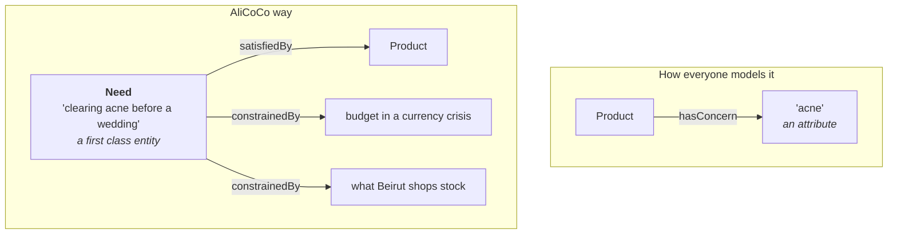
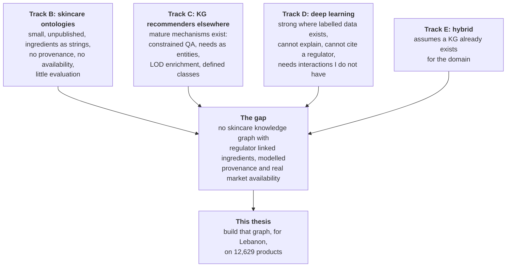

# Literature review, tracks C, D and E

Track B was the direct competitors. These three tracks are where the mechanisms
come from.

| Track | What it covers | What I get from it |
|---|---|---|
| C | Ontology and knowledge graph recommenders in any domain | Mechanisms. Nobody in skincare has solved these problems, but somebody in food or e-commerce has |
| D | Deep learning recommenders, and skin analysis | The alternative I must position against, honestly |
| E | Hybrid, knowledge graph plus neural | Where the field is going, and where my future work chapter lives |

---

# TRACK C: ontology and knowledge graph recommenders in other domains

---

## C1. Middleton, Shadbolt and De Roure (2004), the origin point

| | |
|---|---|
| Citation | S. E. Middleton, N. R. Shadbolt, D. C. De Roure, "Ontological User Profiling in Recommender Systems", *ACM Transactions on Information Systems*, 22(1), 54 to 88, 2004 |
| DOI | [10.1145/963770.963773](https://dl.acm.org/doi/10.1145/963770.963773) |
| Venue | **ACM TOIS. Q1, and the highest ranked venue here.** The most respected venue in my entire review |
| Citations | in the thousands. This is the paper everyone cites when justifying an ontology in a recommender |
| Institution | University of Southampton |

**Cite this first in the chapter.** It is the paper that establishes that using
an ontology in a recommender is a legitimate research position rather than an
eccentric choice.

### What they built

Two systems, **Quickstep** and **Foxtrot**, recommending academic research
papers. User profiles are built from unobtrusively monitored behaviour plus
relevance feedback, and the profile is expressed **in terms of a topic
ontology** rather than as a bag of keywords.

### The three findings, which are my three arguments

| Their finding | My use of it |
|---|---|
| **Ontological inference improves user profiling.** If you are interested in a subtopic, inference concludes you are interested in the parent topic | My skin concerns have a hierarchy. Interest in "post acne marks" implies interest in "hyperpigmentation" |
| **External ontological knowledge successfully bootstraps a recommender.** They started new users from an existing publication database rather than from nothing | **This is my cold start answer.** A new user in Beirut has no history. But the ontology already knows what suits combination skin, so recommendation is possible on day one. A collaborative filtering system cannot do this |
| **Profile visualisation improves profiling accuracy.** Showing users their own profile and letting them correct it | A user can see and edit "the system thinks your skin is oily and you dislike fragrance". That is an interface argument for an ontology |

### Outside the box

The unobtrusive monitoring idea, applied to Lebanon, is not browsing history.
It is **the receipt**. Lebanese pharmacies are small and repeat custom is the
norm. A profile built from what a person actually re-bought is more honest than
one built from what they clicked. My `shops_in_lebanon` and price columns are
the beginning of a purchase side model that no global system has.

---

## C2. FoodKG (2019), the closest structural analogue in any domain

| | |
|---|---|
| Citation | S. Haussmann, O. Seneviratne, Y. Chen, Y. Ne'eman, J. Codella, C. Chen, D. L. McGuinness, M. J. Zaki, "FoodKG: A Semantics-Driven Knowledge Graph for Food Recommendation", *ISWC 2019* |
| DOI | [10.1007/978-3-030-30796-7_10](https://link.springer.com/chapter/10.1007/978-3-030-30796-7_10) |
| Venue | **ISWC, the top semantic web conference.** A rank A venue |
| Institutions | Rensselaer Polytechnic Institute and IBM Research |
| Published | yes, [foodkg.github.io](https://foodkg.github.io/) |

**If you read one paper outside your own domain, read this one.** The shape of
the problem is nearly identical to mine.

### The analogy, spelled out

| FoodKG | My work |
|---|---|
| recipes | products |
| ingredients | INCI ingredients |
| nutrition data from an authority | **CosIng from the European Commission** |
| food taxonomies | product type taxonomy |
| allergies as hard constraints | **the EU 26 declarable allergens as hard constraints** |
| "what can I make with what is in my kitchen" | "what can I buy with what is in my pharmacy" |
| health goals | skin concerns |

They integrate recipes, nutrition, taxonomies and links into existing
ontologies into one graph, then run a **SPARQL based service that finds a
recipe from available ingredients while respecting constraints such as
allergies**.

That last sentence describes a service I could build over my data next week.

### What they did that I should copy exactly

| Practice | Why |
|---|---|
| They describe the **construction process** as a contribution in its own right | My dataset construction is already a paper. FoodKG shows a top venue accepting graph construction as the contribution |
| They state a **maintenance plan** | Every skincare ontology in track B is a snapshot with no plan. Saying how mine stays current is cheap and rare |
| Multiple applications on one graph | Question answering, recipe suggestion, constraint satisfaction. I should present my graph as infrastructure, not as one app |
| **Hard constraints, not preferences** | An allergy is not a preference to weigh. It is a filter. My allergen and restriction data works the same way, and this is where an ontology beats a neural recommender outright |

### Outside the box

FoodKG powers a **question answering agent**, not a ranked list. The related
work here, "Personalized Food Recommendation as Constrained Question Answering
over a Large-scale Food Knowledge Graph"
([arXiv 2101.01775](https://arxiv.org/pdf/2101.01775)), frames recommendation as
constrained QA.

For me: a Lebanese user does not want a ranked list of 12,629 products. They
want to ask **"something for dry skin, under fifteen dollars, that I can
actually buy in Hamra"**. That is a constrained question, and my dataset has
all four constraints as real columns. Framing my system as constrained QA
rather than as ranking is both more useful and more defensible, because
constraint satisfaction is where symbolic methods are genuinely better than
neural ones.

---

## C3. Di Noia, Ostuni and colleagues, the Linked Open Data recommender line

| | |
|---|---|
| Key papers | "Linked Open Data to Support Content-based Recommender Systems", I-SEMANTICS 2012; "Top-N recommendations from implicit feedback leveraging Linked Open Data", RecSys 2013; ["Using Linked Open Data in Recommender Systems", WIMS 2015](https://dl.acm.org/doi/10.1145/2797115.2797128) |
| Institution | Politecnico di Bari |
| Data | DBpedia, Freebase, LinkedMDB. Movies |

### The mechanism

They compute similarity with a **semantic vector space model**, sVSM. Each item
becomes a vector whose dimensions are its links in the LOD cloud rather than
its words. Two films are similar if they share a director, a genre, a period, a
country.

For me: two products are similar if they share ingredient functions, a
restriction profile, a concern, a price band, a country of origin. **I can
compute product similarity from graph structure without a single user rating.**
Given that my `rating` column is only 51 percent complete and I have no user
history at all, this is not a stylistic choice. It is the only content based
similarity available to me that uses everything I collected.

### The honest limitation, which they state

Their future work names better SPARQL queries and **better DBpedia matching
rules and resource identification**. In other words, entity matching is the
hard part.

I know this already. My fuzzy matching experiment showed `token_set_ratio`
scoring a category page 100 against a full product name, and my third party
database pass produced an error rate between 19 and 33 percent. **I have
measured, on my own data, the exact failure mode that a top group in this field
named as their open problem.** That is a strong paragraph for my thesis and I
should write it.

### Outside the box

They used LOD to enrich items that were otherwise thin. My items are not thin,
they are unusually rich. So invert it: **use LOD to enrich the shops, not the
products.** Wikidata and OpenStreetMap know where Beirut pharmacies are. A
graph that knows a product is available at a shop that is a fifteen minute walk
away is doing something no cosmetics recommender has ever done, and geography
is the one dimension where a Lebanese thesis has data nobody else can get.

---

## C4. AliCoCo (2020), the idea that reframes my whole design

| | |
|---|---|
| Citation | X. Luo, L. Liu, Y. Yang, L. Bo, Y. Cao, J. Wu, Q. Li, K. Yang, K. Q. Zhu, "AliCoCo: Alibaba E-commerce Cognitive Concept Net", *ACM SIGMOD 2020* |
| DOI | [10.1145/3318464.3386132](https://dl.acm.org/doi/10.1145/3318464.3386132) |
| Follow up | AliCoCo2, SIGKDD 2021 |
| Venue | **SIGMOD, rank A star.** The highest ranked database venue |
| Code | [github.com/alicogintel/AliCoCo](https://github.com/alicogintel/AliCoCo) |

### The one idea

Existing product ontologies describe **what a product is**. AliCoCo's argument
is that this leaves a semantic gap, because shoppers do not think in product
categories. So they make **user needs first class entities**, calling them
e-commerce concepts. Not "moisturiser" but "outdoor barbecue", "keeping warm in
winter", "preparing for a beach holiday".

### Why this matters more to me than any other paper in track C

My `concerns` column is already a user need, sitting in a product schema as if
it were a product attribute. AliCoCo says promote it.

A need entity can be satisfied by a routine of several products, can carry a
budget, can carry a season, and can be constrained by availability. A product
attribute can do none of that.

### Outside the box

Lebanese needs are not global needs. **"A routine under twenty dollars a month
that survives a power cut", "products that do not need refrigeration",
"something for a bride", "a routine I can buy entirely in one pharmacy".** These
are real needs shaped by a real economy, and they are expressible in my data
because I have prices in lira, shop level availability and multi shop
comparison.

Modelling Lebanese consumer needs as first class ontology entities, grounded in
a real product catalogue, is a contribution nobody can replicate without my
dataset. **If I want one idea that makes this thesis special rather than
competent, it is this one.**

---

## C5. Guo et al., the survey that gives me my taxonomy

| | |
|---|---|
| Citation | Q. Guo, F. Zhuang, C. Qin, H. Zhu, X. Xie, H. Xiong, Q. He, "A Survey on Knowledge Graph-Based Recommender Systems", *IEEE Transactions on Knowledge and Data Engineering*, 34(8), 3549 to 3568, 2022. Preprint [arXiv:2003.00911](https://arxiv.org/pdf/2003.00911), 2020 |
| Venue | **IEEE TKDE. Q1** |
| Citations | over a thousand |

**Cite the 2022 TKDE version, not the 2020 preprint.** I nearly got that wrong.

### Their three way split, which I will use to structure my chapter

| Family | How the KG is used | Strength | Weakness |
|---|---|---|---|
| **Embedding based** | turn entities into vectors, feed to a model | scales, learns latent structure | the reasoning is gone. You cannot explain a recommendation |
| **Path based** | find meaningful paths between user and item | **explainable**, the path is the reason | expensive, and path design needs domain knowledge |
| **Unified** | propagate over the graph, combining both | best accuracy in benchmarks | complex, needs a lot of interaction data |

### Where I sit, and I must say this explicitly

**None of the three.** All three assume a user item interaction matrix.

I have **no user interactions at all**. What I have is an unusually rich item
side graph with regulatory grounding and provenance. So my work is upstream of
this taxonomy: I build the knowledge graph that these methods would consume.

**Say it in the thesis like this:** the survey classifies methods for using a
knowledge graph in recommendation. It assumes such a graph exists for the
domain. For skincare in a local market, it does not. This thesis constructs
one.

That sentence turns "I do not have user data" from a weakness into a scope
statement.

---

# TRACK D: deep learning approaches

---

## D1. Lee et al. (2024), the direct deep learning competitor

| | |
|---|---|
| Citation | J. Lee, H. Yoon, S. Kim, C. Lee, J. Lee, S. Yoo, "Deep learning-based skin care product recommendation: A focus on cosmetic ingredient analysis and facial skin conditions", *Journal of Cosmetic Dermatology*, 2024 |
| DOI | [10.1111/jocd.16218](https://onlinelibrary.wiley.com/doi/10.1111/jocd.16218). [PubMed 38411029](https://pubmed.ncbi.nlm.nih.gov/38411029/) |
| Venue | **A Wiley clinical dermatology journal.** Better standing than most of track B |
| Institution | AI R&D Center, lululab Inc., Seoul |
| Read | abstract and publisher page |

**This is the paper that does my problem without an ontology, and I have to
answer it directly.**

### What they do

A deep neural network estimates the **efficacy of a cosmetic from its
ingredients**, combined with AI facial skin analysis, to recommend personalised
products.

Note the overlap. They also start from the ingredient list. They also connect
ingredients to outcomes. The difference is entirely in how.

### The comparison I must write

| | Lee et al. 2024 | This thesis |
|---|---|---|
| Ingredients to efficacy | learned by a neural network from data | **derived from the EU register plus stated rules** |
| Can it explain a recommendation | a weight, not a reason | **the ingredient, its function, and the annex entry** |
| Needs training data | yes, and proprietary | no |
| Handles an ingredient never seen in training | poorly | **it is in the register or it is not, and coverage is reported** |
| Regulatory defensibility | none | **cites Regulation (EC) 1223/2009** |
| Handles availability and price | not addressed | **core** |
| Adapts to a new market | retrain | reload one named graph |
| Corporate or academic | corporate R&D | academic, and the artefacts will be public |

### The honest paragraph I owe the reader

A neural approach will likely beat mine on any benchmark where enough labelled
data exists, because it can learn interactions my rules do not encode. **I
should say that rather than pretend otherwise.** My argument is not accuracy.
It is that in a domain with physical risk and a legal framework, a
recommendation that cannot cite its reason is not usable by a pharmacist, is
not auditable by a regulator, and cannot be corrected when it is wrong. And
that in a market of 12,629 products and no user interaction logs, there is no
training data anyway.

### Outside the box

Their DNN is a function from an ingredient list to an efficacy estimate. **I
could use it as a hypothesis generator and my ontology as the check.** Train
something small on my 11,802 formulas to predict claimed benefits, then take
its confident predictions and test them against the CosIng functions. Where the
model and the register agree, the claim is well supported. Where they disagree,
I have found either a mislabelled product or a genuinely novel formulation.
**That disagreement set is a research result in itself**, and it is only
computable because I have both halves.

---

## D2. The deep learning recommender background

Cited briefly, for context rather than for method. I am not building these.

| Work | What it introduced | Relevance |
|---|---|---|
| He et al., **Neural Collaborative Filtering**, WWW 2017, [arXiv:1708.05031](https://arxiv.org/abs/1708.05031) | replaced the inner product of matrix factorisation with a neural network | the standard baseline. Needs a user item matrix, which I do not have |
| Zhang, Yao, Sun, Tay, **Deep Learning based Recommender System: A Survey and New Perspectives**, *ACM Computing Surveys* 52(1), 2019, [arXiv:1707.07435](https://arxiv.org/abs/1707.07435) | the reference survey | cite for the taxonomy of neural recommenders |
| Cheng et al., **Wide and Deep**, 2016 | memorisation plus generalisation together | the argument that rules and learning are complementary, which supports my hybrid future work |
| Sun et al., **BERT4Rec**, CIKM 2019 | sequence models for recommendation | relevant only if I ever get session data |

### The one sentence that positions all of them

Every method in this track learns from **user behaviour**. My dataset contains
none, by design, because it is a product resource rather than an interaction
log. That is a boundary, not a defect, and it defines which half of the
literature my thesis belongs to.

---

## D3. Skin analysis by CNN

Covered in track B under Hansanie and Silva. The general point: computer vision
on faces is a solved enough problem that several groups treat it as a component.
Every such system still needs a product side to recommend from, and the product
side is consistently the weaker half. **Vision tells you the skin has acne. It
cannot tell you the cream is sold in Beirut, costs eleven dollars, and contains
a restricted preservative.**

That sentence is my one line answer to "why not just do deep learning".

---

# TRACK E: hybrid, knowledge graph plus neural

This track is my future work chapter, not my method chapter. But I must show I
know it exists, because a supervisor will ask why I am not doing it.

---

## E1. The four canonical models

| Model | Citation | Idea | What it needs |
|---|---|---|---|
| **CKE** | Zhang et al., KDD 2016 | learn item embeddings from a KG and from ratings jointly | ratings |
| **RippleNet** | Wang et al., CIKM 2018, [arXiv:1803.03467](https://arxiv.org/abs/1803.03467) | spread user interest outward through the graph like a ripple | interaction history |
| **KGAT** | X. Wang, X. He, Y. Cao, M. Liu, T. Chua, KDD 2019, [arXiv:1905.07854](https://arxiv.org/pdf/1905.07854), [code](https://github.com/xiangwang1223/knowledge_graph_attention_network) | graph attention over a collaborative knowledge graph, models high order relations | interaction history |
| **KPRN** | Wang et al., **AAAI 2019**, [paper](https://ojs.aaai.org/index.php/AAAI/article/view/4470) | encodes the **path** between user and item with a recurrent network, pools paths by strength | interaction history |

**KPRN is the one to read**, because it is the explainable one. The path from
user to item *is* the explanation. That is the same intuition as a reasoner
producing a justification, arrived at from the neural side.

Related: **PGPR**, policy guided path reasoning with reinforcement learning, and
work on **explanation path quality** measured by recency, popularity and
diversity ([Balloccu et al.](https://arxiv.org/pdf/2209.04954)).

### The pattern across all of them

Every one assumes a user item interaction matrix and treats the knowledge graph
as **side information** to fix sparsity. **My position is the mirror image.** I
have no interactions and a very strong graph. So these methods are what my
graph enables later, once a deployment produces interaction data.

Say exactly that in the future work section and the question is answered before
it is asked.

---

## E2. Ontology embeddings, the bridge I might actually use

| | |
|---|---|
| **RDF2Vec** | Ristoski and Paulheim, ISWC 2016. Random walks over the graph treated as sentences, then word2vec |
| **OWL2Vec\*** | Chen, Jiménez-Ruiz, Horrocks et al., *Machine Learning* journal, 2021, [DOI 10.1007/s10994-021-05997-6](https://link.springer.com/article/10.1007/s10994-021-05997-6), [code](https://github.com/KRR-Oxford/OWL2Vec-Star) |

OWL2Vec* exists because RDF2Vec ignores OWL logic. OWL2Vec* uses graph
structure, lexical information **and logical constructors**, materialising the
ontology with a reasoner first.

**Why this is the right hybrid entry point for me and RippleNet is not.**
OWL2Vec* needs an ontology, not a user log. I will have an ontology with real
logical constructors, my three defined classes among them, so it is directly
applicable. Two things it would give me:

1. **Product similarity with no ratings.** Embed products, find neighbours.
   Evaluate by asking whether neighbours share concerns and functions.
2. **Missing value prediction.** My `size_value` is 27 percent complete and
   `rating` 51 percent. Class membership prediction is exactly what OWL2Vec*
   was evaluated on.

Tooling: [PyKEEN](https://pykeen.readthedocs.io/) for embedding models
generally.

---

## E3. Ontology plus deep learning, recent

- **"Ontology-based recommender system: a deep learning approach"**, *The
  Journal of Supercomputing*, 2024,
  [DOI 10.1007/s11227-023-05874-0](https://link.springer.com/article/10.1007/s11227-023-05874-0).
  Cite as evidence that the combination is a current, publishable direction.
- **LLMs4OL**, the Large Language Models for Ontology Learning challenge at
  ISWC, [2024 overview](https://arxiv.org/pdf/2409.10146), second edition 2025.
  Three tasks: term typing, taxonomy discovery, non taxonomic relation
  extraction.
- **"Large Language Models for Ontology Engineering: A Systematic Literature
  Review"**, Li, Garijo, Poveda-Villalón, *Semantic Web* journal, 2026,
  [DOI 10.1177/22104968261465514](https://doi.org/10.1177/22104968261465514).
  The current state of the art review. Read it before writing my methodology
  chapter.

### Outside the box, and this is a real opportunity

My `benefits` and `concerns` columns are free text written by retailers in
several languages. That is precisely **term typing and taxonomy discovery**,
the LLMs4OL tasks. I could use an LLM to propose a concern taxonomy from my own
data, then **validate every proposal against CosIng and against DermO**, and
report how many survived.

That design is defensible in a way that "I asked ChatGPT" is not, because the
LLM proposes and an authority disposes. And the survival rate is a number
nobody has published for cosmetics. It would make a strong second paper.

---

# TRACK A: dataset and resource construction

Short, because this is contribution one and it is already written up.

The argument to make in the chapter: **resource papers are a recognised
category with their own venues and their own standards.** FoodKG at ISWC and
TOXIN in *Database* are both resource contributions in strong venues. Data
descriptor journals such as *Scientific Data* and *Data in Brief* exist for
exactly this.

What a resource paper is judged on, and how I stand:

| Criterion | My position |
|---|---|
| Is the resource novel | first skincare dataset combining a global catalogue with a specific national retail and manufacturing market |
| Is it available | yes, with code |
| Is it documented | 42 columns, a portal, a runbook, a glossary |
| Is it validated | a validation suite, all checks passing |
| Is provenance recorded | four evidence levels, quoted source sentences, source URLs |
| Is it reusable | the ontology phase is the demonstration of reuse |
| Are the limits stated | 984 products with no formula, and the gap is described rather than hidden |

**The strongest thing about contribution one is the failure reporting.** Per
route recovery rates, the 19 to 33 percent error rate measured on third party
matches, the routes abandoned for stated reasons. Almost no dataset paper does
this. Lead with it.

---

# The one page summary of what this whole review says

