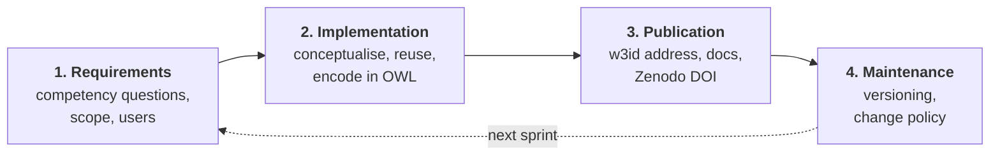
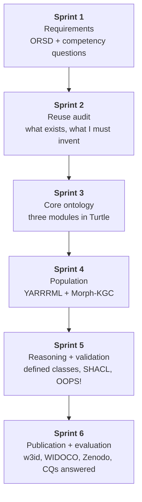

# Methodologies, toolkits and the build roadmap

The literature review says what other people did. This says what I will do,
with the decision points marked and a recommendation at each one.

---

# Part 1: choosing a methodology

A methodology is a named, published procedure for building an ontology. Naming
one in the thesis matters, because "I made it up as I went" is not a method and
a reviewer will notice.

| Methodology | Year | Character | Verdict for me |
|---|---|---|---|
| **Ontology Development 101** | Noy and McGuinness, 2001 | seven steps, teaching oriented. [PDF](https://protege.stanford.edu/publications/ontology_development/ontology101.pdf) | Cite it. Everyone does. Too light to be my only method |
| **METHONTOLOGY** | Fernández-López et al., 1997 | heavyweight, the eight document tasks Moe and Aung followed | Used by the bit-Tech paper. Thorough, but old and slow |
| **On-To-Knowledge** | 2001 | enterprise oriented | Skip |
| **DILIGENT** | 2004 | for distributed teams arguing about a shared ontology | Skip, I am one person |
| **NeOn** | Suárez-Figueroa et al., 2012 | nine scenarios, built around **reusing existing resources** | Strong. Its scenario framing fits me because reuse is my situation |
| **eXtreme Design (XD)** | Presutti et al., 2009 | agile, built on **Ontology Design Patterns** | Good ideas, best used alongside another method |
| **SAMOD** | Peroni, 2016 | agile, test driven, small increments | Attractive if I want a test driven story |
| **LOT, Linked Open Terms** | Poveda-Villalón et al., *Engineering Applications of AI*, 2022. [DOI](https://www.sciencedirect.com/science/article/pii/S0952197622000525), [site](https://lot.linkeddata.es/) | lightweight, iterative, built around **reusing published terms** and **publishing the result** | **This is my choice** |

## Why LOT

Four reasons, and each maps onto something I have already done or already
decided.

| LOT emphasises | My situation |
|---|---|
| Reusing terms from already published vocabularies | I have already chosen schema.org, PROV-O, SKOS and Dublin Core, and identified OntoCosmetic, DermO and CosIng as domain sources |
| Publishing the ontology properly | One of my five gap findings is that almost nothing in track B is published. I cannot make that criticism and then not publish |
| Iterative sprints rather than one big design | My dataset was built iteratively and its scope widened twice. Pretending otherwise would be dishonest |
| Industry orientation | My stated ambition is that a Lebanese company could adopt this |

## The four LOT activities, and what each produces for me



| Activity | My deliverable | Goes in thesis chapter |
|---|---|---|
| Requirements | an ORSD, ontology requirements specification document, with my competency questions | Methodology |
| Implementation | `skincare-lb.ttl` plus the three modules | Design |
| Publication | w3id.org address, WIDOCO documentation, Zenodo DOI | Results |
| Maintenance | versioning policy, what happens when CosIng updates | Discussion |

**An ORSD is a short structured document** stating the ontology's purpose,
scope, intended users, intended uses, and its competency questions. It is
maybe three pages. Writing one is the single highest value hour I can spend,
because it turns everything after it into checkable work.

---

# Part 2: the tool decisions

Six decisions. Each has a recommendation and a reason.

## Decision 1: editor

| Option | For | Against |
|---|---|---|
| **Protégé desktop** | standard, reasoners built in, everyone knows it | file based, awkward with git |
| WebProtégé | browser, sharing, supervisors can look | fewer features |
| Write Turtle by hand | full control, clean diffs | easy to make invalid |

**Recommendation: Protégé for modelling, hand edited Turtle in git as the
source of truth.** Protégé to check the reasoner is happy and to produce the
class hierarchy screenshot for the thesis. But the `.ttl` in the repository is
what counts, because it diffs cleanly and it is what other people will download.

## Decision 2: how instances get in, and this is the most important one

| Option | Verdict |
|---|---|
| By hand in Protégé | impossible at 12,629 |
| A Python script with RDFLib | works, but the mapping is buried in code and cannot be audited |
| **A declarative mapping file** | **yes** |
| OntoRefine point and click | good, but the mapping is trapped inside GraphDB |
| An LLM | not defensible on its own, yet |

**Recommendation: RML mapping written in YARRRML, executed by Morph-KGC.**

| Why | |
|---|---|
| Precedent | TOXIN, peer reviewed in *Database*, used R2RML for exactly this |
| Auditable | the mapping is a readable YAML file that goes in the appendix and the repository |
| Repeatable | dataset changes, rerun one command, graph rebuilt. That is a method, not a script |
| Python | Morph-KGC is pandas based, which matches my pipeline |
| Standard | RML is a community specification, not a tool specific format |

Links: [Morph-KGC](https://morph-kgc.readthedocs.io/),
[YARRRML](https://rml.io/yarrrml/), [RML](https://rml.io/specs/rml/),
[awesome-kgc-tools](https://kg-construct.github.io/awesome-kgc-tools/)

**What a YARRRML mapping looks like**, so it is not mysterious:

```yaml
mappings:
  product:
    sources: [SKINCARE_FINAL.csv~csv]
    s: http://w3id.org/skincare-lb/product/$(product_id)
    po:
      - [a, schema:Product]
      - [schema:name, $(name)]
      - [schema:brand, http://w3id.org/skincare-lb/brand/$(brand)~iri]
      - [skc:ingredientCount, $(ingredient_count), xsd:integer]
      - [skc:cosingCoverage, $(cosing_coverage), xsd:decimal]
```

Six lines, and every product row becomes a set of triples. That is the whole
idea.

## Decision 3: triple store

| Option | For | Against |
|---|---|---|
| **GraphDB Free** | reasoning built in, OntoRefine included, good visual explorer for demos | desktop licence limits |
| Apache Jena Fuseki | free, simple, scriptable, used by the bit-Tech paper | no reasoning worth the name |
| Stardog | strongest reasoning | commercial |

**Recommendation: GraphDB Free.** The visual graph explorer alone is worth it,
because showing a supervisor a picture of the graph is worth more than any
paragraph. Fuseki as a fallback if licensing gets awkward.

## Decision 4: reasoner

**Recommendation: HermiT inside Protégé for development, plus GraphDB's own
inference at query time.** Add **Openllet** only if I write SWRL rules, because
HermiT does not do SWRL.

## Decision 5: validation

**Recommendation: SHACL, and run OOPS! and FOOPS! once and report the results.**

| Tool | Gives me |
|---|---|
| [SHACL](https://www.w3.org/TR/shacl/) | my `validate_dataset.py` checks, on the graph |
| [OOPS!](https://oops.linkeddata.es/) | a graded list of design pitfalls |
| [FOOPS!](https://w3id.org/foops/) | a FAIR compliance score |
| [OntoMetrics](https://ontometrics.informatik.uni-rostock.de/) | structural metrics for a table |

Reporting an OOPS! result is a concrete evaluation number that **not one paper
in track B has**. It costs an afternoon.

## Decision 6: publishing

| Step | Tool |
|---|---|
| Permanent address | [w3id.org](https://w3id.org/), free, a pull request on GitHub |
| Documentation | [WIDOCO](https://github.com/dgarijo/Widoco), generates an HTML page from the ontology |
| Citable version | [Zenodo](https://zenodo.org/), gives a DOI per release |
| Discoverability | [Linked Open Vocabularies](https://lov.linkeddata.es/dataset/lov/) and BioPortal |

---

# Part 3: the roadmap

Six sprints. Each one produces something showable.



## Sprint 1: requirements

Write the ORSD. Purpose, scope, users, uses, and the competency questions.

Start with these five, then add:

1. Which products under twenty dollars, sold in Lebanon, suit oily skin and
   contain no declarable allergen?
2. Which products claiming sensitive skin suitability contain one of the EU 26?
3. For a given product, which shop is cheapest, and when was that price seen?
4. Which Lebanese origin products contain an ingredient restricted under
   Annex III?
5. Which claims about this product come from the manufacturer rather than a
   retailer?

**Every one of those is answerable from columns I already have.** That is not
an accident, it is the point.

## Sprint 2: reuse audit

For every one of my 42 columns, decide: reuse an existing term, or invent one.
Search [LOV](https://lov.linkeddata.es/dataset/lov/) before inventing anything.

Also, three things to check that could each save weeks:

| Check | Why |
|---|---|
| [biobricks-ai/cosing-kg](https://github.com/biobricks-ai/cosing-kg) | if CosIng is already usable RDF, my ingredient layer is nearly free |
| [DermO on BioPortal](https://bioportal.bioontology.org/ontologies/DERMO) | if my concerns map onto DermO terms, my vocabulary gains clinical standing |
| Wikidata brand coverage | if my 1,463 brands are there, I get parent company and country free |

Produce a table with 42 rows. It goes straight into the thesis.

## Sprint 3: the core ontology, three modules

Following Hansanie and Silva's three file design, for the reason they give:
the three parts change at completely different speeds.

| Module | Holds | Changes |
|---|---|---|
| `skincare-domain.ttl` | skin types, concerns, benefits, ingredient functions, regulatory status | rarely |
| `skincare-product.ttl` | Product, Brand, Offer, Shop, Ingredient, and the links | with the market |
| `skincare-user.ttl` | Person, profile, allergies, ratings | per user |

Plus `skincare-lb.ttl` that imports all three and adds the Lebanon specifics.

Splitting like this means I can hand a dermatologist one small file instead of
12,629 rows, which is a real practical argument, not a tidiness one.

## Sprint 4: population

Write the YARRRML mapping. Run Morph-KGC. Load into GraphDB as **named graphs
by source**, following TOXIN.

| Named graph | Contents |
|---|---|
| `graph:skinsort` | the 6,294 global catalogue products |
| `graph:lb-retail` | the 5,014 sold by Lebanese shops |
| `graph:lb-origin` | the 802 made in Lebanon |
| `graph:cosing` | the ingredient register layer |
| `graph:inferred` | whatever the reasoner concludes |

Then a query can be restricted to sources I trust, and a source can be reloaded
without disturbing the others.

## Sprint 5: reasoning and validation

- Encode the defined classes. Start with the three I have.
- Run HermiT. **Expect it to find contradictions, and treat every one as a
  finding rather than a nuisance.** The 593 products marked sensitive safe that
  contain a declarable allergen will surface here as a formal inconsistency
  rather than as a note in a README.
- Write SHACL shapes mirroring `validate_dataset.py`.
- Run OOPS! and FOOPS!, record the scores, fix what is cheap to fix, report the
  rest.

## Sprint 6: publication and evaluation

- w3id address, WIDOCO docs, Zenodo DOI.
- Answer every competency question with a SPARQL query. Put the query and its
  result in the thesis. **That is the evaluation chapter**, and it is a stronger
  one than most of track B has.

---

# Part 4: the evaluation plan, because this is where track B is weakest

Four layers, none of which needs users I do not have.

| Layer | Method | Result |
|---|---|---|
| **Structural** | OntoMetrics, OOPS!, FOOPS! | numbers, comparable to other ontologies |
| **Functional** | every competency question answered by a SPARQL query | a table of question, query, result count |
| **Logical** | HermiT consistency, and what the defined classes infer | count of products entering each defined class, and any contradictions found |
| **Comparative** | the track B table | show which cells only my work fills |

Optionally a fifth, if time allows: **an expert review**, three or four
pharmacists or dermatologists in Beirut shown twenty recommendations and asked
whether the stated reason is sound. Small, cheap, and more than Hansanie and
Silva's survey achieved, because it evaluates the reasoning rather than
satisfaction.

---

# Part 5: the five contribution claims, ranked

Ordered by how defensible each is, not by how exciting.

| | Claim | Strength |
|---|---|---|
| 1 | A skincare ontology whose ingredient layer is grounded in the EU register, on 12,629 products | **Strongest.** No competitor does this. TOXIN grounds ingredients but has no products |
| 2 | Provenance as a first class part of the model, four evidence levels | **Strong.** Nobody in track B models it. PROV-O makes it standard rather than invented |
| 3 | Availability and price as first class, so the Lebanese market is modelled rather than assumed | **Strong and unique.** Every other system assumes purchasability |
| 4 | A published, documented, versioned artefact with a DOI | **Easy and rare.** One in six competitors publishes |
| 5 | Needs as first class entities, in the AliCoCo sense, shaped by Lebanese conditions | **Most original, least certain.** Highest reward if it works |

**Claims one to four are safe.** Deliver those and the thesis is sound. Claim
five is the one that makes it memorable, so attempt it after the others are
done, not before.
