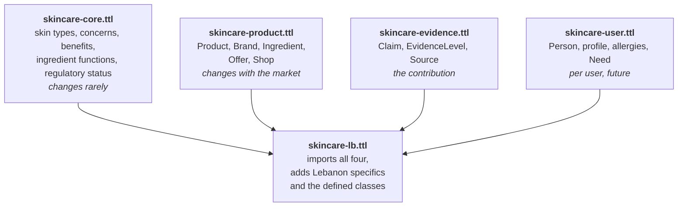
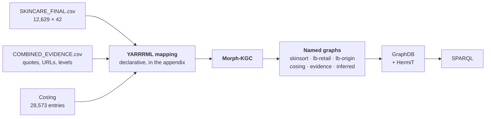

# The ontology master plan

Everything, in build order, justified by the literature. This is the document
to work from.

I searched again through an academic index covering Semantic Scholar, PubMed,
Scopus and arXiv, which returned papers the general web search missed. Section
0 lists what changed as a result. Everything after that is the plan.

---

# 0. What the second search round changed

Nine papers I did not have. Four of them change the plan, not just the review.

| Paper | Why it matters | Effect |
|---|---|---|
| **Rahayu et al. (2022)**, *Computers and Education: AI*, 137 citations. Systematic review of ontology use in recommender systems | Finds that ontology based recommenders **"seldom use the methodology of building ontologies"** and that **"none of the primary studies described ontology evaluation methodologies"** | This is my gap statement, quantified, by somebody else, in a well cited review. Naming a methodology and naming an evaluation method now puts me ahead of the field rather than merely being tidy |
| **Shimizu et al. (2022)**, *Semantic Web*, 84 citations. Modular Ontology Modeling (MOMo) | A modern, evaluated methodology built on modules and design patterns, with tool support | Changes my methodology choice. See section 1 |
| **O'Sullivan et al. (2025)**, *Int. J. Population Data Science* | Builds a **derived PROV-O ontology using the four step LOT methodology**, for provenance and audit | My exact plan, already published by somebody else. A precedent I can cite rather than a bet |
| **Hoang et al. (2025)**, *IEEE Access*, 8 citations. HaCKG | A **cosmetics knowledge graph** with a pre-trained relational graph attention network, predicting halal status from ingredients | Somebody has already built a cosmetics KG plus GNN. My halal idea is real but no longer novel on its own. See section 9 |
| **Ali et al. (2026)**, *J. Biomedical Informatics*, 11 citations | Ontology grounded GraphRAG cut hallucination from 63 percent to 1.7 percent in clinical QA | The strongest available argument for why an ontology beats an LLM alone. Goes in my introduction |
| **Gong et al. (2023)**, *Bioinformatics*. CCIBP | A cosmetic ingredient platform with regulations from major world regions, at `design.rxnfinder.org/cosing` | A possible second ingredient source, and a resource paper precedent in a strong journal |
| **Klaschka (2015)**, *Environmental Sciences Europe*, 107 citations | 1,358 natural substances in INCI, 655 in the EU classification inventory, **56 percent classified as hazardous**, 53 as CMR | Hard evidence that "natural" does not mean "safe". Directly usable against my `free_from` marketing claims |
| **Lahoud et al. (2022)**, *Education and Information Technologies*, 36 citations | An ontology based recommender **evaluated on Lebanese students** | Local precedent. Shows a Lebanon focused ontology recommender is publishable |
| **Sepehri et al. (2025)**, *Database* | The TOXIN paper. **Correction: it is 2025, not 2024**, 88 ingredients, 53 with liver effects, live at `toxin-search.netlify.app` | Fix the citation |

Two corrections to what I wrote before:

1. TOXIN is **Sepehri et al., 2025**, not 2024.
2. Moe and Aung has a **second version, 2016, with 8 citations**, more than the 2014 one. Cite the 2014 IJITCS version and note the reprint.

---

# 1. Methodology: MOMo with LOT publication, and why I changed my mind

I recommended LOT alone before. The better answer is a combination, and I can
defend the combination because both are published and evaluated.

| Methodology | Contributes | Citation |
|---|---|---|
| **MOMo**, Modular Ontology Modeling | How to build: modules, design patterns, graphical schema diagrams as the elicitation device | Shimizu et al., *Semantic Web*, 2022 |
| **LOT**, Linked Open Terms | How to run the project and how to publish: requirements, implementation, publication, maintenance | Poveda-Villalón et al., *Eng. App. AI*, 2022 |
| **Noy and McGuinness 101** | The teaching reference everybody knows | 2001 |

MOMo builds on eXtreme Design, which builds on Ontology Design Patterns. The
reason it fits me is that Shimizu et al. name the four reasons ontology reuse
usually fails, and I have hit three of them already:

| Their stated failure reason | Where I hit it |
|---|---|
| Differing granularity between an ontology and the use case | OntoCosmetic has 116 classes of emulsion chemistry and I need ten of them |
| Lacking conceptual clarity in reusable ontologies | Moe and Aung's `hasIngValue` means nothing without the paper |
| Difficulty adhering to good modelling principles | My first `.ttl` mixed product properties with ingredient properties |
| Lack of reuse emphasis in tooling | Protégé gives me no help finding an existing term |

**The sentence for the thesis:** the ontology was developed following Modular
Ontology Modeling for design and the Linked Open Terms methodology for
requirements, publication and maintenance, addressing the finding of Rahayu et
al. that ontology based recommender systems seldom apply a named ontology
construction methodology and rarely report an evaluation method.

That single sentence answers the two questions the literature says nobody
answers.

---

# 2. Requirements: the competency questions

Write these first. Everything downstream is checked against them. This is
sprint one and it is three pages of writing, not code.

## The ontology requirements specification

| Field | Value |
|---|---|
| Purpose | Represent skincare products, their ingredients, their regulatory status, the evidence behind each claim, and their availability in the Lebanese market, so that recommendations can be produced with a stated reason |
| Scope | Skincare only. Not makeup, not haircare. Retail selection, not formulation chemistry |
| Intended users | Consumers, pharmacists, and researchers. Secondarily Lebanese retailers |
| Intended uses | Constrained product search, safety screening, price and availability comparison, provenance audit |
| Out of scope | Clinical diagnosis, formulation design, dosage, efficacy prediction |

## Competency questions, grouped

Each is answerable from columns I already hold. That is not a coincidence, it
is the design constraint.

**Group A, safety and regulation**

1. Which products contain an ingredient restricted under Annex III?
2. Which products marked suitable for sensitive skin contain one of the 26
   declarable fragrance allergens?
3. For a given product, which ingredients are regulated, under which annex, and
   according to which authority?
4. Which products contain no ingredient classified as hazardous, and how many
   of those are marketed as natural?

**Group B, availability and price**

5. Which products suiting oily skin are sold in Lebanon for under twenty
   dollars?
6. For a given product, which shop is cheapest, and on what date was that price
   observed?
7. Which products exist in the global catalogue but cannot be bought in
   Lebanon?
8. Which Lebanese origin products contain a restricted ingredient?

**Group C, provenance**

9. Which claims about this product come from the manufacturer rather than a
   retailer?
10. Which products have a suitability claim supported only by inference from the
    formula?
11. Where two shops disagree about a product, what does each say and how
    strong is each source?

**Group D, structure and completeness**

12. Which products have a fully identified formula, meaning every ingredient
    found in the register?
13. What functions do the ingredients of this product perform, and how many
    ingredients perform each?
14. Which products are similar to this one by ingredient function profile?

**Group E, the Lebanese needs layer**

15. Which combinations of products form a complete routine under a stated
    monthly budget, all purchasable from one shop?

Question 15 is the ambitious one. Attempt it last.

---

# 3. The module structure

Four modules plus an integration file. Two independent justifications: Hansanie
and Silva split into three for the same reason, and MOMo makes modularity the
method.



| Module | Why separate |
|---|---|
| `skincare-core` | I can hand a dermatologist this one file instead of 12,629 rows. It is the only file a clinician needs to review |
| `skincare-product` | Rebuilt from the CSV every time the dataset changes. Nothing else has to move |
| `skincare-evidence` | The novel part. Separating it means somebody in another domain can reuse it, which is a second contribution |
| `skincare-user` | Empty for now. Its existence is the argument that the design scales to a deployed system |
| `skincare-lb` | Keeps the market specifics out of the reusable parts |

Namespace: `https://w3id.org/skincare-lb/` with prefix `skc:`.

---

# 4. The classes

Written out in full so this can be typed straight into Protégé.

## 4.1 skincare-core

```
Thing
├── SkinAttribute
│   ├── SkinType              Oily, Dry, Normal, Combination
│   └── Sensitivity           Sensitive, NotSensitive
├── SkinConcern               ← align each to DermO where one exists
│   ├── Acne                  ← DermO acne
│   ├── Dryness
│   ├── Redness
│   ├── Hyperpigmentation
│   ├── Wrinkles
│   ├── Dullness
│   ├── EnlargedPores
│   └── Oiliness
├── Benefit                   SKOS concepts, not OWL classes. See 4.6
├── IngredientFunction        ← names taken from CosIng
│   ├── Emollient
│   ├── Humectant
│   ├── Preservative
│   ├── UVFilter
│   ├── Surfactant
│   ├── Antioxidant
│   ├── Solvent
│   ├── ViscosityController
│   ├── SkinConditioning
│   ├── Fragrance
│   └── ChelatingAgent
├── RegulatoryStatus
│   ├── Prohibited            Annex II
│   ├── Restricted            Annex III
│   ├── PermittedColorant     Annex IV
│   ├── PermittedPreservative Annex V
│   ├── PermittedUVFilter     Annex VI
│   └── DeclarableAllergen    the EU 26
├── Annex                     AnnexII … AnnexVI, individuals not classes
└── Authority                 EuropeanCommission, SCCS, LebaneseMinistryOfHealth
```

**Two decisions to be able to defend.**

`Annex` entries are **individuals**, not classes, because `AnnexV/29` is a
specific entry, not a kind of thing. Noy and McGuinness's test: if you would
never subclass it, it is an individual.

`Authority` exists as a class because of the halal flavouring ontology pattern.
A status is always granted **by somebody**. Modelling the authority separately
means Lebanese regulation can be added later without redesign, and it makes the
statement `Phenoxyethanol restrictedUnder AnnexV/29 accordingTo
EuropeanCommission` expressible.

## 4.2 skincare-product

```
Thing
├── schema:Product ≡ skc:Product
│   ├── Cleanser
│   ├── Moisturiser
│   │   └── SunCare           SPF sits here, following Abesova et al.
│   ├── Serum
│   ├── Toner
│   ├── Exfoliant
│   │   ├── ChemicalExfoliant
│   │   └── PhysicalExfoliant
│   ├── Mask
│   ├── EyeCare
│   └── Treatment
├── Ingredient                one individual per CosIng entry
├── IngredientListing         ← the n-ary relation. See 4.4
├── schema:Brand ≡ skc:Brand
├── schema:Offer ≡ skc:Offer
├── Shop
│   ├── OnlineShop
│   └── PhysicalShop
└── Country
```

## 4.3 skincare-evidence, the contribution

```
Thing
├── Claim                     a reified statement about a product
├── EvidenceLevel
│   ├── ManufacturerStated    level 1
│   ├── RetailerStated        level 2
│   ├── WeakSourceStated      level 3
│   └── FormulaInferred       level 4
└── prov:Agent
    ├── Manufacturer
    ├── Retailer
    └── InferenceProcedure
```

`Claim` is the single most important modelling decision in the whole ontology,
and section 5 explains why it has to be reified.

## 4.4 The two reifications, and why they are unavoidable

This is the part that separates a real ontology from a spreadsheet in Turtle.

### Reification 1: IngredientListing

A triple has three slots. `Product hasIngredient Ingredient` cannot carry a
fourth fact: **the position in the INCI list**.

Position matters enormously. INCI order is concentration order down to one
percent. It is the only concentration signal a consumer ever gets, and the
2026 MVFM paper builds an entire method on it.

```turtle
:product_LBR00193  skc:hasListing  :listing_LBR00193_3 .

:listing_LBR00193_3
    a skc:IngredientListing ;
    skc:listsIngredient  :Niacinamide ;
    skc:atPosition       3 ;
    skc:fromSource       :graph_lb_retail .
```

This is the **n-ary relation ontology design pattern**, and citing it as such
shows I know the literature rather than having improvised.

### Reification 2: Claim

Same problem. `Product suitableFor OilySkin` cannot carry who said so, where
they said it, or how much they are worth.

```turtle
:product_LBR00193  skc:hasClaim  :claim_991 .

:claim_991
    a skc:Claim ;
    skc:claimProperty     skc:suitableFor ;
    skc:claimValue        skc:OilySkin ;
    skc:hasEvidenceLevel  skc:ManufacturerStated ;
    prov:wasAttributedTo  :brand_Cetaphil ;
    prov:wasDerivedFrom   <https://cetaphil.com/...> ;
    prov:generatedAtTime  "2026-03-14"^^xsd:date ;
    skc:quotedSentence    "Suitable for oily and combination skin." .
```

**Then assert the shortcut as well.** Keep `:product skc:suitableFor
skc:OilySkin` alongside the Claim, so simple queries stay simple and the
detailed ones can reach the evidence. Both, not one.

**The precedent:** O'Sullivan et al. (2025) built a derived PROV-O ontology by
exactly this route, using LOT, for audit in a trusted research environment.
Cite them. It converts my design from a guess into an established pattern.

## 4.5 skincare-lb

```
Thing
├── LebaneseShop      ⊑ Shop
├── ConsumerNeed      ← the AliCoCo idea
│   ├── BudgetConstrainedRoutine
│   ├── SingleShopRoutine
│   ├── HumidSeasonRoutine
│   └── OccasionRoutine
```

## 4.6 What must be SKOS rather than OWL

**Benefits and product marketing vocabulary are SKOS concepts, not OWL
classes.** They are terms people use, spelled inconsistently, with no logical
consequences.

```turtle
skc:Hydrating a skos:Concept ;
    skos:prefLabel "Hydrating"@en ;
    skos:altLabel  "Hydration"@en , "Moisturising"@en , "Moisturizing"@en ;
    skos:broader   skc:BarrierSupport .
```

Getting this distinction right is a real marker of competence. Concerns are
classes because products reason over them. Benefits are concepts because they
are only ever labels.

---

# 5. The properties

## 5.1 Object properties

| Property | Domain | Range | Characteristics | Reuses |
|---|---|---|---|---|
| `skc:hasListing` | Product | IngredientListing | | n-ary ODP |
| `skc:listsIngredient` | IngredientListing | Ingredient | functional | |
| `skc:hasIngredient` | Product | Ingredient | shortcut, inferred | |
| `skc:hasFunction` | Ingredient | IngredientFunction | | CosIng names |
| `skc:restrictedUnder` | Ingredient | Annex | | |
| `skc:accordingTo` | Ingredient | Authority | | halal ontology pattern |
| `skc:suitableFor` | Product | SkinType | | Hansanie and Silva |
| `skc:addressesConcern` | Product | SkinConcern | | |
| `skc:notRecommendedFor` | Product | SkinType | | |
| `skc:hasBenefit` | Product | skos:Concept | | SKOS |
| `schema:brand` | Product | Brand | functional | **schema.org** |
| `schema:offers` | Product | Offer | | **schema.org** |
| `schema:seller` | Offer | Shop | functional | **schema.org** |
| `skc:inCountry` | Shop, Brand | Country | | |
| `skc:hasClaim` | Product | Claim | | |
| `skc:claimProperty` | Claim | rdf:Property | | |
| `skc:claimValue` | Claim | Thing | | |
| `skc:hasEvidenceLevel` | Claim | EvidenceLevel | functional | |
| `prov:wasAttributedTo` | Claim | prov:Agent | | **PROV-O** |
| `prov:wasDerivedFrom` | Claim | prov:Entity | | **PROV-O** |
| `skc:satisfiedBy` | ConsumerNeed | Product | | AliCoCo |
| `owl:sameAs` | Brand | wikidata entity | symmetric | **Wikidata** |

**Inverses to declare**, because they cost nothing and make queries readable:
`skc:ingredientOf`, `schema:offeredBy`, `skc:claimAbout`.

## 5.2 Data properties

| Property | Domain | Range | From column |
|---|---|---|---|
| `schema:name` | Product | xsd:string | `name` |
| `skc:ingredientCount` | Product | xsd:integer | `ingredient_count` |
| `skc:cosingMatched` | Product | xsd:integer | `cosing_matched` |
| `skc:cosingCoverage` | Product | xsd:decimal | `cosing_coverage` |
| `skc:spf` | Product | xsd:integer | `spf` |
| `skc:sizeMl` | Product | xsd:decimal | `size_ml` |
| `schema:price` | Offer | xsd:decimal | `price_usd` |
| `skc:priceLbp` | Offer | xsd:decimal | `price_lbp` |
| `skc:pricePerMl` | Offer | xsd:decimal | `price_per_ml` |
| `skc:priceSeenDate` | Offer | xsd:date | `price_seen_date` |
| `schema:ratingValue` | Product | xsd:decimal | `rating` |
| `skc:atPosition` | IngredientListing | xsd:integer | derived from INCI order |
| `skc:inciName` | Ingredient | xsd:string | CosIng |
| `skc:casNumber` | Ingredient | xsd:string | CosIng |

**Note the placement.** `price` is on the **Offer**, not the Product. That is
the schema.org split, and it is why one Cetaphil lotion can hold two Beirut
prices at once. Getting this wrong is the most common modelling error in the
papers I reviewed.

## 5.3 The defined classes

The mechanism from Abesova et al. Membership is computed, never typed.

| Defined class | Definition | Expected size |
|---|---|---|
| `SensitiveSafeProduct` | Product with no ingredient that is a DeclarableAllergen | ~9,537 |
| `AvailableInLebanon` | Product with at least one Offer whose seller is a LebaneseShop | ~11,937 |
| `ManufacturerStatedProduct` | Product with a Claim at level ManufacturerStated | ~4,460 |
| `RegulatedProduct` | Product with at least one Restricted ingredient | ~9,613 |
| `FullyIdentifiedProduct` | Product with cosingCoverage = 100 | ~9,032 |
| `AffordableInLebanon` | AvailableInLebanon with an Offer under a stated price | query time |
| `NaturalClaimProduct` | marketed natural, for testing against Klaschka's hazard data | to measure |

**Predicting the count before running the reasoner, then checking, is a real
validation step.** If `SensitiveSafeProduct` does not come out near 9,537, the
model is wrong. Put the predicted and actual counts in a table in the thesis.

---

# 6. Population, the step that decides whether this is a method or a script

## The decision

**RML mappings written in YARRRML, executed by Morph-KGC.**

| Evidence | Source |
|---|---|
| TOXIN, peer reviewed in *Database*, used R2RML for cosmetic ingredient data | Sepehri et al. 2025 |
| Abesova et al. used OntoRefine, a mapping tool, not a script | 2023 |
| Morph-KGC scales through mapping partitions and supports RML views over tabular sources | Arenas-Guerrero et al. |
| A whole research community exists around declarative KG construction | KG Construction Workshop, W3C community group |

A Python script would work. It would not be citable, auditable, or rerunnable
by a reviewer. A mapping file is all three.

## The pipeline



## Named graphs, one per source

Following TOXIN, which uses named graphs so that **"users can easily manage and
trace the origins of the information"**.

| Named graph | Contents | Rows |
|---|---|---|
| `graph:skinsort` | global catalogue | 6,294 |
| `graph:lb-retail` | sold by Lebanese shops | 5,014 |
| `graph:lb-origin` | made in Lebanon | 802 |
| `graph:cosing` | the ingredient register | 28,573 entries |
| `graph:evidence` | claims, quotes, levels | ~10,351 quotes |
| `graph:inferred` | reasoner output, kept separate | computed |

Four things this gives me that a single graph does not: reload one source
without disturbing others, query only trusted sources, count triples per
source for the thesis, and keep inferred triples visibly separate from asserted
ones.

## Two population problems to solve before writing the mapping

**Problem 1: INCI position.** My `ingredients` column is one string. The
mapping needs one `IngredientListing` per ingredient, with its index. Morph-KGC
does not split strings. Solve it by producing a long-format helper CSV first:

```
product_id, position, ingredient_raw, cosing_id
LBR-00193,  1,        AQUA,            00001
LBR-00193,  2,        NIACINAMIDE,     28769
```

One row per mention, so about 295,991 rows. Then the mapping is trivial. **Do
this as a preprocessing step and say so.** Preprocessing that produces a clean
tabular source is normal practice, and Arenas-Guerrero et al. discuss exactly
this limitation of RML.

**Problem 2: ingredient identity.** Two products writing `AQUA` must resolve to
one `Ingredient` individual. Mint the IRI from the **CosIng identifier**, not
from the string. Unmatched ingredients get an IRI minted from a normalised
string and are typed `skc:UnregisteredIngredient`, which keeps the 3.4 percent
visible instead of dropping them.

## Estimated size

| | Triples, roughly |
|---|---|
| Products | 12,629 × ~25 = 316,000 |
| Ingredient listings | 295,991 × 4 = 1,184,000 |
| Offers | ~12,300 × 6 = 74,000 |
| Claims | ~10,400 × 7 = 73,000 |
| Ingredients and CosIng | 28,573 × 6 = 171,000 |
| **Total asserted** | **roughly 1.8 million** |

Comfortable for GraphDB Free. Worth stating in the thesis, because a triple
count is the standard size measure for a knowledge graph.

---

# 7. Reasoning and validation

## The division of labour, which people get wrong

| Question | Tool |
|---|---|
| What follows from what I said? | **OWL reasoner**, HermiT |
| Does my data meet its requirements? | **SHACL** |
| If-then rules OWL cannot express | **SWRL**, sparingly |
| Is the ontology well designed? | **OOPS!** |
| Is it FAIR? | **FOOPS!** |

OWL uses the open world assumption: not stated does not mean false. So OWL
cannot say "every product must have a brand". SHACL can. **Say this in the
defence and it demonstrates real understanding.**

## SHACL shapes, ported from validate_dataset.py

```turtle
skc:ProductShape a sh:NodeShape ;
    sh:targetClass skc:Product ;
    sh:property [ sh:path schema:name ;   sh:minCount 1 ; sh:maxCount 1 ] ;
    sh:property [ sh:path schema:brand ;  sh:minCount 1 ; sh:maxCount 1 ] ;
    sh:property [ sh:path skc:cosingCoverage ;
                  sh:minInclusive 0 ; sh:maxInclusive 100 ] ;
    sh:property [ sh:path skc:hasClaim ;
                  sh:qualifiedValueShape [ sh:path skc:hasEvidenceLevel ;
                                           sh:minCount 1 ] ;
                  sh:qualifiedMinCount 1 ] .
```

Every check in `validate_dataset.py` becomes a shape. The thesis then says:
the validation suite developed for the dataset was reimplemented as SHACL
shapes, so that the same guarantees hold over the graph. That is a clean
continuity between contribution one and contribution two.

## SWRL, only where needed

Two rules, and no more if I can avoid it:

```
Product(?p) ^ hasIngredient(?p, ?i) ^ DeclarableAllergen(?i)
    -> notRecommendedFor(?p, SensitiveSkin)

Ingredient(?i) ^ restrictedUnder(?i, AnnexV) ^ hasFunction(?i, Preservative)
    -> PermittedPreservative(?i)
```

Precedent: OntoCosmetic uses SWRL for heuristics in Protégé. Note that HermiT
does not execute SWRL, so use **Openllet** or **Pellet** when rules are active.

## The expected contradiction, which is a result not a bug

593 products are marked suitable for sensitive skin **and** contain one of the
EU 26. Under the SWRL rule above plus a disjointness axiom, that is a formal
inconsistency the reasoner will find.

**Do not suppress it.** Report it. The dataset records the marketing claim and
the ingredient without overruling either, and the ontology makes the conflict
machine detectable. That is a finding, and it is exactly the kind of thing an
ontology can do that a spreadsheet cannot.

---

# 8. Evaluation, four layers, none needing users

Rahayu et al. found that **none** of the 28 studies they reviewed described an
ontology evaluation methodology. So doing any of this puts me ahead.

| Layer | Method | Output |
|---|---|---|
| **Structural** | OntoMetrics, OOPS!, FOOPS! | class count, depth, richness, pitfall list by severity, FAIR score |
| **Functional** | every competency question as a SPARQL query | a table of question, query, result count, and whether it answered |
| **Logical** | HermiT consistency; predicted versus actual defined class membership | the seven predictions in section 5.3, checked |
| **Comparative** | the track B table | the cells only my work fills |

Optional fifth: **expert review**. Three or four Beirut pharmacists shown twenty
recommendations, asked whether the stated reason is sound. Twenty judgements is
small but it evaluates the **reasoning**, which is more than Hansanie and
Silva's satisfaction survey did.

For framing, cite Zangerle and Bauer, *ACM Computing Surveys* 2022, 283
citations, on recommender evaluation. It lets me argue that the evaluation
setting must follow the goal, and that my goal is correctness with a stated
reason rather than ranking accuracy.

---

# 9. Where the novelty now sits, after the second search

Being honest about what survived contact with the literature.

| Idea | Status |
|---|---|
| Regulator linked ingredient layer over a product catalogue | **Still novel.** TOXIN has the regulation and no products. Every skincare ontology has products and no regulation. Nobody has both |
| Provenance and evidence levels on product claims | **Still novel in this domain.** The PROV-O pattern exists elsewhere, which is good, since it means I reuse rather than invent |
| Availability and price in a specific national market | **Still novel.** No reviewed system models purchasability |
| Halal layer | **Weakened.** Hoang et al. 2025 built a cosmetics KG with a GNN for halal prediction. Still open: they predict from a learned model, I could **derive** from INCI plus a curated list, and cite the derivation. That difference is defensible, but it is now a smaller claim |
| Lebanese consumer needs as first class entities | **Still the most original.** Nothing in the literature does this for cosmetics |
| Ontology plus LLM | **A strong future work chapter**, not a contribution. Ali et al. 2026 showing 63 percent to 1.7 percent hallucination reduction is the citation that makes it credible |

## The five claims, ranked by defensibility

1. First skincare ontology whose ingredient layer is grounded in the EU
   register, at scale, on 12,629 products
2. Provenance modelled as a first class part of the design, four evidence
   levels, PROV-O aligned
3. Market availability and price modelled rather than assumed, for a specific
   national market
4. Published, documented, versioned, with a DOI and a named construction
   methodology, which the literature says is rare
5. Lebanese consumer needs as ontology entities

**One to four are safe. Deliver those and the thesis is sound.** Five is the
one that makes it memorable. Attempt it after the others.

---

# 10. The schedule

Six sprints. Each produces something showable.

| Sprint | Do | Produces | Files |
|---|---|---|---|
| **1** | ORSD and 15 competency questions | 3 pages | `requirements.md` |
| **2** | Reuse audit: all 42 columns, reuse or invent. Check CosIng-KG, DermO, CCIBP, Wikidata brands | a 42 row table | `reuse-audit.md` |
| **3** | Build the four modules in Protégé, export Turtle | the ontology | `*.ttl` |
| **4** | Long format helper CSV, YARRRML mapping, Morph-KGC, load to GraphDB as named graphs | 1.8M triples | `mapping.yaml` |
| **5** | Defined classes, HermiT, SHACL, OOPS!, FOOPS! | evaluation numbers | `shapes.ttl`, `evaluation.md` |
| **6** | w3id, WIDOCO, Zenodo DOI, answer every CQ in SPARQL | the artefact and the evaluation chapter | `queries/*.rq` |

## The three things to check in sprint 2 that could each save weeks

| Check | Payoff if it works |
|---|---|
| [biobricks-ai/cosing-kg](https://github.com/biobricks-ai/cosing-kg) | the entire ingredient layer arrives free and cited |
| [DermO on BioPortal](https://bioportal.bioontology.org/ontologies/DERMO) | my concern vocabulary gains clinical standing, which fixes the "no clinician reviewed this" weakness |
| Wikidata brand coverage | parent company and country for 1,463 brands, free, and market concentration becomes computable |

Do these three before writing any Turtle. If CosIng-KG is usable, sprint 3
halves.

---

# 11. The tools, one line each

| Job | Tool | Link |
|---|---|---|
| Modelling | Protégé 5.6 | [protege.stanford.edu](https://protege.stanford.edu/) |
| Modular design with diagrams | CoModIDE, the MOMo tool | [comodide.com](https://comodide.com/) |
| Find an existing term first | Linked Open Vocabularies | [lov.linkeddata.es](https://lov.linkeddata.es/dataset/lov/) |
| Design patterns | MODL, the pattern library | Shimizu et al. 2019 |
| Population | Morph-KGC with YARRRML | [morph-kgc.readthedocs.io](https://morph-kgc.readthedocs.io/) |
| Mapping documentation | RMLdoc | Toledo et al. 2025 |
| Store and query | GraphDB Free | [graphdb.ontotext.com](https://graphdb.ontotext.com/) |
| Reasoner | HermiT, and Openllet if SWRL | |
| Python access | Owlready2 and RDFLib | |
| Validation | SHACL, via pySHACL | [pySHACL](https://github.com/RDFLib/pySHACL) |
| Design check | OOPS! | [oops.linkeddata.es](https://oops.linkeddata.es/) |
| FAIR check | FOOPS! | [w3id.org/foops](https://w3id.org/foops/) |
| Metrics | OntoMetrics | [ontometrics.informatik.uni-rostock.de](https://ontometrics.informatik.uni-rostock.de/) |
| Documentation | WIDOCO | [WIDOCO](https://github.com/dgarijo/Widoco) |
| Permanent IRI | w3id.org | [w3id.org](https://w3id.org/) |
| DOI | Zenodo | [zenodo.org](https://zenodo.org/) |

---

# 12. The paragraph to read to your supervisors

> The ontology is developed following Modular Ontology Modeling for design and
> the Linked Open Terms methodology for requirements, publication and
> maintenance. It comprises four modules covering domain knowledge, products,
> evidence and users, reusing schema.org for the commercial description, PROV-O
> for provenance, SKOS for the controlled vocabularies and Dublin Core for the
> dataset metadata. Ingredients are individuals identified by their CosIng
> entry, so that regulatory status is inherited from the European register
> rather than asserted by us. Every suitability claim is reified as a Claim
> carrying its source, its quoted sentence and its evidence level, following the
> PROV-O derived ontology pattern. The graph is generated from the dataset by
> declarative RML mappings executed with Morph-KGC, and loaded as named graphs
> partitioned by source so that the origin of any statement is traceable.
> Evaluation is structural, using OOPS! and FOOPS!, functional, using fifteen
> competency questions expressed as SPARQL queries, and logical, comparing
> predicted against inferred membership of seven defined classes. This addresses
> the finding of Rahayu et al. that ontology based recommender systems seldom
> apply a named construction methodology and rarely report any evaluation
> method at all.

Every clause in that paragraph is backed by a citation in the review.

---

*Papers found through Consensus, covering Semantic Scholar, PubMed, Scopus and
arXiv. Upgrade to Consensus Pro to return 20 results per search instead of 10,
and include more data like study design and key takeaways for every result:
https://consensus.app/pricing/?utm_source=claude_desktop*
